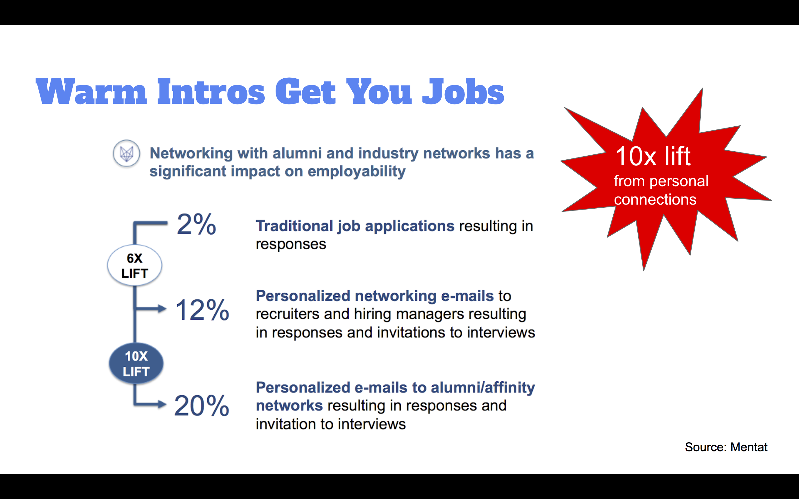

<!--
Here are some staggering statistics ....

[image]
-->

Silicon Valley hiring is driven by who you know. **You can increase your potential for employment 3x by getting a warm introduction.**

For this reason it is critical that you start _building your network now_ to better position yourself for jobs opportunities.

Past Make School students have regretted not building their network early enough.

<!--
"  " - name

"  " - name

"  " - name
-->

Thankfully, this tutorial will help you _make connections_ and _overcome_ any fears of talking to real professionals.

## You ALREADY have connections at top companies

Strangely enough, you may know more people at a company than you think. To explain, I'll share a bit about network theory.

Sociologists call people in your immediate circle your **first degree connections**. These are people you interactive with frequently - friends, family, acquaintances.

The majority of your network is in **second degree connections** - the aggregate amount of people directly connected to your first degree connections.

Sociologists estimate that your number of second degree connections is X times greater than your number of first degree connections:

If you look through your second degree connections, you may find that you have second degree connections at practically every tech company in the valley - especially when you count the networks of Jeremy & Ashu (YC alums), and all the instructors.

All these companies are just a _single_ connection away.

How can you tap into these networks?

## How to find Contacts

> [action]
>
> Review these slides on [Messaging to industry contacts](https://docs.google.com/presentation/d/1g4FuBBQIBLJ30eGXD9YsDjK2PaNUnrg6a60ip0WBc6A/edit#slide=id.g40f6408b0c_0_5), these slides on [How to find anyone's contact information](https://docs.google.com/presentation/d/14xM4JfFusj6rPMX9awvy1I42b12G39ifJjgBrLTRqrY/edit#slide=id.g44bb656f4b_0_24), and [networking tips and finding events](https://docs.google.com/presentation/u/1/d/1HgatbVpG_d0QqUACg59i3qhMUSK0o5IckLR3UH_hOhs/edit?usp=drive_web&ouid=102349547791146369642)

These slides will give you:

- template messages
- tips to connect with anyone
- hacks to find email addresses
- tips to connect at networking events

## Do it! Find contacts

> [action]
>
> Now, use the tips above to connect with 2-3 first and second degree connections at companies you want to eventually apply to. Alternatively go to one of the many [meet-ups happening WEEKLY](https://www.meetup.com/find/events/?allMeetups=false&keywords=technology&radius=2&userFreeform=San+Francisco%2C+CA&mcId=z94101&mcName=San+Francisco%2C+CA&eventFilter=mysugg) in San Francisco and connect with an engineer there.
>
> Mark your completion in the course tracker.

**Congrats on completing the tutorial!** You should now be prepared to knock that next interview out of the park. **Remember: you got this!**
