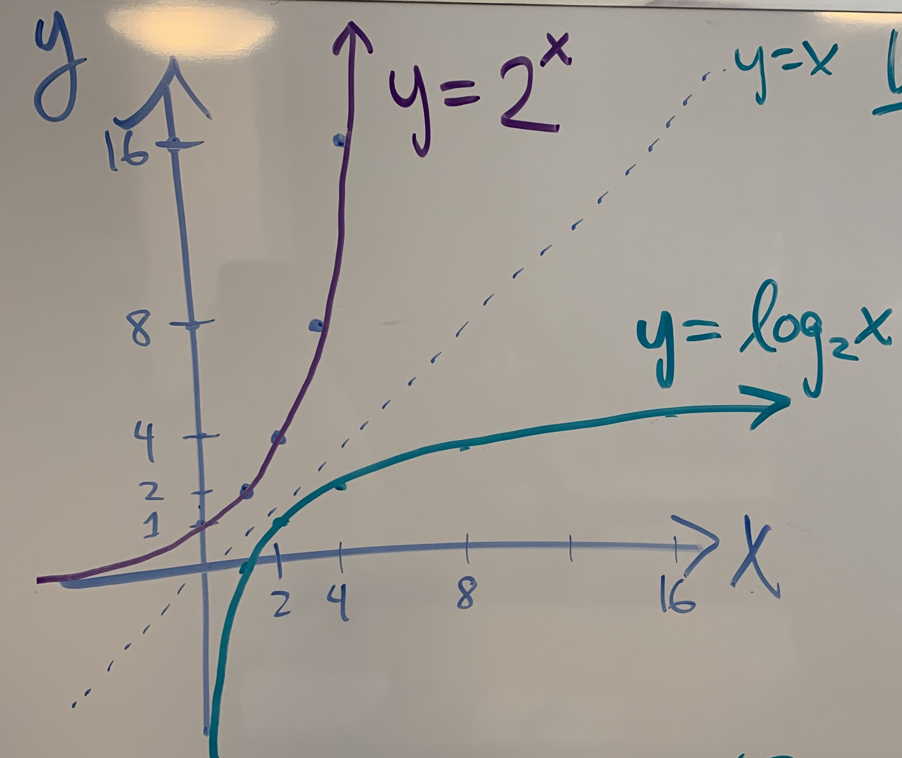

# Recursion & Search Algorithms

## Important links
- [Slides](https://docs.google.com/presentation/d/1m8c02CY9i5Vq35ooqVEf4zOwUI6DnUZt7piUOOJVgMk/edit?usp=sharing)
- [Starter Code](https://github.com/Make-School-Courses/CS-1.3-Core-Data-Structures/tree/master/Code/recursion-and-search)
- [Code Rubrics](https://drive.google.com/file/d/1QMm-cc0jieP-sLXOsXGxNPupz5FYYP0C/view?usp=sharing)

## Topics
- Compare [iteration] and [recursion] with [factorial] function
- Search algorithms: [linear search] and [binary search]

## Learning Outcomes

By the end of this lesson, students should be able to...

1. Compare and contrast iterative and recursive implementations of a function
1. Compare and contrast linear and binary search
1. Practice algorithm analysis to find the running time of the algorithm

## Resources
- Review Make School's [algorithm analysis slides]
- Read Vaidehi Joshi's [article on logarithms, binary search, and big O notation][BaseCS logarithms] with excellent, beautiful drawings
- Read Interview Cake's [article on logarithms and binary search][logarithms article]
- Read Interview Cake's [article on the idea behind big O notation][IC big O]
- Read Stack Overflow's [plain English explanations of big O notation][SO big O]
- Read Justin Abrams's [article on big O notation explained by a self-taught programmer][JA big O]
- Watch HackerRank's [recursive algorithms video], [binary search algorithm video], and [big O notation video]
- Watch Harvard's [old recursion video], [new recursion video], [stack frames video], [linear search video], [binary search video], [asymptotic notation video], and [computational complexity video]

## Challenges
- Implement iterative [factorial] function using [recursion starter code]:
    - Implement `factorial(n)` - the product of all integers 1 through `n`
    - Run `python recursion.py number` to test `factorial` on a number
        - Example: `python recursion.py 8` gives the result `factorial(8) => 40320`
    - Run `pytest recursion_test.py` to run the [recursion unit tests] and fix any failures
- Implement recursive linear and binary search algorithms using [search starter code]:
    - Implement `linear_search(array, item)` - the first index of `item` in `array`
    - Implement `binary_search(array, item)` - the index of `item` in sorted `array`
    - Run `pytest search_test.py` to run the [search unit tests] and fix any failures
- Annotate functions with complexity analysis of running time and space (memory)

## Stretch Challenges
- Implement recursive [permutation] and [combination] functions
- Make these functions efficient by avoiding repeated subproblems
- Write your own unit tests to ensure your algorithms are robust

<!--## Minute-by-Minute

| **Elapsed** | **Time**  | **Activity**              |
| ----------- | --------- | ------------------------- |
| 0:00        | 0:05      | Progress Tracker                |
| 0:05        | 0:10      | Factoid of the Day                  |
| 0:15        | 0:25      | Code Review in Pairs       |
| 0:40        | 0:30      | Code Review Presentation       |
| 1:10        | 0:05      | BREAK       |
| 1:20        | 0:25      | Card Sorting Activity       |
| 1:45        | 0:10      | TT - Recursion       |
| 1:55        | 0:04      | Recursive Binary Search Card Activity       |
| 1:59        | 0:01      | Wrap up       |
| TOTAL       | 2:00      |                           |-->

## Progress Tracker (5 min)

Fill out attendance, challenges completed, etc.

## Factoid of the Day (10 min)

There's a secret hexagram code known as [I Ching](https://en.wikipedia.org/wiki/I_Ching#Hexagrams). Here's an example of it:


**Find out what this secret code means**

Tips

- There's 64 characters that make up this code. Why 64?
    - Demonstrate on the whiteboard that for every bar (x) that you add, you get 2^x possible combinations
    - Binary and the Ching code can be seen as the same representation!
    - This means with 6 bars, we can represent 64 numbers!

## Card Sorting Activity (25 min)

### Linear Search - "Special" sort

- Get into pairs, each pair should have a stack of cards. No computers!
    - Each deck should be pre-sorted by the instructor such that it takes 3-5 flips per pair to find their card
- Each deck should have exactly 8 cards with 1 duplicate. Pull out the duplicate, this will be the **target card**
- That one duplicate is the card you're going to be searching for
- Leave cards face down in a row, with the duplicate target card face up and off to the side.
- Pick face down cards one at a time, if it matches the target, you're done, if not, put it face down and then move onto the next one
- Note how many times you had to flip cards to find your target card

### Unsorted Linear Search

- Shuffle the deck, and now do the same exercise you just did
- Note how many times you had to flip cards to find your target card
- Reshuffle and do this one more time, noting the number of flips again

### Compare Results

- The worst case for number of flips is 7, since the card you were looking for could be the last one you flip
- When the decks were strategically sorted by the instructor, everyone gets aorund 3-5 flips
- When the decks were unsorted, it could take anywhere between 1-7 flips to find your card!
- Either way, **when we do linear search, we are always scanning from left to right**
- If the cards were truly sorted without strategic instructor tampering....could we do better?

### Phone Book Search

- Imagine you have a phone book, but it has no table of contents. It's in alphabetial order, but you have no idea where the "M's" start or end, and you're looking for the name McGregor
- Since you know it's in alphabetical order, one strategy could be:
    - Open to the middle of the book
    - From there, flip to the left or right depending on what letter you land on.
        - i.e. if you open up to the "K's", you know that "M" appears later, so you can flip to the right and ignore any pages to the left of the "K" page that you opened to.

### Phone Books and Cards

- Sort the cards lowest to highest and put them face down in a row
- Work with your partner for 2-3 minutes on this, and try the phone book strategy with your face-down, sorted cards
- Everyone should take _no more than 3 steps_ to find their card!
- This technique is known as **binary search**

### Binary Search

- The "phone book search" we just discussed is actually **binary search!**
- At a high level, the algorithm does the following, given an array and a target value:
    - Looks at the middle item (let's call it "mid") of the array, and decides if mid is equal to, less than, or greater than the target value
    - If it's equal, we're done, we've found it!
    - If it's less than the target value, we can ignore all items to the right of mid, and we can now look at all items in between the first item of the array and mid-1. From here, we start the algorithm over
    - If it's greater than the target value, we can ignore all items to the left of mid, and we can now look at all items in between the mid+1 and the last item in the array. From here, we start the algorithm over
- This is pretty small stakes with 7 cards and 1 target, but imagine Facebook with 1 billion people and trying to find 1 person. **With binary search, can do this in 32 steps in the worst case!**
    - We will analyze this in detail and write code for it in a future class!

**Two important notes on binary search:**

1. The array MUST be sorted
1. You must be able to compare items in the aray to establish which have "lesser" and "greater" values

## TT - Recursion (6 min)

### Factorial Definition on the Whiteboard

- A **factorial** is when a given number is multiplied by each number less than it. Use the "!" symbol to represent a factorial
    - i.e. 4! = 4 * 3 * 2 * 1 = 24
- Draw out 5! through 2!, what is the pattern seen?
    - 5! = 5 * 4! = 5 * 4 * 3! = 5 * 4 * 3 * 2! = 5 * 4 * 3 * 2 * 1! = 5 * 4 * 3 * 2 * 1
    - 0! = 1
    - **n! = n * (n-1) * )n-2) * ... * 2 * 1**
- **You can define factorials in terms of each other!**
- Factorial can be written recursively based on this principle:

```python
def factorial(n):
    if n == 1:
        return 1
    else:
        f = factorial(n-1)
        return n*f
```

**Think of recursion as only doing one thing yourself, and then passing the buck**

## Recursive Binary Search Card Activity (3 min)

- Sort your deck of cards again as you did before.
- Now you pick up one card. If you didn't find your target card, communicate what the other person has to do given what you found (i.e. do they search the first or second half of the deck?)
- Next the other person does the same, and the roles keep switching until the card is found

## Wrap up (1 min)

Overview of challenges to work on for next class session

## Code Review + Presentations (80 min)

### Code Review in Pairs - Iterative Factorial (10 min)

- In partners, go over solutions for the Iterative Factorial coding challenge from last class
- Once each of you have discussed the problem, find a new partner, and trade approaches again to see more ways on how people went about the problem
- A few students will be chosen after to go up and present their solutions

### Code Review Presentation (15 min)

Chosen students present their solutions for Iterative Factorial

**Tips:**

- Use two variables: One to track which number in the factorial you're looking at, and one to track the factorial (product) so far
- It's important to start with 1 here, starting with 0 would screw it all up. Remember `0! = 1`
- It's important to have a starting value, whether it's multiplication (starting at 1) or addtion (starting at 0)
- Given `n` is the input number to the factorial function, you can start at `n` and move down to 1, or start from 1 and go up to `n`. Each approach is the same

### Code Review in Pairs - Recursive Linear Search (5 min)

- In partners, go over solutions for the Recursive Linear Search coding challenge from last class
- Specifically, **look at what operators you're using** - are you doing things that could potentially slow your code down? Or speed it up?
- Once each of you have discussed the problem, find a new partner, and trade approaches again to see more ways on how people went about the problem
- A few students will be chosen after to go up and present their solutions

### Code Review Presentation (15 min)

Chosen students present their solutions for Recursive Linear Search

**Tips:**

- Notice the similar structures between the recursive and iterative solutions
- Make sure you're checking for an invalid index for your array (remember this could happen both through the recursive call or through user input). Remember you need to check for _all valid array lengths_
- Remember to comment your code to make it clear!
- Can we do this without an index?
    - Yes! through array slicing: `array[1:]`
    - _But_ this is slow. Given `n` is the length of the array, it takes `n-1` steps to copy the array. Since this operation takes linear time, and we would have to call this operation a linear number of times, the algorithm would have a runtime of **n<sup>2</sup>**. Yikes!
    - **Avoid slice operators for recursive code**. You run the risk of becoming [accidently quadratic](https://accidentallyquadratic.tumblr.com/)


### Code Review in Pairs - Recursive/Iterative Binary Search (15 min)

- In _new_ partners from the previous two code reviews, go over solutions for the Recursive/Iterative Binary Search coding challenge from last class
- Once each of you have discussed the problem, find a new partner, and trade approaches again to see more ways on how people went about the problem
- A few students will be chosen after to go up and present their solutions

### Code Review Presentation - Iterative Binary Search (10 min)

Chosen students present their solutions for Iterative Binary Search

**Tips:**

- Using multiple indexes (i.e. `left` starting at the beginning of the array, `right` starting at the end) is fine, but once they _meet or cross over_, some action should take place
- Once an item in the array has been checked to see if it matches, you shouldn't search over that item again
- What do you return if you _can't_ find the item?
- Make sure you are guaranteed an _integer_ value when finding the median in the array


### Code Review Presentation - Recursive Binary Search (10 min)

Chosen students present their solutions for Iterative Binary Search

**Tips:**

- If you can't calculate the value of a parameter in the function definition, set it to `none`, and then calculate it in the function when you have access to what you need
- The iterative solution's looping conditional _should be the same_ as the base case of recursive solution
- Compare your iterative/recursive solutions and see where they're the same or differ
    - Almost every line of code can be matched between the two algorithms
    - The loop in the iterative solution iterative will be called the same number of times as the number of recursive calls in the recursives solution
    - **Runtime should not differ here for this function**

## TT - Algorithm Analysis (10 min)


Credit to [Mathwarehouse](https://www.mathwarehouse.com/programming/gifs/binary-vs-linear-search.php) for the animation!

### Linear Search

- **Best case:** The item we're looking for is the first one in the list: `O(1)`
    - Contant time since we only have to do 1 operation regardless of the length of the list
- **Worst case:** The item we're looking for is at the end of the list: `O(n)`
    - Where `n` is the number of items in the array
    - Linear time since we may have to search the length of the list to find the item.
- This is why it is called _linear_ search. It takes _linear_ time!
- You don't need to make any assumptions about the input: sorted and unsorted both have the same runtime
- This is slower though than other algorithms

### Binary Search

- **Best case:** The item we're looking for is exactly in the middle: `O(1)`
    - Never examine data, just checked the middle and found it
    -  `O(1)` space too, since it's just local variables
- **Worst case:** The item we're looking for is first, last, or one off from the median in the array: Given `n` is the length of the input array, `O(log(n))`
    - We're _splitting the array in half_ each time until we have 1 item.
    - **If you double the length of the array, in the worst case, you only increase the number of steps it takes to find the item by one**
        - i.e. a 7 item array takes at most 3 steps to find the item. A 14 item array would take at most 4 steps (try it out yourself!)
- This algorithm runs _really_ fast, but only works if the array is _sorted_

### Graph It

- Binary search has _constant run-time operations_ for checking for the target item and changing pointers
- Given `n` is the length of the array, our range of items that we're searching through goes from `n` --> `n/2` --> `n/4` --> ... 1
    - i.e. for a 7 item list, our number of items that we need to look through goes from 7 --> 3 --> 1
- This follows the **log function**
    - This is a slow growing function because we are _dividing by two_ as we grow
- Exponent and log are **inverses** of each other - exponent is fast growing (doubles), log is slow growing (halves)

See the graph below to compare exponent, linear, and log:




[iteration]: https://en.wikipedia.org/wiki/Iteration
[recursion]: https://en.wikipedia.org/wiki/Recursion_(computer_science)
[factorial]: https://en.wikipedia.org/wiki/Factorial
[linear search]: https://en.wikipedia.org/wiki/Linear_search
[binary search]: https://en.wikipedia.org/wiki/Binary_search_algorithm
[permutation]: https://en.wikipedia.org/wiki/Permutation
[combination]: https://en.wikipedia.org/wiki/Combination

[logarithms article]: ../Slides/Logarithms.pdf
[algorithm analysis slides]: ../Slides/AlgorithmAnalysis.pdf
[big O notation video]: https://www.youtube.com/watch?v=v4cd1O4zkGw
[asymptotic notation video]: https://www.youtube.com/watch?v=iOq5kSKqeR4
[computational complexity video]: https://www.youtube.com/watch?v=IM9sHGlYV5A

[recursive algorithms video]: https://www.youtube.com/watch?v=KEEKn7Me-ms
[old recursion video]: https://www.youtube.com/watch?v=t4MSwiqfLaY
[new recursion video]: https://www.youtube.com/watch?v=VrrnjYgDBEk
[stack frames video]: https://www.youtube.com/watch?v=beqqGIdabrE

[linear search video]: https://www.youtube.com/watch?v=vZWfKBdSgXI
[binary search video]: https://www.youtube.com/watch?v=5xlIPT1FRcA
[binary search algorithm video]: https://www.youtube.com/watch?v=P3YID7liBug

[BaseCS logarithms]: https://medium.com/basecs/looking-for-the-logic-behind-logarithms-9e79d7666dda
[IC logarithms]: https://www.interviewcake.com/article/python/logarithms
[IC big O]: https://www.interviewcake.com/article/python/big-o-notation-time-and-space-complexity
[SO big O]: https://stackoverflow.com/questions/487258/what-is-a-plain-english-explanation-of-big-o-notation
[JA big O]: https://justin.abrah.ms/computer-science/big-o-notation-explained.html

[recursion starter code]: ../Code/recursion.py
[recursion unit tests]: ../Code/recursion_test.py
[search starter code]: ../Code/search.py
[search unit tests]: ../Code/search_test.py
