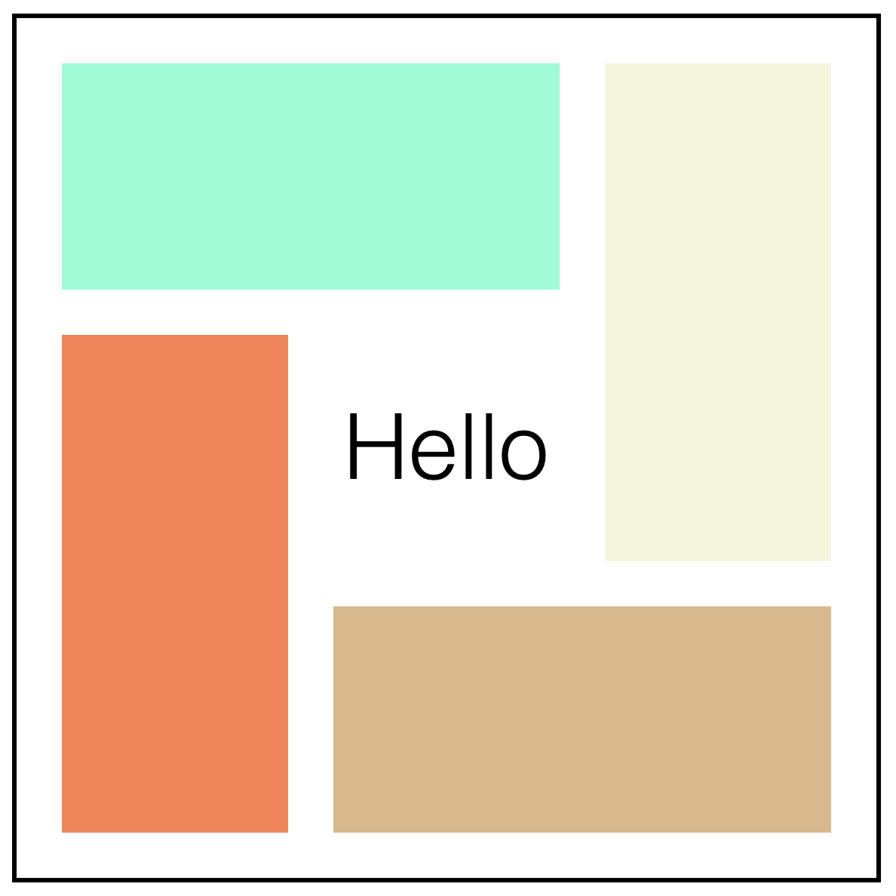

# FEW 2.2 - CSS Preprocessors part 2

Preprocessors are an important tool used in modern production environments today. You should know how they work! 

## Review 

Recreate the image here with the mark up below: 



```JS
<div class="box">
	<h1>Hello</h1>
	<div class="a"></div>
	<div class="b"></div>
	<div class="c"></div>
	<div class="d"></div>
</div>
```

The colors don't matter, use any colors you like. You can approximate the size as long as the four rectangles are all the same size and the container is square!

Hint: Use CSS Grid areas! 

## Learning Objectives

- Use SASS
- Automate style rule creation
- Compare and contrast CSS custom properties with SASS variables 
- Use SASS functions
- Use SASS variable interpolation

## Why you should know this?

SASS is an important tool expect to see it industry. You may also want to use it to automate your projects! 

## CSS Custom properties scope

Custom properties are live in the browser. Making a change to a custom property updates any element that uses that property in a style rule. 

This effects your work by making it possible to make changes and customize elements with custom properties. 

Custom properties have scope. Their scope is the selector where they are defined. Selectors that are descendants inherit properties from their ancestors. This idea leads to powerful techniques. Follow the video tutorial for an example. 

## SASS Variables 

SASS variables are useful but act only as placeholders for values. They do not exist in code when it has been compiled to CSS. USe these to automate the creation of your CSS code. 

Follow the video tutorial for an example of creating a color palette using SASS. 

## Video Lesson

Follow the videos labeled lesson 13 in this playlist:

https://youtube.com/playlist?list=PLoN_ejT35AEhF_M9vBuZgW0E4PiDb19oX

## After Class

Choose a past project that has a stylesheet. Your goal is to update that project to work with SASS. Your goal is to convert the original stylesheet to SASS `.scss` and then compile it into CSS `.css`. 

Along the way be sure to use the following SASS features: 

- SASS Variables - Use Variables wherever possible. Anytime you have a value that appears more than once or you need easy access to make it a variable. This is espeically useful for values that are based on values where you are calculating a value, let the computer do the math. 
	- colors
	- sizes
- Use a @for loop - Use a loop to caluclate values or styles that are repeated in code. 
- Use a list - Create a SASS list. 
- Look through the list SASS functions and see if you can incorporate any of these into your work.

## Additional Resources

- [video tutorials](https://www.youtube.com/playlist?list=PLoN_ejT35AEhF_M9vBuZgW0E4PiDb19oX)
- [SASS](https://sass-lang.com) 