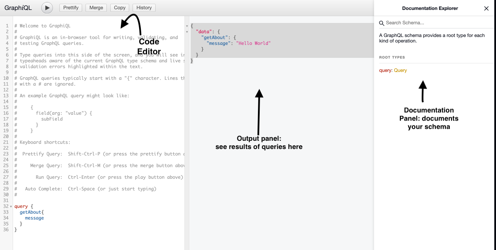

# FEW 2.9 GraphQL Schemas and Types

<!-- > -->

Use a schema to define what your <br> GraphQL API can provide.

<!-- > -->

## GraphQL 😎 Schemas and Types

Today we will look at a simple example implementing GraphQL with Express. This will give us a chance to look at GrapQL from the server side.

<!-- > -->

## Class Learning Objectives/Competencies

1. Define a GraphQL Schema
1. Use the GraphQL Schema Language
1. Define a GraphQL Resolver
1. Use GraphQL Queries
1. Use GraphiQL

<!-- > -->

## Warm Up (5 mins)

**Discuss:**

GraphQL and SQL are both Query languages. How do they differ?

<!-- > -->

## Review 

**Name three advantages of GraphQL 😎 over REST 😴**

<!-- > -->

### GraphQL Queries

**Use: https://graphql.org/swapi-graphql to answer the following questions...**

<small>**HINT:** If you get stuck, refer back to the [examples from the previous lesson](https://github.com/Make-School-Courses/FEW-2.9-Technical-Seminar/blob/master/Lessons/Lesson-1.md#nested-types)</small> 

<!-- > -->

- Who is person 10?
  - name?
  - eyecolor?
  - height?

<!-- > -->

- What movies did they appear in? 
  - totalCount?
  - titles?

<!-- > -->

- What about vehicles?
  - totalCount?
  - names?

<!-- > -->

## GraphQL 😎 Schemas 🛠

<!-- > -->

A GraphQL **Schema** 🛠 contains a set of Types that describe everything you can query from a service. 

<!-- > -->

Schemas 🛠 are written in the GraphQL 😎 **Schema language** which is similar to the Query language. 

<!-- > -->

SWAPI might define a person 💁 like this: 

```JS
type Person {
  name: String!
  eyeColor: String!
  ...
}
```

- `name` is a field 
- `String` is it's type
- `!` means the field is non-nullable (it will always return a value.)  

<!-- > -->

```JS
type Person {
  name: String!
  height: Int!
  eyecolor: String!
  films: [Film!]!
}
```

You can use types like: 

- `Int`
- `Float`
- `[...Type...]` (a collection)

<!-- > -->

GraphQL includes these default types: 

- `Int`: Integer
- `Float`: Decimal
- `String`: String
- `Boolean`: true or false
- `ID`: Special type that represents a unique value
- `[Type]`: Array of a type

<!-- > -->

The elements in a collection are typed and they will all be the same type. 

```python
type MyType {
  favNumbers: [Int!]   # null, [], [1,4,7] Not [1,null,7]
  favFoods: [String!]! # [], ["a", "b"] Not null, ["a", null]
  favWebsites: [URL]!  # [], ["http://", null] 
  favFavs: [Favs]      # null, [], [Fav1, null Fav2]
}
```

<!-- > -->

What about a Recipe 🍛 type: 

```python
type Recipe {
  name: String! # Name is a string can't be null
  description: String # Description is a string and 
                      # might be null
}
```

<small>(the `!` means a field _must_ have a value)</small>

<!-- > -->

A recipe 🍝 might have a list of ingredients. 

```python
type Recipe {
  name: String!
  description: String
  ingredients: [String!]! # Must have a list of Strings
                          # and none of those strings can be 
                          # null 
}
```

<!-- > -->

The Recipe type needs some more information: 

```python
type Recipe {
  name: String!
  description: String
  ingredients: [String!]! 
  isSpicy: ?      # what type?
  isVegetarian: ? # what type?
}
```

<small>What are the types for `isSpicy` and `isVegetarian`?</small>

<!-- > -->

### Enum ☎️

<!-- > -->

The GraphQL Schema language supports enumerations.

<!-- > -->

An **enumeration** ☎️ is a list of set values.

<!-- > -->

The Recipe type needs some more information: 

```python
enum MealType {
  breakfast
  lunch
  dinner
}

type Recipe {
  ...
  mealType: MealType! # Only "breakfast", "lunch" or "dinner"
}
```

<small>(Validates and restricts values to one from the list)</small>

<!-- > -->

Write an enum that defines the diet type: 

- ominvore 🍱
- paleo 🍖
- vegetarian 🧁
- vegan 🥗
- insectivore 🐝

<!-- > -->

```python
enum DietType {
  ominvore
  paleo
  vegitarian
  vegan
  insectivore
}

type Recipe {
  ...
  dietType: DietType! 
}
```

<!-- > -->

### Interface 🔌

<!-- > -->

An **interface** 🔌 is a description (or contract) that describes types that conform to it. 

<!-- > -->

Imagine characters 👯‍♂️ in the Star Wars films 🎬 could be humans 👷 or droids 🤖. 

```python
interface Character { # All Character have...
  name: String!
  films: [film!]!
}

type Human implements Character { 
  name: String!     # Character
  eyeColor: String! # Character
  films: [film!]!
}

type Droid implements Character {
  name: String!   # Character
  films: [film!]! # Character
  primaryFunction: String!
}
```
<small>(Anything that implements the interface must include the fields: `name` and `films`)</small>

<!-- > -->

An interface 🔌 is also a type. For example: 

```python
type Film {
  title: String!
  cast: [Character!]! # Can be Humans or Droids
}
```

<small>(Cast contains Humans or Droids, or any type with fields name and films)</small>

<!-- > -->

## GraphQL 😎 and Express 🚂

<!-- > -->

Let's get started with GraphQL 😎 and Express 🚂. 

**The goal of this section is to create an Express server that implements GraphQL.**

<!-- > -->

### Setup

1. Create a new folder
1. Initialize a new npm project: `npm init -y`
1. Install dependancies: `npm install --save express express-graphql graphql`
1. Create a new file: `server.js`

<!-- > -->

**Important!** Be sure to include a `.gitignore`. You need to prevent uploading your `node_modules` folder to GradeScope!

**How to add a `.gitignore`:** https://www.toptal.com/developers/gitignore/api/node

<!-- > -->

Edit `package.json`

```json
  "scripts": {
    "start": "nodemon server.js"
  }
```

<small>If you don't have nodemon use: "start": "node server.js"</small>

You can now run your project with: 

```bash
npm start
```

<!-- > -->

### GraphQL Express Server setup

Add the following to `server.js`.

```JS
// Import dependancies
const express = require('express')
const { graphqlHTTP } = require('express-graphql')
const { buildSchema } = require('graphql')
```

<small>Import dependancies</small>

<!-- > -->

Build a schema. Add the following to `server.js`.  

```JS
// Create a schema
const schema = buildSchema(`
type About {
  message: String!
}

type Query {
  getAbout: About
}`)
```

<small>The schema is written in the GraphQL schema language, `buildSchema()` takes the schema as a string and returns a schema object</small>

<!-- > -->

Define a resolver:

```JS
// Define a resolver
const root = {
  getAbout: () => {
    return { message: 'Hello World' }
  }
}
```

<small>A **resolver** is a function that's responsible for returning the results of a query. You might a say a resolver *resolves a query.*</small>

<!-- > -->

### Create an Express app

Add this to `server.js`:

```JS
// Create an express app
const app = express()
```

<small>Standard Express.</small>

<!-- > -->

Define a route. Use `graphqlHTTP` to handle requests to this route. 

```JS
// Define a route for GraphQL
app.use('/graphql', graphqlHTTP({
  schema,
  rootValue: root,
  graphiql: true
}))
```

<small>In the `use` function above, we supplied the schema, the root resolver, and activated the GraphiQL browser for our app.</small>

<small>The endpoint will be: `/graphql`</small>

<!-- > -->

Finally, start your app: 

```JS
// Start this app
const port = 4000
app.listen(port, () => {
  console.log(`Running on port: ${port}`)
})
```

<small>(Standard Express app)</small>

<!-- > -->

### Test your work! 

- `npm start` run your app
- http://localhost:4000/graphql

This should open GraphiQL in your browser. 

GraphiQL allows us to test our GraphQL Queries. Its the same tool you used in the last class. 

<!-- > -->

### Try a query: 

```JS
{
  getAbout {
    message
  }
}
```

<!-- > -->

Compare this to the schema and the resolver:

- query type: `getAbout`
  - Returns: an `About` type
- `About` has a field of `message` of type string

<!-- > -->

Let's follow this backwards. Starting with this query: 

```JS
{
  getAbout {
    message
  }
}
```

<small>Sending this query...</small>

<!-- > -->

GraphQL handles with a resolver: 

```JS
const root = {
  getAbout: () => {
    return { message: 'Hello World' }
  }
}
```

<small>It returns an object with a `message` property that is type `String`.</small>

getAbout has to return something that looks the the About type. 

<!-- > -->

The Resolver checked this against the schema. 

```JS
type About {
  message: String!
}

type Query {
  getAbout: About
}
```

The `getAbout` query returns an `About` which always has a `message` of type `String`. 

<!-- > -->

## GraphQL Resolvers ⚙️

<!-- > -->

A resolver is responsible for resolving a query. Resolvers can be hierarchical and complicated. You might spend more time here in some projects. 

<!--  -->

<!-- > -->

This is the **root resolver**. <br> It maps queries to the schema.

```JS
const root = {
  getAbout: () => {
    return { message: 'Hello World' }
  }
}
```

<small>(`getAbout` maps to the query type with the same name)</small>

```python
type Query {
  getAbout: About
}
```

<!-- > -->

### Your turn! 

<!-- > -->

Imagine you're making an API for yourself. Imagine a query is like asking you a question. The repsonse is like the answer you might provide. 

<!-- > -->

Define a new type in your schema

If someone asks what to eat? You would reply with a meal type. 

```python
type Meal {
	description: String!
}
```

<small>Add a data type</small>

<!-- > -->

**Add a query type to handle meal queries.** It will return a Meal.

```python
type Query {
  getAbout: About
	getmeal: Meal
}
```

<small>Add a query type</small>

<!-- > -->

**Add a resolver function**. This function returns something that must match the Meal type (has description field of type string)

```JS
const root = {
  getAbout: () => {
    return { message: 'Hello World' }
  },
	getmeal: () => {
		return { description: 'Noodles' }
	}
}
```

<!-- > -->

Sometimes it takes some information to get some information. Often you'll need to provide parameters to the data that you need. 

<!-- > -->

Queries can take parameters. You saw this in SWAPI. You can add arguments to your queries. 

<!-- > -->

Imagine there is a different meal depending on the time: breakfast, lunch, or dinner. 

The Meal type will stay the same since it will still be a field description that is a string. 

<!-- > -->

**Modify the Query type to accept an argument.**

```JS
type Query {
  getAbout: About
	getmeal(time: String!): Meal
}
```

<small>(`getMeal` now takes an argument: `time`, of type `String` which is required)</small>

<!-- > -->

**Modify the resolver to work with this argument.**

```JS
const root = {
  getAbout: () => {
    return { message: 'Hello World' }
  },
	getmeal: ({ time }) => {
		const allMeals = { breakfast: 'toast', lunch: 'noodles', dinner: 'pizza' }
		const meal = allMeals[time]
		return { description: meal }
	}
}
```

<small>(The resolver receives an args object with all of the parmeters defined in the query type)</small>

<!-- > -->

**Test your query:**

```JS
{
  getmeal(time: "lunch") {
    description
  }
}
```

Should return:

```JSON
{
  "data": {
    "getmeal": {
      "description": "noodles"
    }
  }
}
```

<!-- > -->

Since there are only three possible values you can use an enum!

```python
enum MealTime {
  breakfast
  lunch 
  dinner
}

type Query {
  getAbout: About
    getmeal(time: MealTime!): Meal
}
```

<small>Note! Using an enum prevents spelling errors or things assumptions like bunch...</small>

<!-- > -->

### Working with Collections

<!-- > -->

Often you'll want to work with collections. You'll often return posts, or users, or foods.

<!-- > -->

Imagine you want to define a list of pets. You might start with a `Pet` type. 

```python
type Pet {
  name: String!
  species: String!
}
```

<!-- > -->

Imagine you have an array of pets. A query type might look like this: 

```python
type Query {
  ...
  getPet(id: Int!): Pet # Add a query to get a single pet
  allPets: [Pet!]!      # Returns an array of type Pet
}
```

<!-- > -->

Now set up a resolver for each of the new queries. 

```JS 
const root = {
  ...
	getPet: ({ id }) => {	
		return petList[id]
	},
	allPets: () => {	
		return petList
	},
	...
}
```

<small>`getPet(id)` takes the `id` and returns the pet at that index, `allPets` returns an array of all pets</small>

<!-- > -->

Better define the `petList`!

```JS
// Mock datatbase in this case:
const petList = [
	{ name: 'Fluffy', species: 'Dog' },
	{ name: 'Sassy', species: 'Cat' },
	{ name: 'Goldberg', species: 'Frog' }
]
```

<small>This could be defined by a database!</small>

<!-- > -->

Now write a query. Notice you can choose fields to fetch. 

```python
{ # Get the names of all pets
  allPets {
    name
  }
}
```

```python
{ # Get pet 2 species
  getPet(id: 2) {
    species
  }
}
```

<!-- > -->

## Challenges 🎳

<!-- > -->

Your goal is to make a list of things, not unlike SWAPI. This could be a list of pets, songs, recipes, movies, anything really. 

You are going to make a GraphQL server that serves the things in your list.

<!-- > -->

**Challenge 1**

Make an Array of objects. Each object should have at least three properties.

*Examples*:

- Pet: name, species, age
- Song: title, genre, length
- Movie: title, genre, rating

<!-- > -->

In code this might look something like: 

```JS
const petList = [
	{ name: 'Fluffy', species: 'Dog' },
	{ name: 'Sassy', species: 'Cat' },
	{ name: 'Goldberg', species: 'Frog' }
]
```

<!-- > -->

**Challenge 2** 

Make a Type in your schema for your objects:

```python
type Pet {
	name: String!
	species: Species! # use an enum!
}
```

Use an enum for something!

Advanced: Use an interface!

<!-- > -->

**Challenge 3**

Make a Query type that will return all of the things: 

```python
type Query {
  allPets: [Pet!]! # returns a collection of Pet
}
```

<!-- > -->

**Challenge 3**

Write a resolver for your query: 

```JS
const root = {
  allPets: () => {	
		return petList
	},
  ...
}
```

This returns the entire list. 

<!-- > -->

**Challenge 4**

Test your work in Graphiql: 

```python
{ 
  allPets {
    name
  }
}
```

Shoule display a list of names.

<!-- > -->

**Challenge 5**

Add a query that returns a thing at an index: 

```python
type Query {
  allPets: [Pet!]! 
  getPet(index: Int!): Pet
}
```

Add the new query to your Query types in your schema. 

<!-- > -->

**Challenge 6**

Add a new resolver. The parameters from the query will be received in resolver function: 

```JS
const root = {
  ...
  getPet: ({ index }) => { // index is a param from the query
		return petList[index]
	}
}
```

<!-- > -->

**Challenge 7**

Test your work, write a query in Graphiql. 

```python
{
  getPet(index: 0) {
    name
  }
}
```

<!-- > -->

**Challenge 8**

Write a query that gets the last item and the first item from the collection.

Schema: 

`firstPet: Pet` 

Resolver: 

`firstPet: () => ???`

<!-- > -->

**Challenge 9**

We need a type that represents the time. 

- hour
- minute
- second

Write a resolver that gets the time and returns an object with the properties: hour, minute, second.

```JS
{
  getTime {
    hour
    second
    minute
  }
}
```

<!-- > -->

**Challenge 10** 

Imagine we need the server to return a random random number. Your job is to write a query type and resolver that makes the GraphQL query below function: 

```JS
{
  getRandom(range: 100) 
}
```

Which should return: 

```JS
{
  "data": {
    "getRandom": 77
  }
}
```

<!-- > -->

**Challenge 11** 

Create a type that represents a die roll. It should take the number of dice and the number of sides on each die. It should return the total of all dice, sides, and an array of the rolls. 

<!-- > -->

Below is an example query, and the response that should come back

**Example Query**

```JS 
{
  getRoll(sides:6, rolls: 3) {
    total, 
    sides,
    rolls
  }
}
```

**Example Response**

```JS
{
  total: 10, // total of all rolls (see below)
  sides: 6,  // each roll should be 1 to 6 based on the original sides parameter
  rolls: [5, 2, 3] // 3 rolls based on the original rools parameter (5+2+3=10)
}
```

<!-- > -->

**Challenge 12**

Add a query that returns the count of elements in your collection. You'll need to add a query and a resolver.

The trick of this problem is how to form this query. 

<!-- > -->

**Challenge 13**

Add a query that returns some of your collection in a range. Imagine the query below for pets:

```python
{
  petsInRange(start: 0, count: 2) {
    name
  }
}
```

The results of the query should return two pets starting with the pet at index 0.

<!-- > -->

**Challenge 14**

Get things by one of their features. For example if the Type was Pet we could get pets by their species:

```python
{
  getPetBySpecies(species: "Cat") {
    name
  }
}
```

**Challenge 15**

Choose a field. This query should return all of these values that exist in the things in your list. This would work best for a field with a fixed or limited set of values, like a field that uses an enum as it's type: 

Here is a sample query:

```python
{
  allSpecies {
    name
  }
}
```

Returns: "Cat", "Dog", "Frog"

<!-- > -->

## After Class

- Complete the challenges here. Submit them on GradeScope.
- Watch https://www.howtographql.com videos up to the GraphQL Node Tutorial:
  - Clients
  - Servers
  - More GraphQL Concepts
  - Tooling and Ecosystem
  - Security
  - Common Questions
- Submit your work to GradeScope.

<!-- > -->

### Evaulate your Work

1. Define a GraphQL Schema
1. Define a GraphQL Resolver
1. Use GraphQL Queries
1. Use GraphiQL

| -   | Does not meet expectations | Meets Expectations | Exceeds Expectations |
|:---:|:---:|:---:|:---:|
| GraphQL Schemas | Can't describe or explain GraphQL schemas | Can describe GraphQL schemas | Could teach the basic concepts of GraphQL schemas to someone else |
| Writing Schemas | Can't write a GraphQL schema | Can write a GraphQL schema | Feel confident you could write a GraphQL schema for a variety of situations beyond the homework examples |
| GraphQL Queries | Can't write a GraphQL Query | Could write a graphQL query | Feel confident you could write GraphQL queries beyond the solutions to the homework problems |
| Resolvers | Can't explain resolvers, couldn't find them in your code | Could explain how the resolver works in the sample code from the lesson | Could expand on the resolvers from this lesson adding more use cases |

<!-- > -->

## Resources

- https://www.howtographql.com
- https://medium.com/codingthesmartway-com-blog/creating-a-graphql-server-with-node-js-and-express-f6dddc5320e1


<!-- 

Pop Quiz - After Break 

Write a schema for these types


- Kaiju type this is a gian monster like Godzilla
- City type
- Monster battle type should

- Card type for a playing card
- Deck type for a deck of cards
- Hand type for a hand of cards
- Discard pile type

- Image type
- Location type
- Image type needs a location
- User Type
- User type needs a list of images

- Write a location type?
- Write walk type needs to map out a sequence of locations
- Write a query type for a a walk

-->