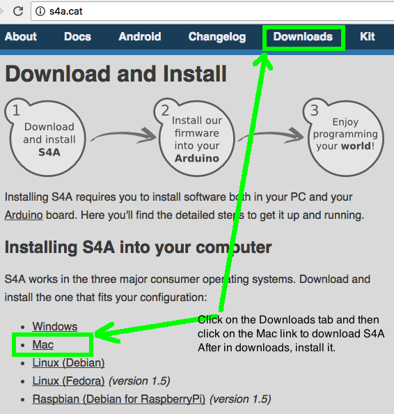

# Devices and IOT Class 1

---
## Objectives
- **Diagram the major components and functions of a range of current consumer and industrial embedded system devices and IOT devices as a group activity**
- **Make an Arduino Mega 2560 blink an LED using the Arduino IDE and mBlock which is a version of MIT Scratch that can generate Arduino code**

---

# First steps
### Download and install the Arduino IDE and S4A (Scratch for Arduino) IDE using the following links

##### Notes: The security settings on OS/X must be set to allow all applications to run or OS/X may throw up a dialog claiming the Arduino IDE and/or S4A is a damaged application erroneously.

# Download S4A firmware for the Arduino Mega 2560 board
### Download the S4A firmware for Ardiuno by navigating to the word "here" as highlighted below, then perform a two finger click and use the "Save Link as" menu item in the pop-up dialog box and allow Chrome to save the S4AFirmware16.ino file as depicted below.

# Loading the S4A firmware into the Arduino IDE
### Click on the S4AFirmware.ino file in a finder window. A dialog box will likely appear indicating that the program needs to move to file to a subdirectory. Click on the Ok button and wait for the Arduino IDE to open.

# Selecting the Arduino Mega 2560 board, processor and port
### Insert the USB cable into the Mega2560 and your Mac's USB 2.0 port. Select the Arduino IDE window and click on the Tools main menu item and then select the Board "...Mega 2560" and the processor "ATmega2560 (Mega 2560)" as depicted below. Then select the port menu item and ensure that the "/dev/cu...Mega 2560" item is displayed and there is a check mark on the left side of that item. If no check mark is present, click the item to select it and a check mark should appear.

# Compiling and flashing the S4A firmware onto the Mega 2560
### Click on the right arrow icon near the top left corner of the Arduino IDE window. This causes the Arduino IDE's C/C++ compiler to compile the code to machine code and then copy that code to the Mega 2560's Program Flash Memory.

### Once it successfully compiles and flashes the Mega 2560 and the bottom window of the Arduino IDE indicates compilation and download succeeded, you should close the Arduino IDE application. This will release the USB port such that the S4A application can connect to the Mega 2560 and send commands to it to turn pins on and off, as well as read pin values back to the S4A program running on the Mac.

# The program will begin running
### Take a Grove cable from the kit and connect a blue LED to one end and plug the other end into the D10-D11 Grove connector on the Grove Mega shield as shown below. Once you create the right S4A program, the LED should blink every two seconds, one second on and another off. You may also see the Mega 2560's tiny communications indicator LED's blinking. That is caused by the S4A Mac application 

# The Mega2560 board and labels for pins and connectors
### Under the Seed Studio Grove Connector Shield is the Mega 2560 PCB. The large chip in the center is the ATMega2560 chip made by Atmel. In the upper left corner is a Atmel ATMega16U2 chip that is preprogrammed to communicate over the USB port to act as a programmer and serial console interface for the Mega 2560 chip. The ICSP pins near each ATMega chip provides ports for an Amtel In Circuit Emulator device to program the chips and perform advanced debugging operations using Atmel Studio IDE.

# Launch the S4A application and create the blink program
### when S4A first launches while the Mega 2560 is plugged into your Mac, it will display a dialog box "searching for board" and then the Analog values will start updating. Create the Blink program as described below.

##### The first time you launch S4A and other apps like the Arduino IDE and mBlock. you will likely have to go into yoru Mac's Security and Privacy settings dialog and launch it using the "Open Anyway" button

### Simple LED blink program written in drag-and-drop Scratch code on S4A

Further Resources:  
[Forbes article on IOT](http://www.forbes.com/sites/gilpress/2016/04/28/consumer-iot-forrester-and-idc-on-consumer-interest-and-concerns/#52516e3e2140)  
[Forrester reports on IOT related topics of markets, security and trends (synopsis only)](https://www.forrester.com/search?sort=3&N=21053+10001)  
[Arduino board components](http://cactus.io/platform/arduino/arduino-uno)  
[Excellent course on computers, history, architecture](http://courses.cs.washington.edu/courses/csep567/10wi/lectures/)  
[ATmega328 microcontroller architecture](
http://courses.cs.washington.edu/courses/csep567/10wi/lectures/Lecture6.pdf)

