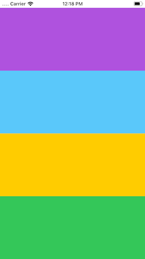

## Using Size Classes

You are required to make a layout of how an app would look like when it supports both portrait and landscape orientations.

1. Start by creating a new Xcode project.
2. Using the storyboard, add 4 views into the view controller. Give each a different color.
3. Place them in a stack view. All views should be of equal size and without space between them.

You should have something similar to this:

4. Run the app and make sure it shows correctly.
5. Since we used a StackView, it should work fine if we rotate the device. Go ahead and change it to be in landscape mode (command + left/right arrow). What do you notice happens? Is this good for displaying content? Would you change it?

6. To make it work using size classes, you are going to have to make some changes first. Divide the current views into two StackViews (each with 2 views). It will look the same but it's structure will be different. It might not look like a good idea right now, but this change in the structure is what's going to let us chance the layout in landscape mode.

7. At the bottom, select the landscape orientation and click "vary for traits". Then select both width and height and the area will turn blue.

You can see this blue indicator as your green flag to go and make the appropriate changes for landscape mode.

8. Select one of the inner stack views and go to the attributes inspector. Click on the plus button for the "Axis" option and add a variation for compact width (wC) and compact height (hC).

9. Then chance the orientation for the variation you just created to horizontal. Notice how the layout changes in the interface builder. It starts to look better.

10. Do the same for the other stack view.

Your storyboard should look similar to this.

11. Click "done varying". This will return the area to its original color, meaning we are finished with the modifications for landscape mode.

12. Toggle between the orientations in the storyboard to make sure they are correct. Then run the app and it should work as intended.

### Questions

1. Why do you think we needed to change our initial setup and add more stack views?
1. Why do we care to change the layout in landscape mode, when the original stack view changed by itself and we could still see the 4 colors?
1. Is it always required to use size classes? What is a good criteria to know if we should use them or not?

### Stretch Challenge

For the same layout, test it on an iPad Pro 11' and make the changed you consider are needed. Notice that for iPads there are even more options, considering they can also support split views.
