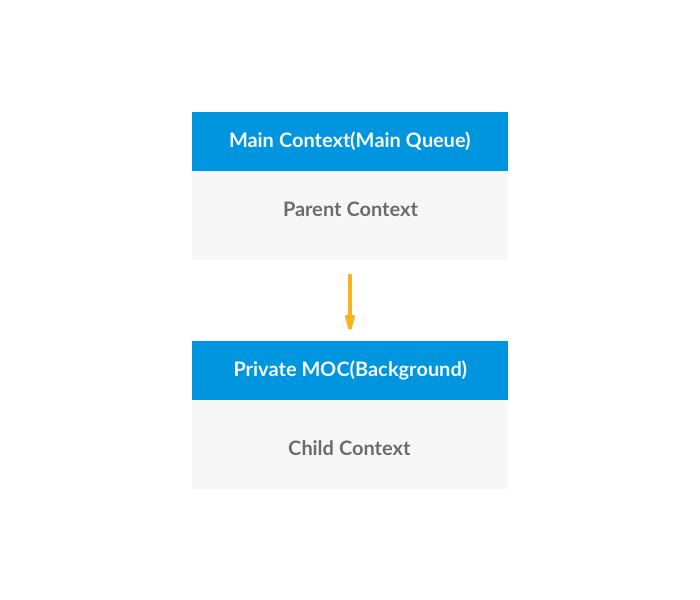

<!-- Run this slideshow via the following command: -->
<!-- reveal-md README.md -w -->


<!-- .slide: class="header" -->

# Multiple Contexts

## [Slides](https://make-school-courses.github.io/MOB-2.1-Local-Persistence-in-iOS/Slides/Lesson9/README.html ':ignore')

<!-- > -->

## Why you should know this

A managed object context is an in-memory scratchpad for working with your managed objects.

Most apps need only one. This managed object context is associated with the main queue, this is the default configuration.

Multiple managed object contexts make apps harder to debug so it's important that you evaluate if you really need it.

<!-- > -->

## When is it a good idea?

- Exporting data (or any long-running task)
- When edits are being made to user data (and we can discard the changes)

All of these will block the main thread on apps that have one managed object context.

This looks like a good place to add another MOC. 🙌🏼

<!-- > -->

## Learning Objectives

- Learn about having multiple ManagedObjectContexts.
- Discuss and use child contexts.
- Discuss thread safety with ManagedObjectContexts.

<!-- > -->

## ManagedObjectContexts & Thread safety

ManagedObjectContexts are not thread safe. 😰

This means we can't just dispatch something to a background queue and use the same Core Data stack.

If we have multiple threads (main and some background thread for example) access the same ManagedObjects, we should have consistent behavior.

A solution is to use a **private background queue** for long running tasks.

<!-- > -->

## How?

The PersistentContainer makes dealing with private contexts easy.

The `performBackgroundTask` method of the PersistentContainer spins up a new private background context in a closure.

<!-- > -->


```swift
persistentContainer.performBackgroundTask { (context) in
    for object in objectArray {
        //heavy processing
    }
    do {
      //save context
        try context.save()
    } catch {
        fatalError("Failure to save context: \(error)")
    }
}
```

<!-- > -->

**Recommended Use of Contexts**

We use the **main context** for interacting with core data on the application's view layer.

But complex operation such as saving multiple ManagedObjects in core data takes a long time and hence will block the main thread(if using main context).

What we want to do is hand off saves to a **background context** so write operations can be performed on the background.

<!-- > -->

**Fetching ManagedObjects from the main ManagedObjectContext & saving on a background Context**

One way we can handle a save in this situation is to change the ManagedObjectContext.

Since fetching from the main context, all objects retrieved will be associated with the main managed object context.

<!-- > -->

**Option 1: Changing Contexts**
1. Grab the objectID from the ManagedObject.

```swift
let objectID = myManagedObject.objectID
```

2. Fetch the same ManagedObject from the background ManagedObjectContext.

```swift
let myBackgroundManagedObject = coreDataStack.privateContext.object(with: objectID)
```

3. Do any modifications to your ManagedObject
4. Perform a save on the privateContext

<!-- > -->

**Option 2: Using Child Contexts**

Think of a notes app. 📝

We create a new note and make edits, delete text, modify, keep changing the content until we're happy with our text and then we want to hit save.

In an app like this, we can simplify how Core Data works by **making the changes as the user edits the note**.

Then we either save the changes or discard them. Depending on the final decision of the user.

<!-- > -->

Child managed object contexts are temporary scratch pads that we can save or discard. If saved, we send the changes to the **parent context**.

All managed object contexts have a parent store from which we can retrieve and change managed objects.

The parent store is a persistent store coordinator. But we can also set the parent store to another managed object context, turning it into a child context.

<!-- > -->



<!-- > -->

Whenever we save a child context, the changes go up to the parent context. BUT these changes won't be sent to the persistent store coordinator until the parent context is saved.

<!-- > -->

## Activity - online tutorial

To practice how to work with more than one MOC, follow [this tutorial](https://github.com/Make-School-Courses/MOB-2.1-Local-Persistence-in-iOS/blob/master/Lessons/Lesson9/assignments/assignment.md).

<!-- > -->

## Additional Resources

- [Slides](https://docs.google.com/presentation/d/1mx-_ELFm5_zCMzEIgTnfM2RhxVgq_pX2k8tAo9bsUB8/edit#slide=id.g514c043897_0_135)
- https://www.raywenderlich.com/7586-multiple-managed-object-contexts-with-core-data-tutorial
- “Core Data by Tutorials.” By Pietro Rea.
