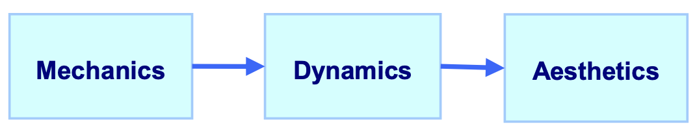

<!-- .slide: class="header" -->

# Game Design

## [Slides](https://make-school-courses.github.io/MOB-2.2-Game-Development/Slides/Game-Design/Readme.html ':ignore')

<!-- > -->

## Agenda

- Course Intro
- Game Design (what, why?)
- Game Genres
- Game frameworks
- Video
- Game design basics
- Mini workshop

<!-- > -->

## Learning Objectives

1. Identify the importance of game design and identify its stages
1. Identify different game genres
1. Describe the MDA framework
1. Implement a basic prototype of a game

<!-- > -->

## Let's play a game...

Take out your phone and for the next 5 minutes play your favorite game.

*Share what you were playing* 👾

<!-- v -->

- What makes the game entertaining?
- Why is it your favorite?
- What's the genre of the game?

<!-- > -->

# Game Design

Game design is the art of applying design and aesthetics to create a game.

It's the segment of game development that has to do with:

- creating goals
- defining rules
- creating challenges

It's what needs to happen before you start coding your game.

<!-- > -->

## Game genres

[List of genres](https://www.lsntap.org/sites/lsntap.org/files/game%20genres.pdf)

<!-- v -->

Was the genre of your favorite game correct? 😬

<!-- > -->

## Game frameworks

Various game frameworks that help in game design. One of them is the MDA framework. It formalizes the consumption of games by breaking them into 3 components.

<!-- v -->

### Mechanics

Describes the particular components of the game, at the level of data representation and algorithms.

<!-- v -->

### Dynamics

Describes the run-time behavior of the mechanics acting on player inputs and each other's outputs over time.

<!-- v -->

### Aesthetics

Describes the desirable emotional responses evoked in the player, when they interact with the game system.

<!-- v -->

### Perspectives

<aside class="notes">
"From the designer's perspective, the mechanics give rise to dynamic system behavior, which in turn leads to particular aesthetic experiences.

From the player's perspective, aesthetics set the tone, which is born out in observable dynamics and eventually, operable mechanics.

It is helpful to consider both the designer and player perspectives. It helps us observe how even small changes in one layer can cascade into others." Hunicke, Robin & Leblanc, Marc & Zubek, Robert. (2004)

</aside>

<!-- v -->

### Aesthetics

So now let's go backwards. As in the player's perspective.

When we describe why a game is fun, usually we use limited vocabulary.

Here's a more descriptive list.

<!-- v -->

### Dynamics

Dynamics work to create aesthetic experiences.

**Challenge** - created by things like time pressure and opponent play

**Fellowship** - encouraged by sharing information across a team or supplying winning conditions that are more difficult to achieve alone

<!-- v -->

### Mechanics

Mechanics are...

- Actions
- Behaviors
- Control mechanisms

afforded to the player within a game context.

Together with the game's content (levels, assets and so on) the mechanics support overall gameplay dynamics.

<!-- v -->

### Tuning

To understand how changed in every component affect the player's experience a game needs to undergo a lot of testing and tuning.

It's important to define the purpose of the game first, and all of the other components of the framework as simple as possible in the beginning.

<!-- > -->

### Game design/development process: Jetpack Joyride

[Video](https://www.gdcvault.com/play/1015527/Depth-in-Simplicity-The-Making)

<!-- > -->

<!-- .slide: data-background="#087CB8" -->
## [**10m**] BREAK

<!-- > -->

## Game design basics

- ⚒ Setup
 - Board setup, arranging pieces, starting values for player
- 🔁Game Loop
  - Player turn
    - Choose from and perform available actions
  - Computer turn
    - Move or perform actions of NPCs and update the environment
  - Check game state
    - If “won”, “lost”, or “tie", end game, otherwise repeat the game loop

<!-- v -->

- 🌎 World / Environment
  - Board size and layout, barriers, tile stats, starting point, time limits
- ✨ Objects
  - Location, abilities, value
- 💕 Non-player Characters (NPCs)
  - Movement, abilities, health, objects
- 🧙🏻‍♀️Player

<!-- > -->

## Game prototype workshop

Goal: Learn how people react to things you have created, how they interact with those things, and how it never is exactly how you expect. 😅

Divide into **even** number of groups of 2 or 3 people.

<!-- v -->

- You will design a game using pen, paper, other materials.
  (alternative for online is using [Jamboard](jamboard.com))
- The game must be grid based,  turn based, and 1 or 2 players.
- The players can play against the game (the team that designed the game can play as the computer) or versus each other.

The game will be played by another team at the end of the exercise.

You will need to design not only a simple game, but instructions on how to play it, and a set of rules for it.

<!-- v -->

## Brainstorm the idea

10 min

<!-- v -->

## Build the game

Pick and idea and build the game.

- Create Board and Pieces
  - Draw a board and create pieces
- Write Player Rules
  - What are the primary and secondary goals?
  - Which abilities are available at which times?
- Write Computer Rules
  - What needs updating each game loop?
  - Does the world or do NPCs react to any player actions?
  - How do you know if the player has won, lost, or tied?

25 min

<aside class="notes">
Once you swap with another team, you will not be allowed to talk.

You can only operate the game as the computer.

You will be allowed to explain the rules out loud once.

</aside>

<!-- v -->

## Pairs to play

1. Find another team.
2. One team explains rules.
3. Then they have to silently watch the other team play and act as NPC (non player character).
4. Play for 5-8 minutes.
5. Then swap and play the other game, same process.
6. You are done!

Things to check:
- Is the player doing what you expected?
- Is the player confident? Having fun? Frustrated?

<!-- v -->

## Insights

- Were your instructions as clear as you thought they were?
- Did the player win/lose faster than you expected?
- Which parts of your game were the most fun?
- Which parts of your game were the most confusing?
- Did the player discover new play strategies?
- What kinds of changes are you considering making to your game based on the playtest?

<!-- > -->

## Wrap Up

- Make sure you are in the slack channel for this class.
- Stay tuned for project specifications. Spoiler: you will need a pair. 😀😀

<!-- > -->

## Additional Resources

1. Hunicke, Robin & Leblanc, Marc & Zubek, Robert. (2004). MDA: A Formal Approach to Game Design and Game Research. AAAI Workshop - Technical Report. 1.
1. [MDA video](https://www.youtube.com/watch?v=uepAJ-rqJKA)
