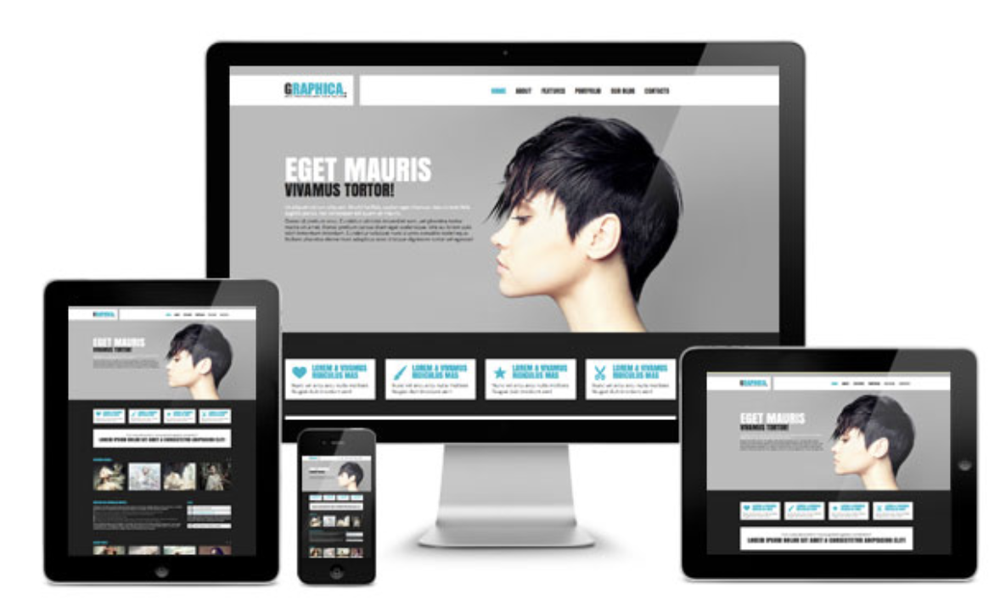
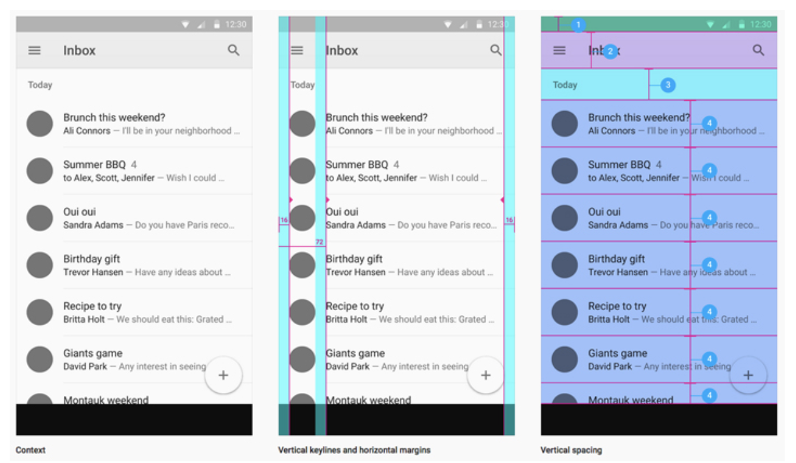

<!-- .slide: data-background="./Images/header.svg" data-background-repeat="none" data-background-size="40% 40%" data-background-position="center 10%" class="header" -->
# FEW 1.1 - Designing with a Grid

CSS Grid is a two dimensional layout system with many option. 

Here are a couple strategies you can use to create a grid.

<!-- Put a link to the slides so that students can find them -->

➡️ [**Slides**](/Syllabus-Template/Slides/Lesson1.html ':ignore')

<!-- > -->

## Warmup <!--8 min-->

Breakout groups of 2 (8 min):

- Partner will spend 2 minutes talking about something important to them. The listener must ask five question in a row to the speaker related to that important topic. Then switch.

<!--This allows students to have deeper conversations and feel heard.-->

<!-- > -->

## Learning Objectives <!--5 min-->

1. Identify columns and rows
1. Identify Grids in the wild
1. Define a visual grid
1. Define a Grid Parent
1. Identify chid grid items
1. Create grid columns

<!-- > -->

<!-- 

Success Skills Exercise - Pair Programming 

- What is pair programming? 
- Why is it important 
- How do you pair program?
- Pair in class today
- Might be good to show a short video on the subject?

 -->

### Why Is This Important?

Grids are used to arrange content. Originally used with print publications like books, newspapers and magazines. Grids are even more important on the web. 

A grid is a design tool. Use grids to create well-designed, good looking pages that present information well. They help us create designs that seamlessly transition between platforms, so that you get a pleasant experience whether you're on your laptop, phone, tablet, or other device!



Once you learn about grids, it becomes easy to see how the majority of apps can be broken down into a grid of some kind:



**Open up your favorite app or website and see if you can find the grid that makes it!**

**Grids used for design are not the same as CSS Grid or Flexbox. Grids used for design are a concept, CSS Grid and Flexbox are tools that help you realize that concept.**

CSS tools are used to arrange elements on a page. Your goal is to use these tools to arrange your content on the grid you imagine. 

<!-- > -->

## Warmup <!--10 min-->

Review the previous class's material by filling out the **first page** of [this worksheet](https://docs.google.com/document/d/1Ll_iJZmOePJfs7egUKpgDlwF2Wh7r_gZ63wQf4Ul1Ck/edit).

Make a copy of the worksheet, and then fill it out on your own. We will review as a class!

<!-- > -->

## Study Grids <!--15 min-->

- Read this article and discuss it with a partner
  - https://webdesign.tutsplus.com/articles/a-comprehensive-introduction-to-grids-in-web-design--cms-26521
  - Answer the questions below: 
    - What is a grid?
    - Why use a grid?
    - What is a unit?, what is a gutter?, what is a column?, what is a field?
    - Why use 12 columns? 
    - What is the rule of thirds? Do you think this works? 

<!-- > -->

### Grids Worksheet

Check your knowledge by filling out the **second page** of [this worksheet](https://docs.google.com/document/d/1Ll_iJZmOePJfs7egUKpgDlwF2Wh7r_gZ63wQf4Ul1Ck/edit).

Make a copy of the worksheet, and then fill it out on your own. We will review as a class!

<!-- > -->

## Identify Grids in the wild <!--15 min-->

- Work with a group and identify grids in the sites below
  - Your job is to identify
    - Units
    - columns 
    - proportions 1/2, 1/3, 1/4, 2/3 + 1/3...
    - Fields

1. https://www.nike.com/us/en_us/
2. https://www.facebook.com
3. https://www.apple.com/mac/
4. https://dribbble.com
5. https://slack.com
6. https://www.nintendo.com/switch/
7. https://www.reddit.com
8. https://www.ea.com
9. https://www.codecademy.com/catalog/subject/all
10. https://terraria.org
11. https://store.steampowered.com
12. https://www.youtube.com
13. http://www.ycombinator.com
14. https://atom.io
15. https://www.yelp.com
16. https://www.sushirrito.com
17. http://www.bobaguys.com
18. http://www.makenoisemusic.com
19. http://www.gibson.com
20. https://www.fender.com

- Stretch challenge: 
  - Study each of the sites above and understand their grid system. Take a screen shot and draw the grid over the image. 

<!-- > -->

## Lab <!--30 min-->

Using [Figma](figma.com), redesign your personal site with grid. 

- Make a new artboard. Size it to match your desktop ~1420
- Turn on the layout grid.
- Draw boxes on grid for each content item in your personal site.
  - Draw a box for each content item
  - Boxes should take up grid columns and not end inside a gutter

<!-- > -->

## Break <!--10 min-->

Take a 10 minute break.

<!-- > -->

## CSS Grid <!--10 min-->

CSS Grid is a tool set of CSS properties that arrange content on a grid. Similar to Flexbox. The two differ with Flex being a one dimensional layout where Grid is a two dimensional layout. 

<!-- > -->

CSS Grid is used for 2 dimensional layouts.

Use grid when you want to arrange elements in rows and columns. 

<!-- > -->

CSS Grid has many properties. You get started with just a few. 

```CSS
.container {  
  display: grid;
  grid-template-columns: 1fr 1fr 1fr;
}
```

Creates three equal columns. 

<!-- > -->

**`fr`** is a unit that represents a fraction. 

Something sized in `fr` will take up a fraction of the available space. 

- `1fr 1fr 2fr` - 25% 25% 50%
- `1fr 1fr 2fr` - 1/4 1/4 2/4

<!-- > -->

Grid columns can also be defined with other units:

```CSS
.container {  
  display: grid;
  grid-template-columns: 200px 1fr 200px;
}
```

Creates three columns where the outer columns are 200px and the inner column takes up the rest of the available space. 

<!-- > -->

If you're making many columns it can tedious to list them all e.g. `1fr 1fr 1fr 1fr 1fr...`

In this case use `repeat()`

```CSS
.container {  
  display: grid;
  grid-template-columns: repeat(1fr, 6);
}
```

Creates 6 equal columns.

<!-- > -->

You can mix repeat a patern. 

```CSS
.container {  
  display: grid;
  grid-template-columns: repeat(100px 1fr, 3);
}
```

Creates the pattern: `100px 1fr 100px 1fr 100px 1fr`

<!-- > -->

What about row height? Most often you'll want to set this automatically to match the size of the content. To do this don't declare it. 

If you want to set the height of a row use: 

```CSS
.container {  
  display: grid;
  grid-template-columns: repeat(1fr, 3);
  grid-template-rows: repeat(300px, 6);
}
```

Creates 6 300px tall rows. 

<!-- > -->

## Check for understanding <!--7 min-->

Answer the following questions on your own (2 min), then pair with another student and discuss in a breakout room (2 min). We'll discuss as a group at the end (3 min):

1. How would you create a grid with 4 equal columns?
1. How would you create a grid with the following pattern for rows:
    1. First row is 500 px
    1. Second row is 1fr
    1. Third row is 100px

<!-- > -->

## CSS Garden <!--rest of class-->

Get practice with CSS Grids through [this beautiful garden tutorial](https://cssgridgarden.com/)!

**Complete as much of the tutorial as you can now, and do the rest for homework!**

<!-- > -->

## Wrap Up <!--5 min-->

Get started on [Homework 4](../Assignments/04-Portfolio-Part-3-Grid.md), due next class.

After that, you will have all the tools needed to work on [Homework 5](../Assignments/05-Single-Page-Site.md). **Homework 5 is due on class 7 (one week from today)** - start on it early so you have time to complete it!

<!-- > -->

## Additional Resources

1. [CSS Grid video playlist](https://www.youtube.com/watch?v=Cxegg6ysdwc&list=PLoN_ejT35AEhwu7PJLHhKKzY7C4tMVHtp) 