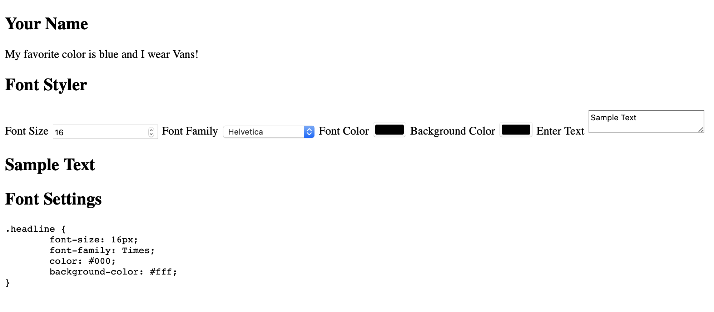

# Web 1.0 Final Assessment

This exercise is meant to assess the skills you have been developing in Web 1.0 this term. In it you will put many of the concepts from class into practice.

The assessment is open note. You can look up documentation, and refer to your notes from class. 

You should not ask another student the answer to any of the questions. This needs to be an honest and accurate assessment of your skills.

The assessment will be presented as a series of problems. Do your best to solve each in order. If you get stuck on one problem you can moveon to the next after giving a fair amount of effort.

## Submission 

Submit your work via gradescope. 

## Final Assessment 

The goal of the assessment is to make headline style generator. It will show some sample text and provide controls that allow you to set the text, set the foregraound and background color, choose a font, and set the size of the font. It will also show the CSS code to generate the headline. 

### Step 1 - HTML document

Create an html document. Be sure to include the following tags:

- doctype
- html
- head
- title
- body

In the title tag put your name and final - web 1.0 like this:

- You Name - Final - Web 1.0

### Step 2 - Sections and ids

Create 4 sections. Use the section tag or the div tag (your choice.)

An an id to each section, use these names: 

- `id="student-info"`
- `id="data-input"`
- `id="headline-display"`
- `id="data-output"`

### Step 3 - `#student-info`

In the #student-info section add the following tags: 

- `h1` - With your name
- `p` - My favorite color is (fill in a color) and I wear (your favorite shoe: Nike, Convere, Sandals, ?)  

### Step 4 - `#data-input`

You need some form elements these will go in the #data-input section. The goal is to make some inputs that will be used to style a headline. Each of the inputs will have a label.

Add a heading h1 with the text: 

- "Font Styler"

Create five inputs each **with an associated label**.

The five labels should be labeled:

1. Font Size 
2. Font Family
3. Font Color
4. Background Color
5. Enter Text

Within each of your labels you'll make a form element. Follow the guide below to create these element and set their attributes. 

1. Font Size - `<input>`
	- `id="input-size"` 
	- `type="number"`
2. Font Family - `<select>`
	- `id="select-font"`
	- add an `<option>` tag for each of the font names below: 
		- Helvetic
		- Arial
		- Times New Roman
		- Georgia
3. Font Color - `<input>`
	 - `id="input-color"`
	 - `type="color"`
	 - `value="#000"`
4. Background Color - `<input>`
	- `id="input-bg-color"`
	- `type="color"`
	- `value="#fff"`
5. Enter Text - `<textarea>`
	- `id="enter-text"`

### Step 5 -  `#headline-display`

The goal of this section is to display a headline and style it with what was input into the form elements.

Put an `<h1>` here with `id="display"`

### Step 6 - `#data-output`

The goal of this section is to display the CSS code that is styling the headline above. 

Use the pre and code tags here to show preformatted computer code. 

Here is a sample: 

```HTML
<pre><code>.headline {
	font-size: <span id="show-size">16</span>px;
	font-family: <span id="show-font">Times</span>;
	color: <span id="show-color">#000</span>;
	background-color: <span id="show-bg-color">#fff</span>;
}</code></pre>
```

## Take a Breather

So far you should have something like this: 



The next step is add some CSS Styles to arrange things in the browser. You might have to add some new markup or rearrange the markup you have, add class names etc. How you approach this section is up to you. 

### Step 7 - Layout 

Add a stylesheet to your document. You can do this in any way that makes sense to you.

### Step 8 - Arrange the page in two columns

The goal of this step is put the Your name and the input elements on the left and the headline display and code output on the right. 

Use Flexbox. Remember! when applying `display: flex` you're arranging the children. You may have to add some extra markup. You're main container needs to have two children one of which will be the left column and the other will the right column. 

### Step 9 - Use Flexbox to arrange the form elements

Use Flexbox to arrange the form element in a column. 

### Step 10 - Add some more styles 

Add a few styles for fun. I added some padding and border on the form eloements, and a border on the input and display. 

## Take another short break

At this stage you should have your page styled it might look close to this: 


### Step 11 - JavaScript

Add a script to yout project. You can do this with the script by either linking a .js file to your project or placing your code within the script tags. 

### Step 12 - 

Your goal is to set the color, background-color, font-family, and font-size of the #display text, and display these values in the mockedup CSS code in the #data-display section. 

First get define some variables for each of the elements, for example: 

```JS
// The headline element
const display = document.querySelector('#display')

// The input field for size
const inputSize = document.querySelector('#input-size')
// The element that displays the value 
const showSize = document.querySelector('#show-size')
// Repeat this for the input and "show" elements
```

Next you need to add an event listener that will listen for input events. In the handler function for the event set the style of the display to change the styles of the #display element. Then set the innerHTML of the #show elements to show the value in the code sample.

```JS
inputSize.addEventListener('input', handleInput)
```

Define a handler that sets style properties on the display element and displays those values in the code sample: 

```JS
function handleInput() {
	// get the font size:
	const fontSize = inputSize.value + 'px'
	// Set the style 
	display.style.fontSize = fontSize
	// Show the size
	showSize.innerHTML = fontSize
}
```

You need to repeat the process for the other properties: 

- font-size
- font-family
- color
- background-color

You also need to set the text of the #display element to the text that is entered into the textarea #enter-text. Take the value and set it as the innerHTML. 

When you're done you should be able to enter the: font-size, color, font-family, and background-color and the values entered should change the appearance of the headline element, and show the CSS code that might be used to create this headline.

## Stretch Goals 

- Add more styles. 
	- Imporve the look of the page over all. 
		- The font styles especial for the code example could use some work.
	- Place all of the content in the center.
- Add more properties 
	- Add another select that sets the font-weight values can be: bold, bolder, normal, and lighter. 
	- Add another select that sets the font-style values can be: normal, italic, oblique. 
	- Add an input type number. Use this for the letter-spacing property.
	- Add an input for padding.
