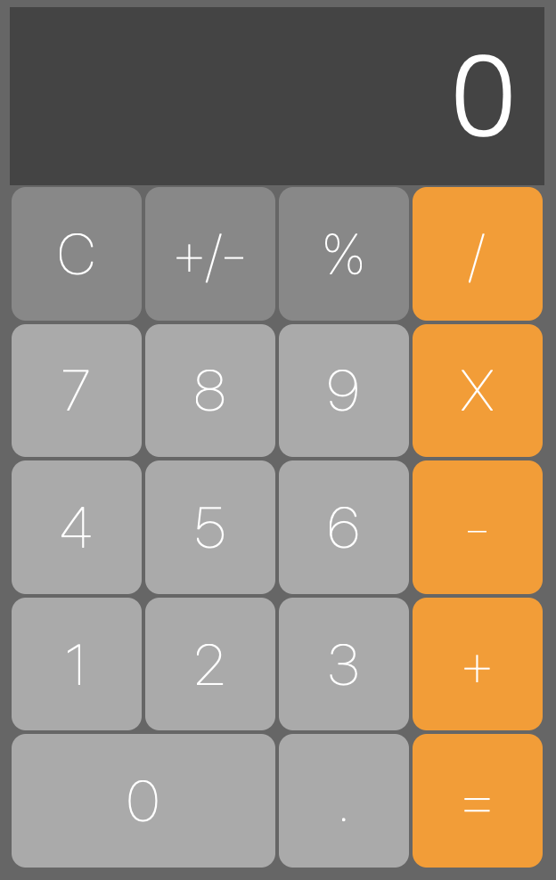

# HTML and CSS Assessment

You need to make a calculator. When Completed it should look like this: 

Your calculator should have a "display". The display would show the number/answer at the top. This can be a `
`, and 19 buttons. Use the `<button>` tag. 

Follow the challenges below in order. You get credit for each of the challenges you complete. 

## Calculator Markup

Write the HTML for the calculator. 

1. Create an HTML page with the base HTML markup. 
2. Create a `
` with the class name calculator. 
3. In `div.calculator` add a `
` with the class name 'display'
4. In `div.calculator` add 19 `<button>` tags. These will be the calculator buttons.

Button text: 

- **C**
- **+/-**
- **%**
- **/**
- **X**
- **-**
- **+**
- **=**
- **9**
- **8**
- **7**
- **6**
- **5**
- **4**
- **3**
- **2**
- **1**
- **0**
- **.**

## Calculator body styles

Give the body and html tags the style: 

- height 100%

The background color should be: 

- #666

The font color should be: 

- #fff

The font family should be: 

- Helvetica

Use Flex box on the body to center the `div.calculator`. Give the body tag these styles: 

- display flex
- justify content center
- align items center 

The body and html tags should have the height set to 100%. 

## Calculator div.calculator styles

Set the width and height of `div.calculator` to

- 300px 500px

## Calculator Display style

Give `div.display` the following styles: 

- font size 4em
- font weight 100
- text align right
- line height 100px
- padding top and bottom 0 
- padding top and bottom 0.25em
- background color #444

## Calculator Button styles 

The buttons should look like the picture. They need some styles. All the buttons share some styles and some styles are only used by some buttons. 

All buttons: 

- Border none
- margin 1px
- font size 2em
- font weight 100
- border radius 0.25em
- background color #aaa

The C, +/-, and % buttons should have a background color of #888. 

The /, X, -, +, and = buttons should have a background color of: #f90.

## Calculator layout 

The calculator needs to arrange the buttons as shown in the image. Notice `div.display` takes up the entire width of the grid, and the 0 button takes up two columns. 

Use CSS Grid. You'll need 4 equal (1fr) columns, and 4 rows, the first row should be 1em and the other rows equal (1fr).

You can map the elements to the grid spaces using grid template areas. You'll need to assign each button a grid area. 