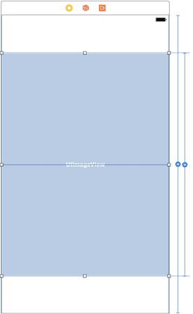
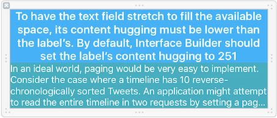
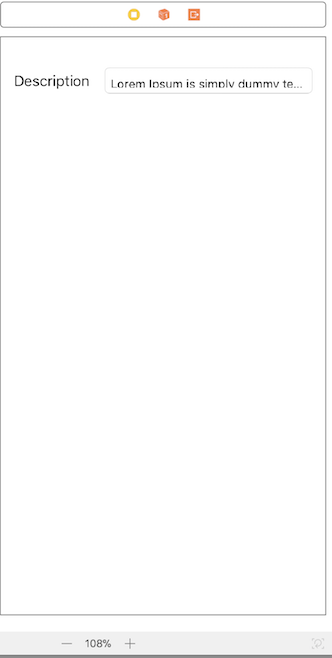
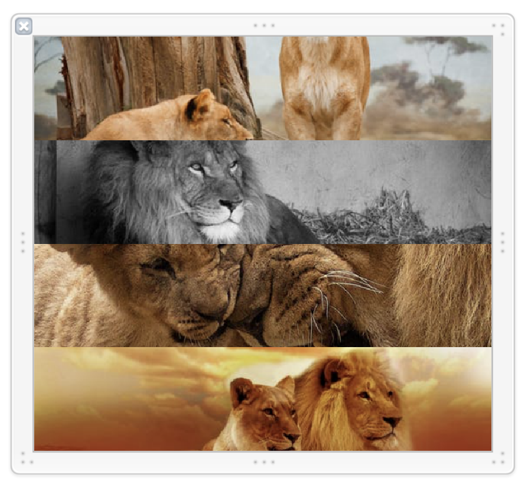
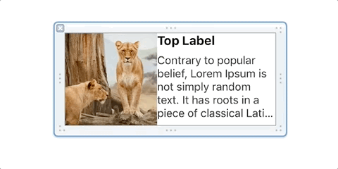

# Layout Essentials

## Objectives

In this lesson we will cover:
- Intermediate AutoLayout (Constraints, Content Hugging Priority, Content Compression Resistence Priority)
- UIStackViews

## Vocabulary
- Content Hugging Priority
- Content Compression Resistence Priority
- Equality contraints

## AutoLayout

### Recap: Constraints
They are a fomula that describe the relationship between objects in a view.

They are composed of a:

#### Constant
A constant offset

#### Priority
This is how important a containt is in relation to other constraints.
When you set this value to 1000, you are telling autolayout that this constraint is required. If autolayout cannot satify the constraint, it thows an error by breaking or excluding the constraint.
Values lower than 1000 tell autolayout that the constraint is optional

#### Multiplier

UIImageView's height constraint is = 0.75 * height of superview + 0 constant

## Content Sizing
### Intrinsic Content Size
Intrinsic content size is information that a view has about how big it should be based on what it displays.
An example is a UIImageView knows how big it should be based on the image it contains.
A UILabel knows what size it should be based on the text it contains.

The intrinsic content size of an item serves as input to autolayout.

### Constraint Priority
Constraints on both the horizontal and vertical axis have a priority attached to them(1000 initially).
The constraint priorty determine how important a constraint is in relation to other constraints; 1000 is a required constaint where 100 is low priority.
When there are autolayout conflicts, autolayout uses these values to resolve them.

### Content Hugging Priority(CHP)

This attribute is used when you want a view to resist growing larger than its intrinsic content size.

In this example the label's horizontal hugging priority is set to 250 while the Name label's is 251. This allows the textfield to stretch to fill its content before the Name label.

The content of the description also has a vertical priority of 250, while all the other components have 251.
This makes the content of the description expand to fill the remaining space in the view.

### Content Compression Resistence Priority (CCRP)

This is when you want a view to resist being smaller that it's intrinsic content size.

Bold Label CCRP

## CHP vs. CCRP
- You can define both either horizontally or vertically

- Content Compression - View with lower priority loses and grows, views with higher priority shrink to their intrinsic content size.

- Content Compression Resistance Priority - View with higher priority resists being shrunk, views with lower priority shrink first.

## Content Size Ambuiguity

Xcode throws an error when two or more views have the same CHP or CCRP. To fix this we need to change the CHP or CCRP of one of the views to satisfy the constraints.

## UIStackView
Layout mechanism similar to CSS Flexbox
Better than manual Auto Layout for dynamic layouts

Position of views in UIStackView is determined by:
- axis: horizontal | vertical
- distribution: fill | fill equally | fill proportionally | equal spacing | equal centering
- alignment: center | top | bottom | leading | trailing
- spacing: 10, 12 etc

Instead of using constraints, stack different
UIStackViews to build a layout.

### StackView Distribution Types
#### Fill

This is the default distribution type.
When you insert elements into a UIStackView with the distribution set to fill, it will keep all but one item at its intrinsic size and stretch it to fill the remaining space.
It determines the view to fill by the Content Hugging Priority (CHP). The view with the **lowest** CHP is stretched to fill the space in the UIStackView.

If all of your view in the UIStackView have the same CHP, Xcode will show an ambiguous layout error.

StackView Control

Banana Content Hugging Priority

Banana has a CHP of 250, Apples and Oranges have 251

#### Fill Equally

Each view in the UIStackView will have the equal size. The CHP does not matter with this type of distribution, because the views are of equal size.

#### Fill Proportionally

This distribution type will try to fill a UIStackView with the intrinsic content size of the elements in the StackView.

With Fill and Fill Equally, the StackView determines how large the elements are, with Fill Proportionally, the size of the elements are determined by the intrinsic size of its elements.

#### Equal Spacing

This distribution type will keep an equal spacing between each of the views but will not resize the views themselves.
It uses the intrinsic size of its views.

- --

#### Equal Centering

This type of distribution will divide the stackview according to the number of elements and place the elements

**Benefits**

- Layout is re-calculated when views are
hidden or added
- Try to build interface with UIStackView, add
explicit constraints only when necessary

## Discusssion
How does a stackview know how to size its components?

## Discussion

1. What is the intrinsic content size for a UIView?

## Challenges

Build the following in interface builder in Xcode. You can clone the repo below to get started.

[Intermediate AutoLayout Challenges Starter](https://github.com/Product-College-Labs/IntermediateAutoLayout)

1. A Label and a UITextField. Label has a minimum dimension and doesn't get squished. UITextField can grow to fill up the remaining space.

2. Same as (1) but the label has a higher priority for growing horizontally instead.

3. Stack the lions vertically and equally

4. Stack the lions vertially with the top lion bigger than the rest

5.Stack an image on the left and two vertically stacked labels on the right. The top label should grow before the bottom one(gets clipped).

6. Two UILabels stacked together. The top bold label is a multiline label, the bottom is only one line. When shrunk, the top label shrinks its text to accomodate.

