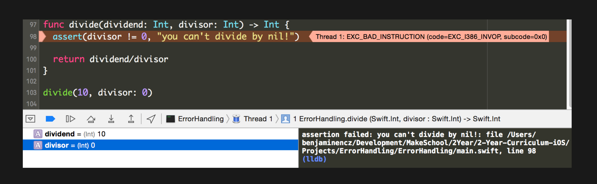

# Error Handling in Swift

### Objectives

- Review various methods for handling errors in swift
- Objective-C’s NSError
- Swift’s try/catch/throws
- Result<T, U> type
- Exceptions & Assertions

## Objective-C error handling

You are given the Error type
Fortunately most methods using this style of error handling have been bridge to use swifts try/catch mechanism

```objective-c
NSError *error = nil;

NSString *string = [NSString stringWithContentsOfFile:@"test.txt"
encoding:NSUTF8StringEncoding error:&error];

if (!string) {
    NSLog(@"File could not be read!");
}

if (error) {
    NSLog(@"%@", error.localizedDescription);
}
```

- Return value is most relevant for checking whether an operation was successful or not [1]
- Methods can return errors, but still successfully return a value 

### NSERROR in Objective-C… …in the sad real world

``` v
NSString *string = [NSString stringWithContentsOfFile:@"test.txt"
 encoding:NSUTF8StringEncoding error:nil];
 ```

## Swift Error Handling

Swift 2+ uses throws instead of NSError
Objective-C methods are bridged to Swift accordingly:


Functions marked with throws need to be handling 

### Calling Throwing functions

You need to choose one of these 4 approaches: 
1. Handle the error with a do/catch block
2. Use forced-try: try!
3. Use optional: try? - returns an optional value
4. Propagate the error further up the call stack by
declaring calling function as throws

```swift
// Option 1
do {
    let content = try String(contentsOfFile: “test.txt", encoding: NSUTF8StringEncoding)
} catch let error {
    print(error)
}

// Option 2
let content = try! String(contentsOfFile: “test.txt", encoding: NSUTF8StringEncoding)

// Option 3
let content: String? = try? String(contentsOfFile: “test.txt", encoding: NSUTF8StringEncoding)

// Option 4
func someFunc() throws {
    try String(contentsOfFile: "test.text", encoding: String.Encoding.utf8)
}

do {
    try someFunc()
} catch {
    
}
```

### Declaring Error types

How do you know which types of errors to catch?
Header documentation!
Unfortunately throws has no type information


### Defining Swift Error types

```swift
enum FileReadError: Error {
    case InvalidFilePath
    case InvalidEncoding
    case IncorrectFileFormat(actualFileFormat: String)
}
```

### Throwing Swift Error types

```swift
/**
- Returns: The content of the file
- Throws: `FileReadError.InvalidFilePath` if file could not be read;
 `FileReadError.InvalidEncoding` if file encoding does not match expected encoding;
 `FileReadError.IncorrectFileFormat` if file format does not match specified one
*/

func readFile(path: String) throws -> Data {
// ...
    throw FileReadError.InvalidFilePath
}

do {
    try readFile("test.txt")
} catch FileReadError.InvalidFilePath {
    print("Invalid filepath")
} catch FileReadError.InvalidEncoding {
    print("Invalid encoding")
} catch let FileReadError.IncorrectFileFormat(actualFileFormat) {
    print("Unexpected file format: \(actualFileFormat)")
} catch {
    print("Unhandled Error!")
}
 
```

## Limitations of Swift Error types

Errors don’t have type information

Error handling doesn’t work for asynchronous code

```swift
//1
func fetchUser(completion: @escaping (User) -> Void) {
    let request = URLRequest(url: URL(string: "https://www.google.com")!)
    let session = URLSession.shared()

    session.dataTaskWithRequest(request) { (data, response, error) -> Void in
    // error handling happens in callback
    let user = //myUser
        completion(user)
    }
}
// 2
func fetchUser(completion: (Void throws -> User) -> Void) {
    
}
```

### Result Type

Result type can represent value or error depending on result of operation

Can be used for synchronous and asynchronous code

```swift
func search(searchString: String) -> Result<Predictions, SearchError>
```

#### Producing Result Type

```swift
func fetchAllTrips(callback: Result<[JSONTrip], Reason> -> Void) {
// in case of success
    var trips: [JSONTrip] = [/*...*/]
    callback(.success(trips))

    // in case of error
    var reason: Reason = .NoData
    callback(.failure(reason))
}
```
 
#### Consuming Result Type

```swift
func handleSearchResult(result: Result<Predictions, Reason>) -> Void {
    switch result {
    case let .success(predictions):
        self.locations = predictions.predictions
    case .failure(_):
        self.errorHandler.displayErrorMessage(
            "The search returned an error, sorry!"
        )
    }
}
```

## Assertions & Exceptions

### Exceptions
Objective-C provides exceptions, Swift does not
Objective-C exceptions should not be caught, they are not intended for error handling
Exceptions are used to crash the app to make you aware of a programming error

### Assertions

Are used to state and verify assumptions
Typically only used at debug time
Objective-C: NSAssert…
Swift: assert, assertionFailure,
fatalError,…

)


## Summary

- Swift uses Error and throws for error handling

- Swift error handling has limitations (no type info, not suitable for async code) - Result type is a good alternative

- Exceptions and assertions are used for
unrecoverable errors

## Resources

[Benjamin Encz Error Handling](http://blog.benjamin-encz.de/post/swift-error-handling-and-objective-c-interop-in-depth)

[Asynchronous error handling](http://alisoftware.github.io/swift/async/error/2016/02/06/async-errors/)