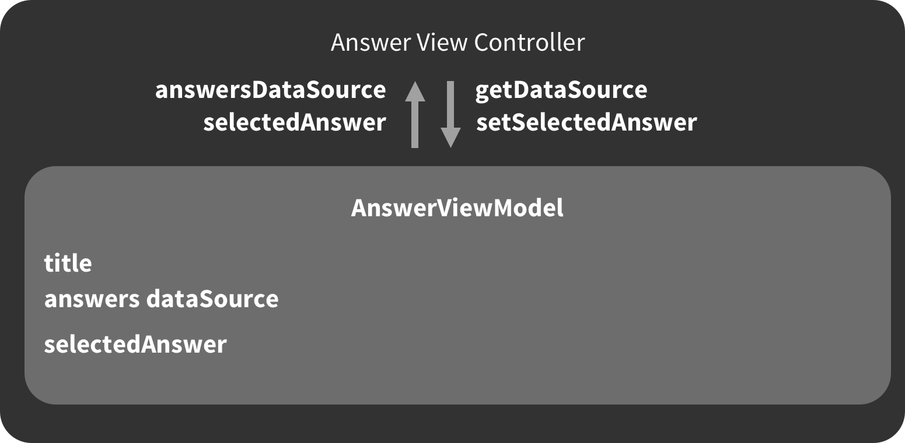

# Architecting your iOS App

### Objectives
 - Benefits/Goals of software architecture
 - Design guidelines
 - Practical tips
 
## Benefits/Goals of software architecture
 - Code is easy for other developers and yourself to comprehend
 - Can adopt to changing requirements
 - Can be reused and shared with other projects
 - Manages complexity
 - Over a long period of time, it saves you time because its easy to make changes
 

## Design Guidelines
### Think in Domains not in Objects


#### Better Architecture (Domain separation)


### Single Responsibility Principle

- A class/object/struct/domain should only do one thing

### Encapsulate

- Every component should know as little as possible
about its surrounding components.
- Provide limited interfaces for components
- Reduces dependencies between components
- Makes it easier to replace components
- Eg. AnswerViewController only binds data from ViewModel, it knows nothing about the data, the ViewModel knows nothing about the view it is binding its data to, it only provides data.



### Avoid the Massive View Controller

- Bad View Controller handles: Persistence, Business
Logic, View Logic, etc.


### Things a View Contoller should do
- Listen to callbacks from the View 
- Invoke methods on the business/application layer
- Send responses from business/application layer back to the view

### Things a View Controller should not do
- Construct complex network requests
- Construct complex database queries
- Take care of object serialization / deserialization

## Practical Tips
### Use View / View Model objects

View objects encapsulate multiple properties that are
relevant for a type to be displayed by a custom view
This is preferred over setting individual properties from
outside the view

```swift
class AnswerCell: UICollectionViewCell {
    @IBOutlet var nameLabel: UILabel!
    @IBOutlet var profilePictureImageView: UIImageView!
    @IBOutlet var questionLabel: UITextField!

     var answerCellViewModel: AnswerCellViewModel? {
     didSet {
     nameLabel.text = answerCellViewModel?.name
     profilePictureImageView.image = answerCellViewModel?.profilePicture
     questionLabel.text = answerCellViewModel.question
 }
```

This allows you to prepare/format all the data nessasary to be displayed by the AnswerCell.
Eg, format dates, format string(bold, italics etc) with NSAttributedString etc.

```swift

let answerCellViewModel = AnswerCellViewModel(
    name: "Eliel Gordon", 
    profilePicture: profilePicture, 
    question: "This is a question"
)

cell.answerCellViewModel = answerCellViewModel
```

### Bad example
```swift
class AnswerCell: UICollectionViewCell {
    @IBOutlet var nameLabel: UILabel!
    @IBOutlet var profilePictureImageView: UIImageView!
    @IBOutlet var questionLabel: UITextField!
}

func cellForItem(at indexPath: IndexPath) -> UICollectionViewCell? {
    //....
    let answer = Answer()

    answerCell.nameLabel.text = "\(answer.sender.firstName)" + "\(answer.sender.lastName)"
    answerCell.questionLabel.text = answer.question.content
    //...
```


Whoever owns the answerCell now knows about the nameLabel and questionLabel of the answerCell

### Encapsulate business logic


## Summary

- Divide code into logical domains
- Strive for each unit of code having a single responsibility
- Define narrow and expressive APIs that hide
- Implementation details of other units of code and
- Reduce dependencies between your units
- Write code that is easy to delete, not to reuse
 
## Resources

[Refactor the Mega-Controller](https://vimeo.com/140037432)

[Protocol Oriented Programming](https://realm.io/news/appbuilders-natasha-muraschev-practical-protocol-oriented-programming/)


# Next [Dependency - Management](../03-Dependency-Management/Readme.md)