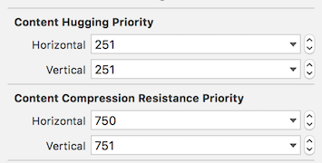
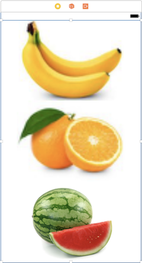

# Layout Essentials

### Objectives

- AutoLayout (Constraints, Content Hugging Priority, Content Compression Resistence Priority)
- UIStackView
- UIScrollView
- UITableView
- UICollectionView

## AutoLayout

### Constraints
They are a fomula that describe the relationship between objects in a view.

They are composed of a:

#### Constant
A constant offset
    
#### Priority
This is how important a containt is in relation to other constraints.
When you set this value to 1000, you are telling autolayout that this constraint is required. If autolayout cannot satify the constraint, it thows an error by breaking or excluding the constraint.
Values lower than 1000 tell autolayout that the constraint is optional

#### Multiplier

UIImageView's height constraint is = 0.75 * height of superview + 0 constant

## Content Sizing
### Intrinsic Content Size
Intrinsic content size is information that a view has about how big it should be based on what it displays.
An example is a UIImageView knows how big it should be based on the image it contains. 
A UILabel knows what size it should be based on the text it contains.

The intrinsic content size of an item serves as input to autolayout.

### Constraint Priority
Constraints on both the horizontal and vertical axis have a priority attached to them(1000 initially).
The constraint priorty determine how important a constraint is in relation to other constraints; 1000 is a required constaint where 100 is low priority.
When there are autolayout conflicts, autolayout uses these values to resolve them. 

### Content Hugging Priority(CHP)

This attribute is used when you want a view to resist growing larger than its intrinsic content size.

 

In this example the label's horizontal hugging priority is set to 250 while the Name label's is 251. This allows the textfield to stretch to fill its content before the Name label.

The content of the description also has a vertical priority of 250, while all the other components have 251.
This makes the content of the description expant to fill the remaining space in the view.

### Content Compression Resistence Priority (CCRP)

This is when you want a view to resist being smaller that it's intrinsic content size.

Bold Label CCRP

## CHP vs. CCRP
- You can define both either horizontally or vertically

- Content Compression - View with lower priority loses and grows, views with higher priority shrink

- Content Compression Resistence Priority - View with higher priority resists being shrunk, views with lower priority shrink first.

## UIStackView
Layout mechanism similar to CSS Flexbox
Better than manual Auto Layout for dynamic layouts

Position of views in UIStackView is determined by:
- axis: horizontal | vertical
- distribution: fill | fill equally | fill propriotionally | equal spacing | equal centering
- alignment: center | top | bottom | leading | trailing
- spacing: 10, 12 etc

Instead of using constraints, stack different
UIStackViews to build a layout.

### StackView Distribution Types
#### Fill

This is the default distribution type.
When you insert elements into a UIStackView with the ditribution set to fill, it will keep all but one item at its intrinsic size and strech it to fill the remaining space.
It determines the view to fill by the Content Hugging Priority (CHP). The view with the **lowest** CHP is stretched to fill the space in the UIStackView.

If all of your view in the UIStackView have the same CHP, Xcode will show an ambiguous layout error.

StackView Control

Banana Content Hugging Priority

Banana has a CHP of 250, Apples and Oranges have 251

#### Fill Equally 

Each view in the UIStackView will have the equal size. The CHP does not matter with this type of distribution, because the views are of equal size.

#### Fill Proportionally

This distribution type will try to fill a UIStackView with the intrinsic content size of the elements in the StackView.

With Fill and Fill Equally, the StackView determines how large the elements are, with Fill Proportionally, the size of the elements are determined by the intrinsic size of its elements.

#### Equal Spacing

This distribution type will keep an equal spacing between each of the views but will not resize the views themselves.
It uses the intrinsic size of its views.

- --

#### Equal Centering

This type of distribution will divide the stackview according to the number of elements and place the elements 

**Benefits**

- Layout is re-calculated when views are
hidden or added
- Try to build interface with UIStackView, add
explicit constraints only when necessary

## Discusssion
How does a stackview know how to size its components?

## UIScrollView

Allows to display content that is larger than screen size User can scroll,
zoom, etc to view the entire content

UITableView and UICollectionView use UIScrollView internally

## UITableView

Use for list content, where amount of elements could be arbitrary large.
Ideal for uniform content.

## UICollectionView

Similar to UITableView but provides flexible, non-linear layout

- Provides default flow layout

- Allows to implement custom layouts

- Layout encapsulates logic for sizing and animating the cells

## Discussion

1. What is the intrinsic content size for a UIView?
1. When should we use UITableView? UICollectionView or UIScrollView?

# Next - [Working with AVFoundation](../09-Working-with-AVFoundation-Playing-Videos/Readme.md)