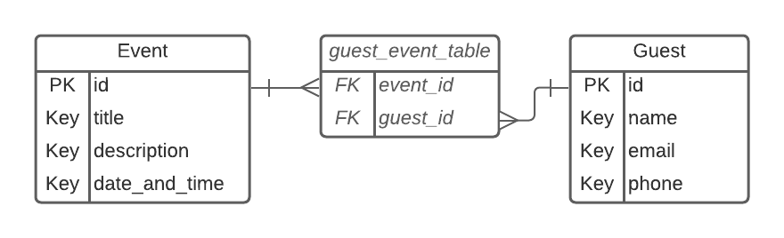

# Homework 2: Events Site

## Purpose (Why should I do this?)

This project will allow you to practice the basics of creating SQLAlchemy models and using them to construct a small web application!

If you have trouble with this assignment, I would highly recommend completing the [SQLAlchemy Models Lab (Books)](https://github.com/Make-School-Labs/BEW-1.2-Models-Lab) which will guide you through step-by-step and show examples of creating and using models and relationships.

Scoring for this project is as follows:

| Score | Rating | Correctness | Code Quality |
| :---: | :----: | :---------: | :----------: |
| **1** | **Needs Improvement** | Required sections of submission are largely missing or not functional. | Code is messy and hard to follow. Code includes TODOs or does not include docstrings for most routes. |
| **2** | **Basic** | Most routes are functional, but a few may be hard-coded or incorrect. | Some routes have code that is messy and hard to follow. Some routes do not include docstrings. |
| **3** | **Proficient** | All routes are functional and produce the expected result. | Code is clear and easy to follow. Submitted code does not include TODOs. Nearly all functions have docstrings. |
| **4** | **Advanced** | Stretch challenges are complete and demonstrate an advanced understanding of the concepts presented. | Code is extensible and may utilize helper functions, classes, or advanced data structures to aid in readability. |

## Setup

Clone the [starter code](https://github.com/Make-School-Labs/BEW-1.2-Events-Homework) and follow the instructions in the README to get started on this project.

## Instructions

You've been commissioned to build out a small event-handling app. Unfortunately, the last developer quit before they finished it, and there's quite a lot to be done!

### Models

The first step here is to create the models we'll use throughout this project. To get an idea of what they should look like, here is an Entity Relationship Diagram of `Event` and `Guest`:

**Navigate to `events_app/models.py` and complete the TODOs to create the model classes.**

### Routes & Templates

Navigate to `events_app/routes.py` and take a look at the existing routes, as well as their corresponding templates. They are:

- `index` and `templates/index.html`: Shows a list of all events
- `create` and `templates/create.html`: Shows a form to create an event, and accepts a `POST` request to create an event
- `event_detail` and `templates/event_detail.html`: Shows the details of a single event, as well as the form to RSVP
- `rsvp`: Accepts a `POST` request with the user's information, and adds them to the event's attendees
- `guest_detail` and `templates/guest_detail.html`: Shows the details for a single guest, and the events they've RSVP'd to

**Complete the TODOs in `routes.py` as well as in the templates** to complete the app's functionality.

## Stretch Challenges

For more practice using SQLAlchemy, check out the [Flask-Django Independent Study Rookie Materials](https://github.com/flask-django-independent-study/rookie) put together by Sid & Starlight! :)

## Resources

- [SQLAlchemy Relationship Patterns](https://docs.sqlalchemy.org/en/13/orm/basic_relationships.html) - A comprehensive guide on how to construct models with One-to-Many, One-to-One, and Many-to-Many relationships.
- [Declaring Models](https://flask-sqlalchemy.palletsprojects.com/en/2.x/models/) - A shorter, but still useful guide.
- [Filter Operations](https://www.tutorialspoint.com/sqlalchemy/sqlalchemy_orm_filter_operators.htm)
- [Getting Started with Flask-SQLAlchemy [VIDEO]](https://www.youtube.com/watch?v=jTiyt6W1Qpo) - Short, to-the-point guide to get you started
- [Full-Featured Web App Tutorial [VIDEO]](https://www.youtube.com/watch?v=MwZwr5Tvyxo&list=PL-osiE80TeTs4UjLw5MM6OjgkjFeUxCYH) - A longer project, but provides a lot of context on how various concepts fit together.

## Submission

Submit your assignment using [Gradescope](https://gradescope.com).
