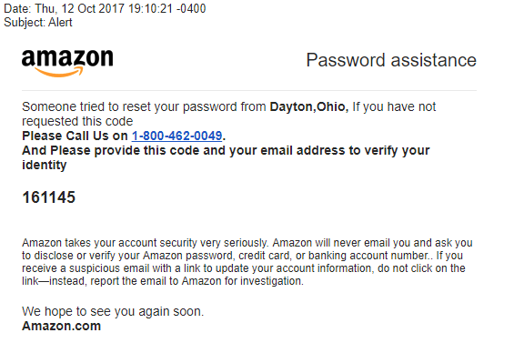

# 📜 Day 1: How to Hack a Human

<!-- omit in toc -->
## ⏱ Agenda

1. [🏆 Learning Objectives](#%F0%9F%8F%86-learning-objectives)
1. [📖 Overview](#%F0%9F%93%96-overview)
1. [💻 Activity: I Want Netflix](#%F0%9F%92%BB-activity-i-want-netflix)
1. [Examples of Social Engineering](#examples-of-social-engineering)
   1. [Tailgating](#tailgating)
   1. [Quid Pro Quo + Baiting](#quid-pro-quo--baiting)
   1. [Pretexting](#pretexting)
1. [Activity: Defense!](#activity-defense)
1. [🌴 BREAK](#%F0%9F%8C%B4-break)
1. [Activity: Social Engineering for Good](#activity-social-engineering-for-good)
1. [🌃 After Class](#%F0%9F%8C%83-after-class)
1. [📚 Resources & Credits](#%F0%9F%93%9A-resources--credits)

## 🏆 Learning Objectives

By the end of this lesson, you should be able to...

1. Understand what social engineering is, and how to recognize it in the wild
1. Apply social engineering skills in order to better understand and defend against them

## 📖 Overview

**How many of you have received an email similar to this one:**

Would you trust this? People are tricked by emails like this every day. This is an example of **phishing**, or tricking people into giving away their private information to you by pretending to be something you're not (i.e. Amazon).

Phishing is an example of a **Social engineering** attack. In a nutshell, social engineering is the act of manipulating people into giving you access to their systems and information.

Social Engineering is probably the most common and most successful type of attack, and it often doesn't require a computer or code!

## 💻 Activity: I Want Netflix

**Scenario:** Your friend's roommate has their own Netflix account, and you _desperately_ want to see the new season of Black Mirror. You've been wanting to have a day of binge-watching for weeks, but you don't have Netflix! The password is heavily protected, and you _just_ started BEW 2.3, so you don't know other ways of obtaining it yet.

**Goal:** Figure out a way to get the password from the friend's roommate without coding. Devise a social engineering attack!

**Instructions:** Come up with your own attack, then pair up with someone and discuss each other's attacks. We'll come together and discuss some of the ideas that you all came up with!

## Examples of Social Engineering

### Tailgating

**Tailgating** is when you gain access to an authorized area when you don't actually belong there.

Often all you need for this is confidence and the right attire. Check out this [short VICE article](https://www.vice.com/en_au/article/mgv4gn/chalecos-reflectantes-entrar-gratis) about two guys in Australia who got into a movie theater, zoo, and Coldplay concert just by wearing Hi-Vis safety vests!

### Quid Pro Quo + Baiting

**Quid Pro Quo** is when you trade a service (or pretend to, at least) for information. The canonical example is when someone impersonates an IT support person who then installs a "virus protector" that just steals the user's information without their knowledge.

**Baiting** is similar to Quid Pro Quo, but you are exchanging _goods_ instead of a service, such as giving the target free video games in exchange for credentials. Another famous form of this attack is a [USB Drop](https://www.redteamsecure.com/usb-drop-attacks-the-danger-of-lost-and-found-thumb-drives/) where there can be malicious code, or baits the victim into entering their credentials for a service/website.

### Pretexting

**Pretexting** is when you create a fabricated scenario in order to trick the victim into giving away personal information. An example would be someone calling you pretending to be the IRS and asking for your social security number over the phone.

## Activity: Defense!

Get in groups of 4 and discuss how you would defend yourself against the types of social engineering attacks (Phishing, tailgating, quid pro quo/baiting, pretexting) we've discussed so far.

Then discuss how you'd help your _grandparent_ defend against these attacks.

After, we'll come together to share our findings as a class

## 🌴 BREAK

## Activity: Social Engineering for Good

With a partner, invent a social engineering hack. It must have a goal. You are trying to get someone to do something or give you something.

For the purpose of this activity, you are not allowed to do anything "evil". No one get's hurt or loses more than $1.

Bonus points for getting person or people to do something nice or beneficial for someone else.

## 🌃 After Class

Try your social engineering (for good) hack in the wild and report on your findings!

## 📚 Resources & Credits
- [Kevin Mitnick on Social Engineering](https://www.youtube.com/watch?v=ScRl8Gudt-4)
- [Brian Brushwood - Social Engineering - How to Scam Your Way into Anything](https://www.youtube.com/watch?v=yY-lMkeZVuY)
- [The Art Social Engineering](https://www.youtube.com/watch?v=WrdrwiTlVoo&frags=wn)
- [Live hack and social engineering at DEF_CON](https://www.youtube.com/watch?v=DB6ywr9fngU)
