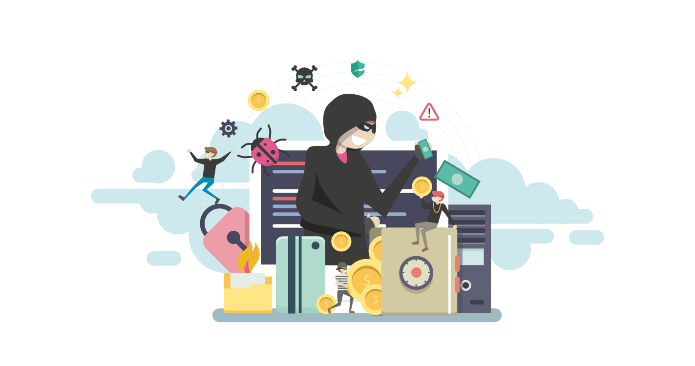

   

# BEW 2.3: Intro to Web Security

## Course Description

_This course covers key concepts in internet data security and best practices for keeping information safe. Students will examine historical hacks, learn how to analyze websites and web architectures for classical security vulnerabilities, and learn how to defend against security attacks._

## Prerequisites

- [BEW 1.2](https://make.sc/bew1.2)

## Course Specifics

**Course Delivery**: online | 7 weeks | 14 sessions 
**Course Credits**: 3 units | 37.5 Seat Hours | 75 Total Hours

## Learning Outcomes

By the end of the course, you will be able to&hellip;

1. Confidently talk about different types of vulnerabilities within the security space.
2. Defend against  vulnerabilities and attacks.
3. Apply web security best practices to your projects.
4. Understand and utilize adversarial security techniques.
5. Use practical techniques for securing applications and web servers.

## Schedule

**Course Dates:** Monday, March 29 through Wednesday, May 12, 2021 _(7 weeks)_ 
**Class Times:** Monday &amp; Wednesday at 9:30am to 12:15pm _(13 class sessions)_

| Class |     Date     |  Security Category   | Topic                                                    |
| :---: | :----------: | :------------------: | -------------------------------------------------------- |
|   1   | Mon, Mar 29  | _Social Engineering_ | **[Lesson 1]: How to Hack a Human** |
|   -   | Wed, Mar 31 |  **No Class - Cesar Chavez**                                |
|   2   | Mon, Apr 5  |      _Culture_       | **[Lesson 2]: Historic Hacks / Ethical Hacking**         |
|   3   | Wed, Apr 7  |        _Web_         | **[Lesson 3]: Server-Side Vulnerabilities**              |
|   4   | Mon, Apr 12  |        _Web_         | **[Lesson 4]: Securing Data: Sanitization & Validation** |
|   5   | Wed, Apr 14  |        _Web_         | **[Lesson 5]: Client-Side Vulnerabilities**              |                                |
|   6   | Mon, Apr 19  |    _Operational_     | **[Lesson 6]: You've Been Hacked. What Do?**             |
|   7   | Wed, Apr 21 |        _Web_         | **[Lesson 7]: Cryptography**              |
|   8   | Wed, Apr 26 |        _Web_         | **[Lesson 8]: Encryption** |
|   9   | Wed, Apr 28 |      _Network_       | **[Lesson 9]: OWASP Top 10** |
|  10   | Mon, May 3 |    _Operational_     | **[Lesson 10]: DDoS**                        |
|  11   | Wed, May 5 |      _Computer_      | Lab Day |
|  12   |  Mon, May 10  | _1-1 w/ Dani_ | Prepare Study Guide / Mock Interviews   |
|  13   |  Wed, May 12  | _1-1 w/ Dani_ | **Interview Day :one:** _(Surnames `N` - `Z`)_ |

## Class Assignments

We will be using [Gradescope] this term, which allows us to provide fast and accurate feedback on your work. All assigned work will be submitted through [Gradescope], and assignment and exam grades will be returned through [Gradescope]. As soon as grades are posted, you will be notified immediately so that you can log in and see your feedback. You may also submit regrade requests if you feel we have made a mistake.

Your [Gradescope] login is your Make School email, and your password can be changed at [https://gradescope.com/reset_password](https://gradescope.com/reset_password). The same link can be used if you need to set your password for the first time.

### Tutorials

| Name | Description | Due Date |
| ---- | ----------- | -------- |
| [NSE 1: The Threat Landscape] | _TODO_ | **Due 04/19 @ 11:59PM** |
| [NSE 2: The Evolution of Cybersecurity] | _TODO_ |  **Due 05/05 @ 11:59PM** |

### Challenges

| Name | Description | Due Date |
| ---- | ----------- | -------- |
| [Historic Hacks Presentation] | _TODO_ |  **Due 04/05 @ 11:59PM** |
| [Social Engineering] | _TODO_ |  **Due 04/07 @ 11:59PM** |
| [Jinja SSTI Exploits] | _TODO_ |  **Due 04/14 @ 11:59PM** |
| [Steganography] | _TODO_ |  **Due 04/30 @ 11:59PM** |
| [Juice Box] | _TODO_ |  **Due 05/10 @ 11:59PM** |

## Evaluation

To pass this course you must meet the following requirements:

- The certificate earned at the end of each [tutorial](#tutorials) must be turned in on [Gradescope].
- Complete and pass all in class [challenges and assignments](#challenges) on [Gradescope].
- Attend and pass a final Course Reflection interview with the instructor.
- Actively participate in class and abide by the attendance policy.
- Make up all classwork from all absences.

## Information Resources

Any additional resources you may need (online books, etc.) can be found here. You can also find additional resources through the library linked below:

- [make.sc/library](http://make.sc/library)

## Make School Course Policies

- [Program Learning Outcomes](https://make.sc/program-learning-outcomes) - What you will achieve after finishing Make School, all courses are designed around these outcomes.
- [Grading System](https://make.sc/grading-system) - How grading is done at Make School
- [Code of Conduct, Equity, and Inclusion](https://make.sc/code-of-conduct) - Learn about Diversity and Inclusion at Make School
- [Academic Honesty](https://make.sc/academic-honesty-policy) - Our policies around plagerism, cheating, and other forms of academic misconduct
- [Attendance Policy](https://make.sc/attendance-policy) - What we expect from you in terms of attendance for all classes at Make School
- [Course Credit Policy](https://make.sc/course-credit-policy) - Our policy for how you obtain credit for your courses
- [Disability Services (Academic Accommodations)](https://make.sc/disability-services) - Services and accommodations we provide for students
- [Online Learning Tutorial](https://make.sc/online-learning-tutorial) - How to succeed in online learning at Make School
- [Student Handbook](https://make.sc/student-handbook) - Guidelines, policies, and resources for all Make School students

[Gradescope]: https://gradescope.com
[Lesson 1]: Lessons/SocialEngineering.md
[Lesson 2]: Lessons/EthicalHacking.md
[Lesson 3]: Lessons/ServerSideExploits.md
[Lesson 4]: Lessons/Sanitization.md
[Lesson 5]: Lessons/ClientSideExploits.md
[Lesson 6]: Lessons/IncidentResponse.md
[Lesson 7]: Lessons/Cryptography.md
[Lesson 8]: Lessons/Encryption.md
[Lesson 9]: Lessons/OWASP.md
[Lesson 10]: Lessons/DDoS.md
[Lesson 11]: Lessons/Drills.md
[NSE 1: The Threat Landscape]: https://training.fortinet.com/course/view.php?id=1406
[NSE 2: The Evolution of Cybersecurity]: https://training.fortinet.com/course/view.php?id=2271
[Historic Hacks Presentation]: Lessons/EthicalHacking.md#%f0%9f%92%bb-40m-activity-historical-hacks-research
[Social Engineering]: Lessons/SocialEngineering.md#activity-social-engineering-for-good
[Jinja SSTI Exploits]: Lessons/ServerSideExploits.md#%f0%9f%92%bb-60m-in-class-activity-ssti
[Steganography]: Lessons/Cryptography.md#35m-%f0%9f%92%bb-activity-decoding-a-secret-message
[Juice Box]: Lessons/OWASP.md#60m-%f0%9f%92%bb-activity-juice-shop
