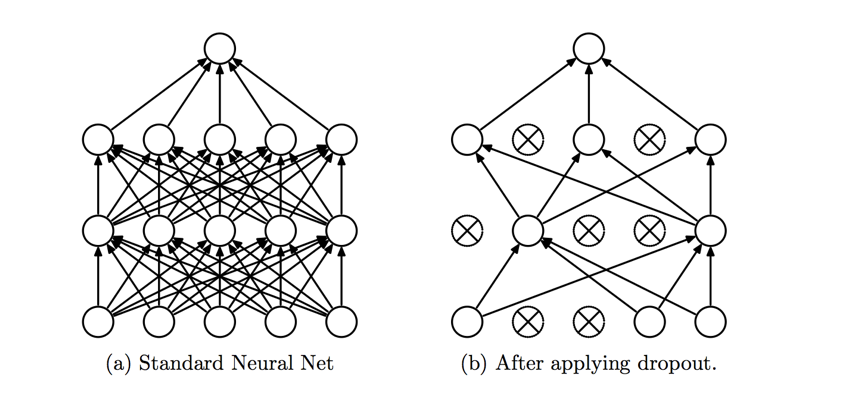

## Learning Objectives
- What is activation function in Neural Network
- What is loss (cost function) in Neural Network
- What is batch and epoch

## Deep Learning Glossary

- We will learn about deep learning components and terminologies

### Activation Function

- To allow Neural Networks to learn complex decision boundaries
- we apply a nonlinear activation function to some of its layers
- Commonly used functions include:
    - softmax, sigmoid, tanh, ReLU (Rectified Linear Unit) and variants of these
```python
model = Sequential()
model.add(Dense(1, activation='sigmoid', input_dim=x.shape[1]))
```
### Loss Function (Cost Function)

- When we build a neural network, the neural network tries to predict the output as close as possible to the actual value

- For prediction type problem the cost functions are:

    - MSE, MAE, ...
    - `model.compile(optimizer='rmsprop', loss='mse')`

- For classification type problem the cost functions are:

    - Categorical Cross-Entropy, Binary Cross-Entropy
    - `model.compile(optimizer='rmsprop', loss='binary_crossentropy')`


### Algorithms (or Optimization Methods) to Minimize Error

- Gradient Descent: To think of it intuitively, while climbing down a hill you should take small steps and walk down instead of just jumping down at once. Therefore, what we do is, if we start from a point x, we move down a little i.e. delta h, and update our position to x-delta h and we keep doing the same till we reach the bottom

- Stochastic gradient descent (SGD)

- Learning rate: Both GD and SGD need learning rate to adjust the new weight

    - w1_new= w1 + (learning rate)* (derivative of cost function wrt w1)

    - RMSprop, Adagrad, Adadelta, Adam, Adamax, Nadam


### Dropout

- Dropout is a regularization technique for Neural Networks that prevents overfitting

- `model.add(Dropout(0.25))`



### Epoch and Batch

- Epoch is when an ENTIRE dataset is passed forward and backward through the neural network

    - `model.fit(x, y, epochs=10, validation_data=(x_val, y_val))`

- Batch is number of samples per gradient update

    - `model.fit(x, y, batch_size=2, epochs=10)`

## Activity: Apply NN with Keras on iris data

- Use 100 samples for training and 50 samples for validation

- Set the value of epoch to 5

- Change the `batch_size` value from 1 to 100 and plot the accuracy versus batch_size

- Change the `verbose` to 0, 1 and 2

## Activity: Apply Lambda Layer in Keras and test how it works

- Write a code that takes a array with size 3 and apply a Lambda Layer in Keras to double the arrays elements

```python
from keras.layers import Lambda, Input
from keras.models import Model

import numpy as np

input = Input(shape=(3,))
double = Lambda(lambda x: 2 * x)(input)

model = Model(input=input, output=double)
model.compile(optimizer='sgd', loss='mse')

data = np.array([[5, 12, 1]])
print(model.predict(data))
```
### Batch Normalization

- Batch Normalization is a technique that normalizes the data even at hidden layers

- `model.add(BatchNormalization())`


