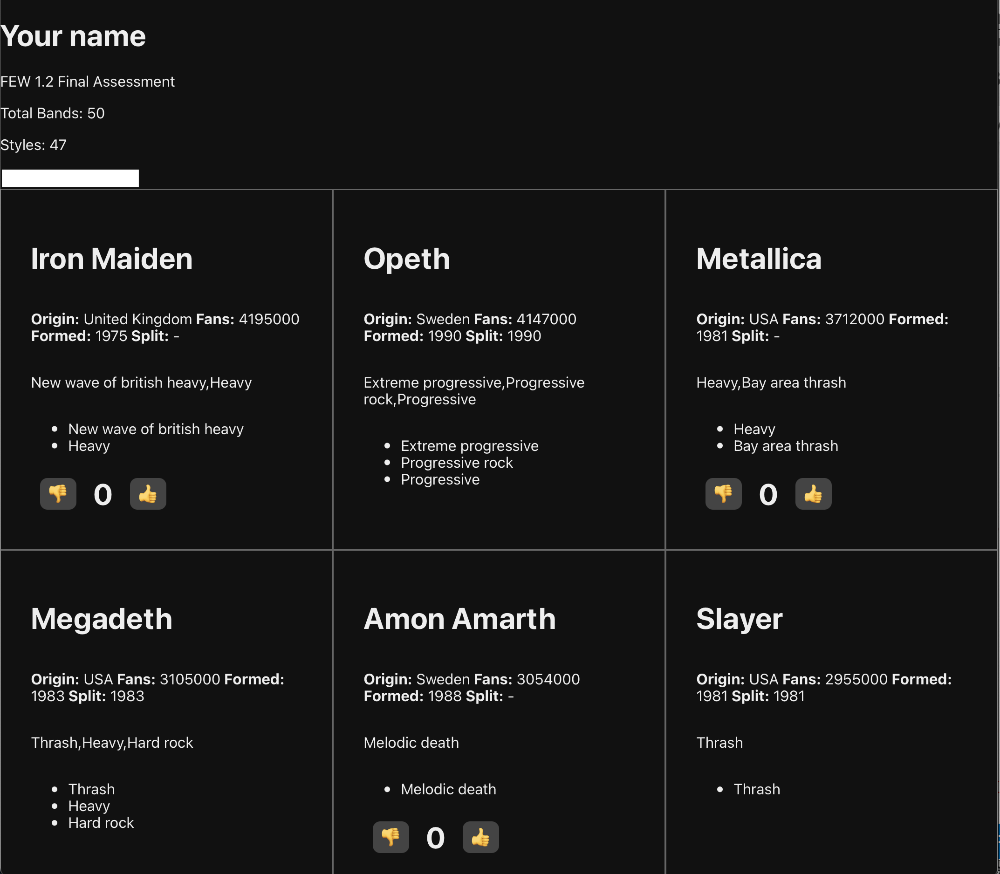

# Assessment

These challenges are a tool to measure the skills you developed this term.  

Your goal is to make a project with React, load data from a JSON file, create and display components, use state, and use Array.map to create a collection of components.

Here is a screen shot of what you will be building. What you make should similar but doesn't need to look exactly like it. 

## Challenges 

### Challenge 1: Make a React project

Create a React Project. Use create react app to generate your starter code. 

I should be able to run your project with `npm start` or `yarn start`.

Name your project with your name and few 1.2:

`{name}-few-1-2-final`

(You can't have any special characters or spaces in the name)

### Challenge 2: Making Simple Components JSX

Create a new component. Make a new file `Heading.js` and write your component code here. 

This will be a heading with a your name and the name of the assignment. Your component should display: 

- FEW 1.2 Final Assessment
- {Your name}

(Don't forget to export your component)

Import and display your `<Heading>` component in `App.js`.

### Challenge 3: Components and JSON

Create a component that displays information about the data as a whole. Name this component: `MetalMeta.js`

Import the `metal.json`. You can do this by adding the file to your **`src`** directory and using:

`import data from './metal.json'`

This JSON file contains an array of objects, each of which describes a metal band 🤘. 

Display the number of bands at the top of the page. Display the count something like:

- Metal Bands 🤘
- Bands: {#}

Get the number of bands from the length of the data array.

### Challenge 4: Components and Props

The goal of this step is to display all of the bands in the data array. But first you need to make a component that will display a single band. This component will use props that set the values it displays. 

Use a component to display each band. This `<Band>` component should display the band data from props and display the following: 

- {Band_name}
- Formed: {formed}
- {origin}
- Fans: {fans}

(Don't for get to export your component!)

### Challenge 5: Displaying a list

In App.js you'll display a list of bands. Use the Band component you made in the previous step. 

The goal is to display a list of Bands, use the `<Band>` Component you created in the previous step. 

Use `Array.map()` to transform the array of bands objects into an array of `<Band>` components. Dipslay this array in your `App` component.

Set the props on your band component so it can display the name, formed date, origin, and fans.

Be sure to add a key prop to each Band component with a unique value. You can use the band name since these are unique. 

### Challenge 6: Component State

Make a `<Like>` component. This component will track a like count. It will have two buttons, one button to increase the count, and the other to decrease the count, it should also display the count.

This component will increment by one with each count and do this with state.

### Challenge 7: Composing with Components

Add a `<Like>` component to your Band component. Each Band should now display the like count and have an up and down vote button that chnages the count.   

### Challenge 8: Styling Components

Style your Components. Create a stylesheet for each of the components you created and link that to the component.

Alternatively you can style your components using inline styles and a JS style Object.

You don't have to spend much time on styling. Add enough styles where I can tell that you styled the components.

### Challenge 9: Display Bands in Grid

Display all of the bands in a grid. Use three columns. 

### Challenge 10: Conditional Rendering

Not all of the bands are still together. The band objects have a `"split"` property. If the value is `'-'` the band is still together, otherwise the value is the year the band split up. 

Your goal is to only display the `<Like>` component for bands that have NOT split. For bands that have split display the year they split in place of the `<Like>` Component.

Here is one way to handle this problem. 

- Make two copies of the Band component: Band and BandSplit
- When you are mapping your band data look at the band.split value. If split === '-' return the Band component, else return a BandSplit component. 

### Stretch Challenges

1) Add an input field that allows us to search for bands by their band name. 

Extra stretch: Also search by style.

2) The number of fans is in thousands. Multiply the fans by 1000 and format the number with commas. For example: 

4147 would become: 4,147,000

Hint! use `someNumber.toLocaleString('en')`. For example: `(1000000).toLocaleString('en')` should return `"1,000,000"`.

3) Display the styles in the `<Band>` component as a list. To do this you need split the style on the ','. Something like this: `band.style.split(',')`. Map this to a list items: `<li>` and display the list items. 

4) In your meta component display the total number of all fans. To do this you'll need to loop through all bands and add the number of fans together, then multiply the total by 10000. Extra stretch: format the number with commas. 

5) Publish your work to GitHub pages! 

## Assessing your knowledge

Use this rubric to assess how your understanding of the learning objectives. You should be striving for an average score of 1 or greater in each row. 

| Expectations | Does not meet (0) | Meets (1) | Exceeds (2) |
|:-------------|:--------------|:-----|:---------|
| **Completion** | Less than 70% of the challenges completed. | Completed 70 to 100% of the challenges | Completed the stretch challenges. |
| **Functionality** | Project does not function or throws errors. | Project runs without errors. | Project runs well without warnings in the console. |
| **Code Quality** | Code editor shows warnings or linter errors. Formatting is inconsistent. | Code is well written and well formatted. | Code is well written and well organized. Careful attention has been paid to names for variables, functions, components. |