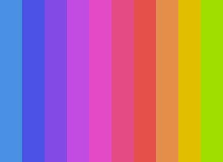

# FEW 1.2 - Class 3

## Working with Canvas

Canvas draws things into an image made of pixels. Canvas has a few methods that let you draw paths and then fill the path with pixels. You can fill with a color or a gradient. You can also stroke the path with pixels. 

There are too many options to list, and the posibilities are endless! Try the challenges below to experiment with canvas. 

## Canvas 

Study up on canvas here are a few articles you can read. Or just jump in and come back to these later. 

- https://developer.mozilla.org/en-US/docs/Web/API/Canvas_API/Tutorial/Applying_styles_and_colors
- https://eloquentjavascript.net/17_canvas.html

## Break Out canvas challenges 

This game is looking really good. But, marketing thinks it could look even better, have they even played it yet? It doesn't matter they have the ear of the investors, and they want some fancy graphics, but that's okay because so do you!

Use a function or functions to solve these challenges. That is, break complex code out of the a larger block and into a new function to make it more readable. 

Take a hint from the starting tutorial code. Notice that the tutorial uses a function to handle drawing the, bricks, ball, paddle, score, and lives. This is instead of keeping all of these systems together in the same function. 

The code also tries to separate code into related blocks. The function that draws the ball only draws the ball. The code here doesn't try to draw other things. 

_Your goals are to make the game look super fancy by drawing more than just solid colors._

**Add a gradient background**

At the moment you're clearing the canvas then drawing bricks, ball, and paddle over the cleared canvas. Clearing the canvas happens on the first line of the `draw()` function. 

If you want the background to look like something you'll need to fill it *before* drawing all of the other things on top of it.

[Read up on gradient fills with canvas](https://www.w3schools.com/graphics/canvas_gradients.asp)

```JavaScript
// Create gradient
var grd = ctx.createLinearGradient(startX, startY, endX, endY);
grd.addColorStop(0, 'red');   // Places a color at the start
grd.addColorStop(1, 'white');  // Places a color at the end

// Fill with gradient
ctx.fillStyle = grd;
ctx.fillRect(x, y, width, height);
```

- **Challenge 1** 
  1. Fill the background with a gradient
    - Hint: use subtle changes in the starting and ending gradient color to make better looking gradients. 
  2. Use a gradient fill for each brick
  
<figure>
  <figcaption> 
    Challenge 1.1: Gradient Background 
  </figcaption>
  
</figure> 
  
<figure>
  <figcaption> 
    Challenge 1.2: Gradient bricks
  </figcaption>
  
</figure> 

_Graphical embelishment_ is the next big thing. Everyone thinks this game could crack the product hunt top ten with a little "graphical embelishment". No one else on the team knows how to do this so it's up to you!

Don't bother looking up "graphical embelishment", it just means draw anything you want, take my word for it, you go this! 

The goal is to draw stuff on the background then draw the bricks, paddle, and the ball on top.

For these challenges you'll need to create a function something like: `drawBackground()`. Call this at the top of the `draw()` immediately _after_ `ctx.clearRect(0, 0, canvas.width, canvas.height);`.

- **Challenge 2** 
  1. Fill the background with vertical stripes.
    - In side your `drawBackground()` function draw 10 rectangles.
    - Use a loop to that counts to 10. 
    - Set the x position of each rectangle to `canvas width / 10 * count`
    - Set the y of each rectangle to 0
    - Set the width of each rectangle to 40
    - Set the height of each rectangle to the height of the canvas
    - Set the color to `hsl(${360 / 10 * index}, 100%, 50%)`
  2. Invent your color own scheme
  
<figure>
  <figcaption> 
    Challenge 1.1:  
  </figcaption>
  
</figure> 
  
You're probably sick of drawing rectangles. Good it's time to draw something new. Draw a circle! Here is some code. 

```
ctx.fillStyle = '#ff00ff44';
ctx.beginPath();
ctx.arc(x, y, radius, 0, 2 * Math.PI);
ctx.fill();
```

Note: The basic procedure with canvas is to create a path then fill and stroke the path.

Look at the `drawBall()` function similar code is used there. 

The important line is this one:

`ctx.arc(x, y, radius, 0, 2 * Math.PI);`

The first two parameters position the circle on the x, and y axis. Imagine you positioning center point of a compass here. 

The third parameter sets the radius of the circle centered at the x and y position. Imagine you are setting the radius of the compass. 

The last two parameters set the _starting_ and _ending_ angle of the arc. An arc is measured in radians. A comnplete circle is 2 PI Radians. In degrees a complete circle is measured as 360. Imagine you are sweeping the compass around and drawing a circle. 

- https://www.w3schools.com/tags/canvas_arc.asp

The code above generates a path, to see the circle you'll need to stroke and or fill the path. To fill the path set the `cts.fillStyle` and call `ctx.fill()`.

- **Challenge 3**
  1. Draw a big circle in the center of the canvas
  2. Marketing is cutting a deal with Target. You need to draw the Target logo on the canvas. 
    - Draw a big red circle
    - then draw a medium white circle
    - last draw a small red circle
  3. Screw Target and their capitalist schemes! It's Alan's birthday draw a rainbow! Follow this guide:
    - Position the circles in the horizontal center at the bottom edge. This should be x of canvas width / 2, and y of canvas height. 
    - Draw the largest circle first, and concetric circle working inward. 
    - Use HSL color. The hue runs 0 to 360. You want to set it to `360 / totalSteps * step`
    - Bonus points: Only half the circle is visible. Only draw half the arc. 
  4. Draw the rainbow in front of the column pattern. 
    - Draw the rectangles first from challenge 1.
    - Then draw the circles
    
<figure>
  <figcaption> 
    Challenge 1.1: Draw a circle
  </figcaption>
  
</figure> 

<figure>
  <figcaption> 
    Challenge 1.2: Draw Target
  </figcaption>
  
</figure>

<figure>
  <figcaption> 
    Challenge 1.3: Draw Rainbow
  </figcaption>
  
</figure>

<figure>
  <figcaption> 
    Challenge 1.4: Draw Rainbow on a Rainbow
  </figcaption>
  
</figure>
