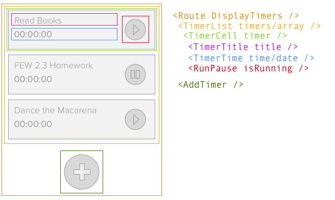

## Defining your custom project

To really own your learning you need to build something that you are invested in. The goal for this class is to define your custom project and set a list of weekly milestones that take it from concept to completion from now to the end of the term. 

### Questions

Q: What is required?

- The project should react and be a Single Page Application using React
- The project is due for review class 11. Why this date?
	- This will give you time for other class projects that are due class 12 and 13
	- It will give you a chance for review and revision before the end of the term.

Q: Does it have to have a server component? 

- No, this is not required
- If you do include a server it can be something from one of you BEW projects or an intensive project. 

## Learning Objectives

- Create a plan for the project
- Identify deliverables 
- Define your project

## Defining your custom project 

Ask yourself: 

- What interests you? 
- What problem can you solve?
- What can you do between now and class 12? 
	- It's important this project be completed by class 12 scope accordingly. 
	
Define your project by writing a short description of what the project is and does.

Ask yourself how you are going to scope this to be able to complete it by class 12. 
	
### Defining Components 

The project will be built with React. The basic building block of React projects is Components. The second step to defining the project be to define the components that will be used to create it. 

Start by drawing a wire frame. Identify each of the components you might use. It's easier to think of them in your head than to create them. 

Think about naming carefully. Identify each component in your wireframe with the name you will use for that component. 

Components take in props that configure the component. Take notes about what values will be required by each component you have defined. 

### Define Milestones 

To keep the project moving forward and gauge progress you will define milestones. Milestones should be tied to something concrete and tangible. I'd like you to think about the components you will build and use these to mark the progress of this project. 

Miletones are made up of the things you did to move your project to completion. Every milestone should have a deliverable. A deliverable is something tangible. That is you can measure it, it esixts i the world. These are things like files or working features in a larger project. 

### Challenge defining your project

Your goal is to use a spread sheet or Trello board that, or other tool. It has to be something you can link to in the project tracker that I can view. 

List all of the tasks it will take to complete your project. For a React project we can look at each component as a deliverable. There maybe other tasks like defining a backend API, you should list these also. 

Your goal is to list all of the things you need to do to finish your project. List everything with a deliverable that proves this thing is complete. 

Add a date to every task. 

Let's sum that up. You are going to define the tasks that need to be completed to build the project you are proposing. Every task must have a deliverable to prove it has been completed. Each task must also have date when it should be completed. 

Make a tracker for your project that lists all of the tasks with their deliverables and dates. 

Note: some tasks are relient on other tasks that must be completed first. 

## After Class

Make a project tracker for your project. Your project must include a list of all tasks required to complete your project. Your tracker should contain the following: 

- List of all Tasks
	- Make a list of all of the components you need to make to get your project completed. 
	- List all of the other things you need to do. These are things like: setup express server or make an API key. 
- Map all of your tasks (these are the things you listed above) across the classes left in the term. This is class 8, start with class 9 through 13. There is a spot for each on the progress tracker. You'll check these off each class until the end of the term. 

Each task should define: 

- The deliverable 
	- This needs to be clearly defined and measurable
- The date it should be completed
