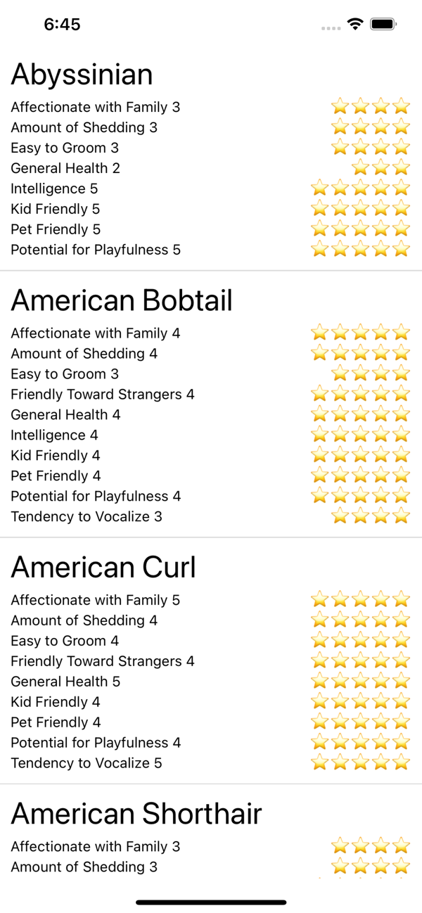

# Class - By Breed - React Native 

## Description 

The goal of this assignment is to make an app using the by breed animal data. 

### Why this assignment?

This is an introduction to React Native and should give you a good look at the process and work of React Native. It should also give you some experience working wit mobile UI components like the List View. 

## Project requirements

Your goal is to build a mobile application with React Native that displays a list of pet breeds along with their features. 

Download the starter code here: 

- https://github.com/Make-School-Labs/few-2-4-by-breed-starter

Complete the challenges below.

### Challenges 
 
**Challenge 1:** 

Using the cat and dog data in the [starter code](https://github.com/Make-School-Labs/few-2-4-by-breed-starter) display a list of dogs or cats. 

Display the list using the React Native Flat List component. Be sure to use a separate component for the cells/rows displayed in the list. 

**Challenge 2:** 

Style the components. Try to cover these ideas: 

- The FlatList should stretch to fill the width and height of the screen. 
- Each Row should have a font style where the text is large enough to read and too small. 
- Add some padding to each cell to keep the text from pushing up flush to the edges. 

**Challenge 3:** 

Use the SafeAreaView component to prevent the list from overlapping the status bar. 

**Challenge 4:** 

Display the animal features with each each animals. These would be the data items and their values for example: "Kid Friendly". Each of these properties has a value from 1 to 5. you should display the key and the value. 

To do this use `Object.keys()` to get a list of keys and turn this into a list of components. 

Make a component to display each feature and value. 

**Challenge 5:**

In your feature component display the value on the right and the feature on the left. 

Use your styles for this. You'll use flex properties. Use `justifycontent: 'space-between'`

**Challenge 6:**

Modify the feature component to display the value as a bar. Imagine a bar that stretches based on value of the feature. Each feature is rated from 1 to 5. 

To do this create two Views one nested inside the other. The parent View sets the maximum width of the bar. Style the parent with a size in pixels or a %. The inner View should have a width in percent: value / 5 * 100. 

**Challenge 7:**

Display a list of stars ⭐️ next to next to each feature. Each animal should have a number of stars equal to the the value of the feature. 

**Stretch Challenge:** 

Display dogs, or cats if you're already displaying dogs. 

**Stretch Challenge:**

Add a button to switch between dogs and cats. A segmented control would be a good choice for this. Sadly there React Native doesn't supply this component, they recommend a community solution: 

- https://github.com/react-native-segmented-control/segmented-control

**Stretch Challenge:**

Add a search bar at the top to search animales by name. 

### Deliverable

Submit your your completed project to gradescope. 

**Be sure to add a .gitignore** top your project to avoid uploading your node_modules. 

## Assessing the assignment

| Expectations | Does not meet | Meets  | Exceeds  |
|:-------------|:--------------|:-------|:---------|
| Completion | Did not complete the challenges | Completed the Challenges | Completed the challenges and some or all of the stretch challenges |
| Code Quality | Code is not functioning | Code functions | Code has been linted and formatted to professional standards |
| Work Ethic.  | < 3 comits.   | Commits show consistent work| commits show full 3 hours of work |

### Resources
- [WTHR Native Tutorial](https://www.makeschool.com/academy/track/standalone/wthr-native-tutorial-mvs/getting-started)