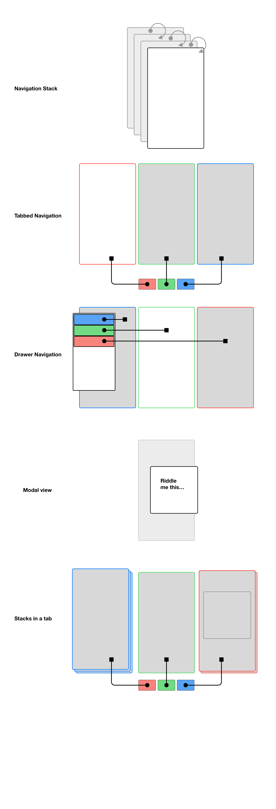

# FEW 2.4 React Navigation

This goal of this lesson is to introduce navigation concepts on mobile and apply them. 

## Learning Objectives/Competencies

- Identify navigation paradigms on mobile
	- Stack
	- Tab
	- Drawer
	- Modal
- Implement and build stack navigator
	- Manage a navigation stack
- Use static properties and methods

## Navigation on Native

On mobile devices space is at a premium and primary content is text which runs horizontally while we are usually viewing in portrait. 

The nature of this environment is such that design dictates that we usually want to make content fill the space and minimize the number of items displayed. 

Rather than showing mulitple content elements simultaneously we opt to focus on a single item. To fit all of your content into a mobile application you're either scrolling or navigating between views. 

Each new whole page of stuff is a screen. Really it's a view with many child views. In iOS native development it's called a ViewController. In React we call it a Component. 

For this dicussion let's use the name **Screen** when we are talking about a view that contains the entire current screen of content and use the term Component or View when we are talking about a sub view. 

A good resource for understanding navigation is the Human Interface Design Guidelines: HIG. 

https://developer.apple.com/design/human-interface-guidelines/ios/app-architecture/navigation/

## Navigating Screens

On the web we navigate between pages and the browser keeps track of navigation in the history. On mobile we don't have this convenience as a default behavior. 

Generally speaking on mobile your apps will use one of four navigation schemes:

- Stacks
- Tabs
- Drawers
- Modals

Your app might use any combination of these at the same time. 

A **Stack** is a series of Screens. This is similar to what you see in the browser. There is a history. You can _push_ and _pop_ Screens on a stack the same way you can push and pop elements in an array. When you see the back button in a mobile app you're using a stack. 

**Tabs** appear at the bottom of the screen and manage a fixed set of Screens. The tabs appear on top of all Screens! Any Screen in tabbed navigation might be a Stack! 

**Drawers** act like tabs but the drawer is hidden until displayed, usually by tapping the "Hamburger" menu. Like Tabs, Drawers are available from any Screen, and anything they display might be a Stack. 

**Modal** Views appear above the current Screen. Imagine a modal as out side of a stack. Anytime you close/dismiss a modal view you are returned to previous Screen. Really you never left, the modal view just appeared on top to ask a clarifying question then went away.



## Navigator

A Navigator is the parent for any set of screens. A navigator is usually a Stack, Tab, or Drawer. Any of the screens displayed might be a Stack. 

Navigator is the top level view that manages displaying subviews. 

## Navigation Libraries for native

- [React Navigation](https://reactnavigation.org/)
- [React Native Router Flux](https://github.com/aksonov/react-native-router-flux)
- [React Router Native](https://github.com/ReactTraining/react-router/tree/master/packages/react-router-native)

I chose [React Navigation](https://reactnavigation.org/) for these examples since it has all of the features any project might need, works on Android and iOS, and was recommended by React Native. It's also an open source solution.

## React Native Navigation

React Navigation is a library for React Native that is open source. It provides all of the basic native navigation systems and works on Android and iOS. 

- https://reactnavigation.org/docs/getting-started

Start with a new Expo project: 

```
expo init react-navigation-example
```

Choose blank project. 

```
cd react-navigation-example
```

Test your project with: 

```
yarn start
```

After you confirm everything is working continue! 

**Get started by importing the library**

```
npm install @react-navigation/native
```

**Install Expo dependancies**

```
npm install @react-native-community/masked-view
```

```
expo install react-native-reanimated react-native-screens @react-native-community/masked-view
```

I had a problem installing all of these at the same time, I tried installing in two passes like this: 

```
expo install react-native-gesture-handler react-native-reanimated react-native-screens react-native-safe-area-context
```

**Creating a Stack View** 

Create a root component that will act as the main navigator. This can be the App component. If you're using a single Stack it should be App. 

```
npm install @react-navigation/stack
```

Edit `App.js`, replace everything there with the code block below: 

```JS
// In App.js in a new project

import * as React from 'react';
import { View, Text } from 'react-native';
import { NavigationContainer } from '@react-navigation/native';
import { createStackNavigator } from '@react-navigation/stack';

function HomeScreen() {
  return (
    <View style={{ flex: 1, alignItems: 'center', justifyContent: 'center' }}>
      <Text>Home Screen</Text>
    </View>
  );
}

const Stack = createStackNavigator();

function App() {
  return (
    <NavigationContainer>
      <Stack.Navigator>
        <Stack.Screen name="Home" component={HomeScreen} />
      </Stack.Navigator>
    </NavigationContainer>
  );
}

export default App;
```

The code above defines a component `HomeScreen` and the component `App` in the same file. You can move `HomeScreen` to it's own file and import it here if you like. 

To keep things simple I used inline styles. You could mov e these inline styles to a styles object if you like. 

The sample code above Defines a HomeScreen component, creates an instance of StackNavigator and wraps these in a NavigationContainer. 

There is a single route: `<Stack.Screen>` which will display: `HomeScreen`. 

The example so far only displays the a single Screen: Home Screen. But, it does this using the StackNavigator!

Notice that Stack navigator provides the title bar at the top. This is the standard behavior. You can configure the title bar and do things like add buttons to the upper right and left, change the background color of the titlebar, and test the title in the center. 

### Navigating to another screen

Add another Component screen. You can add the code below to `App.js` or create a new file, if you make a new file at the standard imports at the top and export default at the bottom. 

```JS
function DetailsScreen() {
  return (
    <View style={{ flex: 1, alignItems: 'center', justifyContent: 'center' }}>
      <Text>Details Screen</Text>
    </View>
  );
}
```

Now add a route to that screen in your stack navigator: 

```JS
function App() {
  return (
    <NavigationContainer>
      <Stack.Navigator initialRouteName="Home">
        <Stack.Screen name="Home" component={HomeScreen} />
        <Stack.Screen name="Details" component={DetailsScreen} />
      </Stack.Navigator>
    </NavigationContainer>
  );
}
```

Now set up a button that will navigate from `HomeScreen` to `DetailsScreen`. 

- Import `Button`
- Add a `Button` to the `HomeScreen`
- Add an `onPress` to the button
- Get the `navigation` prop
- Use Navigation to navigate to Details

```JS 
import * as React from 'react';
import { Button, View, Text } from 'react-native';
import { NavigationContainer } from '@react-navigation/native';
import { createStackNavigator } from '@react-navigation/stack';

function HomeScreen({ navigation }) {
  return (
    <View style={{ flex: 1, alignItems: 'center', justifyContent: 'center' }}>
      <Text>Home Screen</Text>
      <Button
        title="Go to Details"
        onPress={() => navigation.navigate('Details')}
      />
    </View>
  );
}

...
```

Navigating to a Screen creates an instance of that screen and adds it to the navigation stack. You can experiment with that here. Add a button to the `DetailsScreen` that loads another instance of the `DetailsScreen` to the stack.

```js 
...
function DetailsScreen({ navigation }) {
  return (
    <View style={{ flex: 1, alignItems: 'center', justifyContent: 'center' }}>
      <Text>Details Screen</Text>
      <Button
        title="Go to Details... again"
        onPress={() => navigation.push('Details')}
      />
    </View>
  );
}
...
```

Test your work. From the Home Screen press the button to go to Details. Then press the button to load another Details screen. Press the button again to load another Details screen. 

Notice the back returns to the previous screen, try it out. 

Going back from one screen to the previous screen in the stack. Or jump to a screen on the stack. In the next step you'll a Home button that jumps all the Home screen. 

Add two buttons in the Deatils Screen. The first navigates to Home. The second returns to the previous screen on the stack. 

```js
...
function DetailsScreen({ navigation }) {
  return (
    <View style={{ flex: 1, alignItems: 'center', justifyContent: 'center' }}>
      <Text>Details Screen</Text>
      <Button
        title="Go to Details... again"
        onPress={() => navigation.push('Details')}
      />
      <Button title="Go to Home" onPress={() => navigation.navigate('Home')} />
      <Button title="Go back" onPress={() => navigation.goBack()} />
    </View>
  );
}
...
```

Notice the new buttons added to the detail screen. There are three buttons here and they each implement three different choices of navigation. 

- "Go to Details... again" - This button adds a new instance of the Details screen to the stack. Think of this like turning to the nect page in a book. In this case the next looks just like the previous page. 
- "Go to Home" - This button jumps to the first page of the book. Really all of the screens are stored in ana array and you're jumping to the fisrt screen in the array. 
- "Go back" - Think of this like turning to the previous page of the book. If you add more more Detail pages you'll be able to go back to each of those until you eventually get back to the Home screen again. 

## Passing params to routes

Pass params from home to details. The second parameter to `navigation.navigate('Screen', { params })` is an object containing params. 

```js 
...
function HomeScreen({ navigation }) {
  return (
    <View style={{ flex: 1, alignItems: 'center', justifyContent: 'center' }}>
      <Text>Home Screen</Text>
      <Button
        title="Go to Details"
        onPress={() => {
          /* 1. Navigate to the Details route with params */
          navigation.navigate('Details', {
            itemId: 86,
            otherParam: 'anything you want here',
          });
        }}
      />
    </View>
  );
}
...
```

The details screen can access the params object to receive data from the route that called it: 

```JS
...
function DetailsScreen({ route, navigation }) {

  /* 2. Get the param */
  const { itemId, otherParam } = route.params;

  return (
    <View style={{ flex: 1, alignItems: 'center', justifyContent: 'center' }}>
      <Text>Details Screen</Text>
      <Text>itemId: {JSON.stringify(itemId)}</Text>
      <Text>otherParam: {JSON.stringify(otherParam)}</Text>
      <Button
        title="Go to Details... again"
        onPress={() =>
          navigation.push('Details', {
            itemId: Math.floor(Math.random() * 100),
          })
        }
      />
      <Button title="Go to Home" onPress={() => navigation.navigate('Home')} />
      <Button title="Go back" onPress={() => navigation.goBack()} />
    </View>
  );
}
...
```

### Configure the Navigation Bar

On any screen you can set options. 

```js
<Stack.Screen 
  name="Home" 
  component={HomeScreen} 
  options={{ title: "Hello World"}}
/>
```

Here you set the title of the Home Screen. Note `name="Home"` is used for navigation and is also used for the title, if you don't name the title in `options`. 

Set some more styles for the navigation bar: 

```JS
<Stack.Screen 
  name="Home" 
  component={HomeScreen} 
  options={{ 
    title: "Hello World",
    headerStyle: {
      backgroundColor: '#f4511e'
    },
    headerTintColor: '#fff',
    headerTitleStyle: {
      fontWeight: 'bold',
      fontSize: 24
    }
  }}
/>
```

Here you set the title, background color of the nav bar, tint color, and font types of the title. 

You can set styles across all views by applying them to the navigator. 

```js
...
<Stack.Navigator 
	initialRouteName="Home"
	screenOptions={{
		headerStyle: {
			backgroundColor: '#f4511e',
		},
		headerTintColor: '#fff',
		headerTitleStyle: {
			fontWeight: 'bold',
		},
	}}
>
...
```

## Navbars in the wold 

Observe some navbars in apps that you use to see how they are configured and styled:  

- Twitter
- Facebook
- Settings
- Slack
- Instagram

## List Detail Pattern

A common pattern on mobile is the list detail pattern. This pattern displays a list of options tapping one of the list items displays a new screen this is the called the details view. 

## Challenges

Set up an app following the structions above. It should use React Navigation have a Home Screen and a Detail Screen. 

Set up the navigation to allow switching between the Home Screen and the Detial Screen. 

Use the By Breed example from last week to create a list of cats or dogs using a FlatList in the Home Screen component. 

Use the TouchableHighlight to handle a press on a list Item. 

Navigate to the the Detail Screen when a List Item is pressed. 

Pass the cat or dog data to the Detail screen and display it. 

## Plan your navigation

Look at your final project. Ask yourself what type of navigation it will use? Diagram this in any way you like. Identify navigation systems used. 

- Stack Navigator
- Tabbed Navigation 
- Drawer Navigation
- Modal Views

Start working on your project. Start by building your navigation system. Mock up the Content Screens with a a view and text to test your navigation. 

## After Class

Start planning your final project. We will covering Tab Navigation in a future class and you will be able to use this in the final project. 

- [Assignment final project](../Assignments/Assignment-final-project.md)

If you are done with the current challenges (stack view, list and detail view) you can try these challenges: 

- Display the animal features using `FlatList` in the detail screen. 
- Customize the styles of the app. 
- Display the Average rating for each breed in the title bar next to the breed name. 
- Add another level. Start with a FlatList that displays: "Cats" and "Dogs". Tapping one of these two cells displays a new screen with the stack navigator that is a list of all breeds (either cats or dogs.) Tapping on a breed displays details about the breed. This would look forward to creating an app that could handle any number of pet types! 

## Additional Resources

- https://reactnavigation.org/docs/getting-started/


