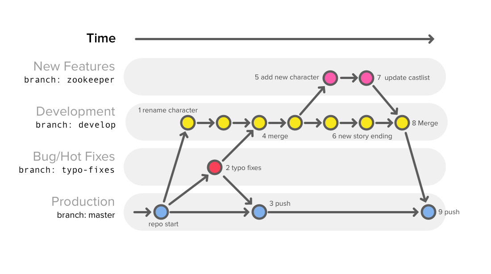
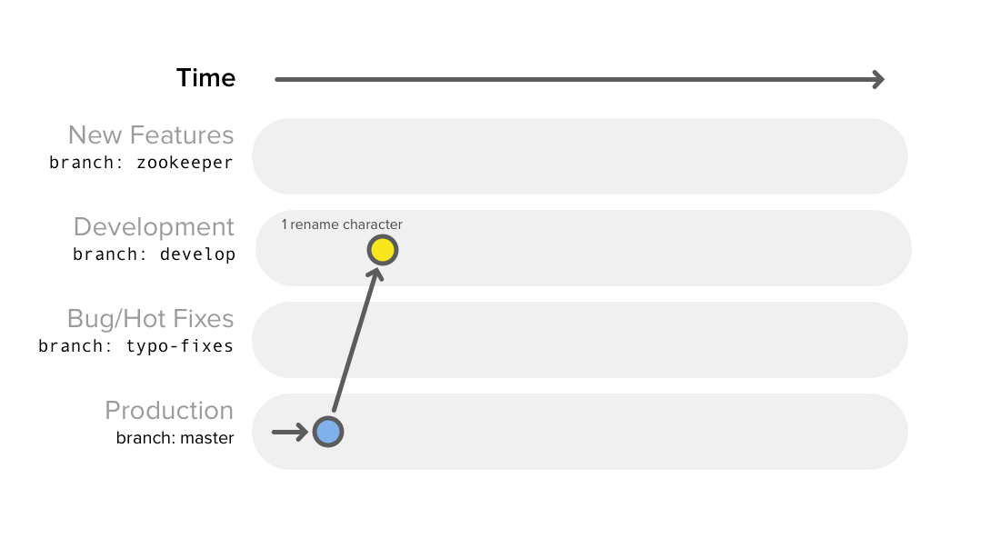
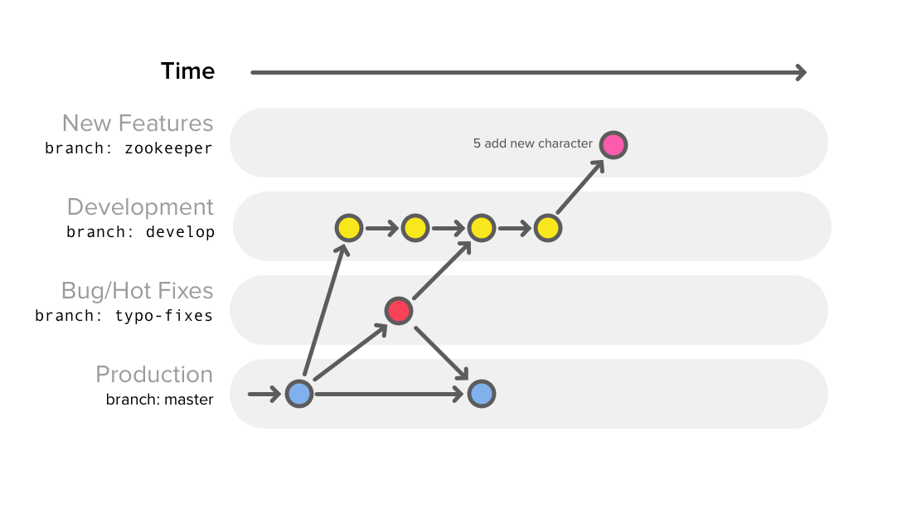

# Git Team Workflow

A tutorial to learn how to manage a coherent and organized workflow on
collaborative team projects with a shared Git repository.

The goal of this tutorial is to practice branching with Git and how you
can use branching to manage a workflow that involves multiple developers.

## Overview

The team workflow presented here is based on Vincent Driessen's article
["A successful Git branching model"](http://nvie.com/posts/a-successful-git-branching-model/)
that introduced the "Git flow" pattern, which is now a best practice used by software engineering teams around the world.

In the course of a team project you are likely to apply the steps outlined
here several times. You should follow this process on real team projects.
Over time, this will make your team more productive while working in parallel.

This image shows the entire process described in the instructions below.
The process likely appears complex at first, but you'll do each step below
one at a time. As you practice this process with teams, you will master it!

## Getting Started

For this lesson you will work alone, but imagine you are working
with a group of other developers. Imagine each commit along
the way as being added by a different member of your group.

To start this exercise, set up your repo and code editor:
- fork, then clone the starter repo: [Git Team Workflow Lab](https://github.com/Make-School-Labs/Git-Team-Workflow-Lab)
- navigate to this repo's directory in your terminal
- open the existing `Script.md` file in your code editor

then carefully follow the instructions below step by step.

## Instructions

You are working on the script for a new movie, "The Unicorn King".
You need to fix typos (bugs) in the script, add new characters (features),
resolve merge conflicts and publish (push) the script along the way.

While working on a team, you will create branches to manage team workflow:
- You need to have an always working published **Production** version.
This is usually the `master` branch.
- Your team will be continually iterating on the **Development** version.
This is usually the `develop` branch.
- Team members will also be developing several **New Features** in parallel
that may sometimes take a while to complete before they are ready to be
incorporated into the Development version.
These are called `feature` branches.
- Movie executives (users) may find typos (bugs) in the Production version
at any time, so you need to be able to fix and publish (push) **Hot Fixes**
quickly without introducing recent changes from the Development version
that are not ready to be published (tested for Production).
These are called `hot-fix` or `bug-fix` branches.

At any point you may want to merge one or more of these branches together
to incorporate changes from several different lines of Development.

### Rename Character

The first step is to create a new branch you can use
to make small changes to the **Development** version.
It's important that the changes to this branch are
not visible until they are considered ready to be published.

Your goal: Create a new `develop` branch and rename the character.
This will be the Development version.

- Create and checkout `develop` branch: `git checkout -b develop`
- Edit text to rename the young boy "George" to any other name
- Add changes to staging area: `git add Script.md`
- Commit changes to `develop`: `git commit -m "Rename George to ______"`

### Oh No... Typos!

Sometimes your team will need to fix the Production version of a movie script
(product) that has already been published to movie executives (users).
Since you don't want them to see the young boy George's new name just yet,
it's important to fix the typos in the Production version (`master` branch).
This is a **Hot Fix**, so you'll need to create a new branch off of `master`.

Check the current version of the project for typos.

- Checkout the master branch: `git checkout master`
- Create and checkout `typo-fixes` branch: `git checkout -b typo-fixes`
- Edit text to fix typos in the Production version (fix the bugs)
- Stage and commit changes: `git add Script.md && git commit -m "Fix typos"`
- Skim the script to verify all typos are fixed (test the product)
- Checkout the `master` branch: `git checkout master`
- Merge `typo-fixes` branch into `master`: `git merge typo-fixes`
- Push to Production (GitHub repo): `git push origin master`
- View script on GitHub to verify typos are fixed, but young boy is not yet renamed

These new changes should be incorporated into the Development version.

- `git checkout develop`
- `git merge typo-fixes`

### Add New Characters

Your team will be creating **New Features** frequently. On larger
teams it's safer to keep this out of the Development version until
the new feature is fully functioning, which may take a long time.

The producers have suggested that adding a zookeeper to the story
would be a good idea. They may change their minds in the future.
Probably best to keep this in a new feature branch.

Create a new `zookeeper` branch where you can incorporate the zookeeper.

- Be sure you're on the `develop` branch: `git status`
  - If not, run `git checkout develop`
- Create and checkout new branch: `git checkout -b zookeeper`
- Edit text to add the Zookeeper character to the plot
- Stage and commit changes: `git add Script.md && git commit -m "Add Zookeeper"`

### Improve Story Ending

The word from the movie execs up top is that the plot's conclusion is weak
and reviews will be critical. You'll need to improve the story's ending.

The current ending is already part of the story (product), so your team is
improving something that has already been written (implemented). Therefore,
this work should be done on the Development version (`develop` branch).

- Checkout develop branch: `git checkout develop`
- Edit text of last paragraph to improve the ending
- Stage and commit changes: `git add Script.md && git commit -m "Improve story ending"`

### Merge new character branch into develop

The new character ideas were approved! Be sure to proof read them
before merging them with main story in the Development version.

- Be sure you're on the `develop` branch: `git checkout develop`
- Merge `zookeeper` branch into `develop`: `git merge zookeeper`

### Review new script and ship it!

When releasing a new version of a product, you'll merge the latest Development  version (`develop` branch) into the Production version (`master` branch).

- Be sure you're on the `develop` branch: `git checkout develop`
- Code review (read the script once through to catch any errors)
- If all looks good, go to your master branch: `git checkout master`
- Merge all changes from development branch: `git merge develop`
- Now ship it! `git push origin master`

Excellent work! Now you know how to manage a coherent and organized workflow on
collaborative team projects with a shared Git repository.

In the course of a team project you are likely to apply the steps outlined
here several times. You should follow this process on real team projects.
Over time, this will make your team more productive while working in parallel.

## Additional Resources

- [Learn Git Branching](https://learngitbranching.js.org/) – interactive tutorial that covers many Git features step by step
- [Git to Know Branching](https://make.sc/git-to-know-branching) – tutorial that covers branching and resolving merge conflicts
- [Git cheat sheet](https://education.github.com/git-cheat-sheet-education.pdf) – quick reference guide that summarizes many Git commands on 2 pages
- [A successful Git branching model](http://nvie.com/posts/a-successful-git-branching-model/) – Vincent Driessen's article that introduced the "Git flow" pattern presented here, which is now a best practice used by software engineering teams around the world
