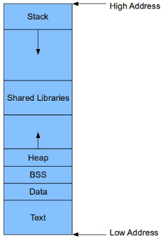

# C / C++ Programming Class 3

---
# Advanced C Language Features for Complex Data Structures and Dynamic Code Execution
## Objectives

- **Master C pointers to data and functions, creating and dereferencing them as needed**
- **Use function arguments passed by reference**
- **Use arrays of pointers**
- **Master pointer arithmetic**
- **Use function pointers to create dynamic code**

---
# Review of Computer Architecture and Memory
### To understand and use pointers in C (or any language that provides direct memory access), a working knowledge of Von Neumann computer architecture and CPU data, address and control bus operation is essential.

### Computer Memory is organized into 8 bit chunks called bytes, which can be used in groups called words (2 bytes together), dwords (2 words together) and qwords (4 words together).  The CPU can read or write to any memory location by setting the address desired on the data bus.  I imagine memory like a very long road and the address bus like a mail truck being given a letter to deliver to one of the millions/billions of mail boxes on that road.  Once the CPU sets the address in the address bus, it uses the control bus to indicate that it wants to read a byte (or word, etc.) from the memory.  The memory then places the value of the byte at the address selected onto the data bus so the CPU can read it.  Writing to memory just requires the CPU to set the value of the byte (or word, etc.) on the data bus before setting the address bus value and setting the control bus to write the value to the memory.

### PCs and smart phones (64  & 32 bit capable) and single chip embedded system computers (32, 16 and 8 bit) all use 8 bit bytes and byte addressable RAM. On CPU's that are 16 bits or wider, the data bus transfers multiple bytes at once aligned to the CPU's word size.
### All modern CPU's except small 8 and 16bit embedded MCU's use special virtual memory hardware to provide each process its own private memory space. This hardware helps the operating system create private memory spaces where each process uses addresses that all start at 0x400000 (on Linux 64 bit systems). 

### The 0x400000 address maps to different physical RAM address locations using the CPU's Page Table.  An application does not know that its actual physical memory location 0x400000 is mapped to physical RAM location 0x49FEE00 for example, and another application has it's address 0x400000 mapped to 0X17FD800.

### When a program is loaded by the operating system, the operating system allocates the memory needed and places various sections of the program in different places.  The primary sections are the text section, (the compiled program code), the data section (the static variables with defined initial data values), the BSS section (static variables that are all zeros), any static library code and the heap and stack areas.  When debugging code, the value of pointers indicates which section they are pointing into.  Pointers allow a program to read and write memory and if a pointer gets set to an erroneous value, it can crash the program.

---
# Pointers To Data
### C pointers are incredibly powerful, flexible, and dangerous if used carelessly.  Pointers are created using the asterisk symbol * in front of a variable declaration.  To get the address of a variable use the ampersand symbol & in front of the variable and then assign that to an appropriately defined pointer variable.  Just a word of warning, off by one bugs and stale pointers can cause erratic program behavior and crashes.  Black hat hackers exploit code that uses pointers that are not protected from out of bounds errors to create malware and viruses:
```c 
char   * pointerToChar;
int    * piValue;   // Hungarian variable naming standard, Pointer to Integer Value
double * pdPi;
char   * psString;
char * * ppsString; // pointer to pointer to string

double   pi = 3.1415962;

main () {
	pdPi = & pi;  // pdPi now points to the pi variable which contains 3.1415962
}
```

### Pointers on PC's and phones are either 32 bits (4 bytes) or 64bits (8 bytes) long and are unsigned integers.  Pointers on 8 and 16 bit processors usually are 16 or 20 bits limiting them to 65536 bytes or 1 megabyte.  The number a pointer holds is the memory address of the first byte of the data they "point" to.  32 bit pointers can point at 4gigs of RAM.  64 bit pointers can point at 16 exabytes though even server PC's only have physical slots and PCB traces allowing up to hundreds of gigabytes.
### This code defines a variety of example pointers, pointing to different type and size data and to both static global variables and local variables.  When the program is run, notice the huge difference in the values of pointers, pointing at global variables versus stack variables.  Write down the addresses (last few unique hexadecimal letters) of each pointer and see which variables are above others and if that matches the order in the code.
```c
int    myInt = 1234;
char * psString;

main() {
    char   myCharacter = 'X';
    double myPi        = 3.1415962;
    char   myString[]  = "Hello Pointers";

    char   * pointerToChar;
    int    * piInt;         // this is Microsoft Hungarian notation standard, pointer to integer
    double * pdPi;          // pointer to double
    char * * ppsString;     // pointer to pointer to string

    pointerToChar = & myCharacter;  // get the address for a pointer to myCharacter
    piInt         = & myInt;
    pdPi          = & myPi;
    psString      = myString;
    ppsString     = & psString;

    printf ("address of char pointer value = 0x%llx\n", (unsigned long long) & pointerToChar);
    printf ("char pointer value = 0x%llx", (unsigned long long)pointerToChar);
    printf (", actual character = %c\n\n", * pointerToChar);

    printf ("address of int pointer value = 0x%llx\n", (unsigned long long) & piInt);
    printf ("int pointer value = 0x%llx", (unsigned long long)piInt);
    printf (", actual integer = %d\n\n", * piInt);
    
    printf ("address of double pointer value = 0x%llx\n", (unsigned long long) & pdPi);
    printf ("double pointer value = 0x%llx", (unsigned long long)pdPi);
    printf (", actual double = %lf\n\n", * pdPi);

    printf ("address of string pointer value = 0x%llx\n", (unsigned long long) & psString);
    printf ("string pointer value = 0x%llx", (unsigned long long)psString);
    printf (", actual string = %s\n\n", psString);

    printf ("address of string pointer to pointer value = 0x%llx\n", (unsigned long long) & ppsString);
    printf ("string pointer to pointer value = 0x%llx", (unsigned long long)ppsString);
    printf (", actual string = %s\n", * ppsString);
}
```
<script src="//repl.it/embed/JHvH/3.js"></script>

---
# Function Arguments Passed By Reference
### C functions can only return a single simple data type or pointer to complex type but can accept multiple parameters that are pointers (references) which the function can modify allowing functions to produce multiple results as needed:
```c 
bool ParseNum (char * psText, char * * ppsNew, int * piNum)
```
### This function returns a boolean result.  It accepts a pointer to text to parse in psText.  It accepts a pointer to a pointer to the final new text position if a valid pointer is passed or if a NULL is passed, it does not change it.  The last parameter is a pointer to the integer result of converting the number from ASCII characters to a binary integer if successful.  If the conversion is unsuccessful, the result value is left unmodified.

```c
#include <stdio.h>
#include <stdbool.h>
// Convert text digits formatted as proper signed integers into binary values
bool ParseNumber (char * psText, char * * ppsNewTextPosition, int * piNumber) {
    char letter;
    bool negative;
    int number = 0;
    int count  = 0;
    
    negative = ('-' == *psText);  // Look for leading minus sign
    if ( negative )
        psText++;
  
    letter = *psText;
    while (('0' <= letter) && ('9' >= letter) && (count < 10) )
    {
        number = number * 10 + (letter - '0');  // for each digit, multiply previous
        letter = * ++psText;                    // value by 10 and add new digit
        count++;
    }

    if ((count == 0) || (count == 10) ) {   // error if the number of digits exceed limit
        return false;
    } else {
        *piNumber = (negative) ? - number : number;
        if (NULL != ppsNewTextPosition)     // if caller provided a return variable,
            *ppsNewTextPosition = psText;   // provide current text position
    }
    return true;
}

char * numbers = {"12345,-432109"};
main () {
    char * pNext;
    int firstNum, secondNum;
    if ( ParseNumber(numbers, & pNext, & firstNum)) {
        printf ("twoNumbers string = %s, first converted = %d\n", numbers, firstNum);
        pNext++;    // skip comma
        if ( ParseNumber(pNext, NULL, & secondNum)) {
            printf ("twoNumbers string = %s, second converted = %d\n", numbers, secondNum);
        }
    }
}
```
<script src="//repl.it/embed/JIFz/1.js"></script>

---
# Arrays Of Pointers
### C arrays can point to any type including other arrays of intrinsic and user defined types.  Arrays of pointers are often used in algorithms such as sorting arrays of data and hash tables where collections of values hang off each hash table row:
###  This is a typical use of pointers in a standard bubble sort algorithm that sorts an array of pointers to strings. The algorithm doesn't actually move the strings, it only swaps the pointers to the strings around until the pointers in the array are sorted based on the string values. It is much faster for the CPU to swap pointers than move strings.
```c
#define COUNT 6
char * animals [COUNT] = {"dog", "cat", "rabbit", "horse", "chicken", "duck"};
main () {
    int number_of_animals = COUNT;
    int inner, outer;
    char * pTemp;
    for (outer = 0; outer < number_of_animals ; outer++) {
        for (inner = 0; inner < number_of_animals -1; inner++) {
            if (0 < strcmp(animals[inner], animals[inner +1])) {
                pTemp = animals[inner];
                animals[inner] = animals[inner +1];
                animals[inner +1] = pTemp;
            }
        }
    }

    for (outer = 0; outer < number_of_animals; outer++) {
        printf("%s\n", animals[outer]);
    }
}
```
<script src="//repl.it/embed/JICt/1.js"></script>


---
# Pointer Arithmetic
### Pointer arithmetic in combination with casting pointers from one type of data to another is one of C's most powerful capabilities, and one of its most dangerous capabilities.  Graphics, kernel, database engine and programming language developers require this capability to create highest performance code:
```c
*(pNewPosition + RED + colorDepth * ((columns * 2) + 6)) );
```

### This code retrieves a bitmap file (simulated) which is copied to a memory buffer.  It retrieves a red channel color value form row 2 and column 6 based on a color depth of 3 bytes per pixel.  The code simulates reading a bitmap file into a memory buffer and determining the bytes per pixel and image dimensions using text header in the file with the number parser code.  Notice how there are risks in this code that can cause it to malfunction or crash if the color depth or dimensions are wrong, the code will access memory outside the image buffer memory area. For fun set the number of columns (13) to a number in the hundreds and run the code and see what it does.
```c
#include <stdio.h>
#include <stdbool.h>

#define RED   0
#define GREEN 1
#define BLUE  2

// Define an 8 bit per color channel RGB bitmap of 4 rows by 13 columns
char bitmapFile[] = {"3,4,13,AAaBBbCCcDDdEEeFFfGGgHHhIIiJJjKKkLLlMMm"
                            "NNnOOoPPpQQqRRrSSsTTtUUuVVvWWwXXxYYyZZz"
                            "aa1bb1cc1dd1ee1ff1gg1hh1ii1jj1kk1ll1mm1"
                            "nn1oo1pp1qq1rr1ss1tt1uu1vv1ww1xx1yy1z11"};

char pPixels[100000]; // Reserve global buffer of 100 kilobytes for any size and depth bitmap

bool ParseNumber (char * psText, char * * ppsNewTextPosition, int * piNumber);

main() {
    int colorDepth, rows, columns;
    char * pNewPosition;
    
    // simulate reading bitmap file into memory array
    for (int i = 0; i < sizeof(bitmapFile); i++)
        pPixels[i] = bitmapFile[i];

    if ( ! ParseNumber(pPixels, & pNewPosition, & colorDepth) )
        return;
    
    pNewPosition++; // skip comma
    if ( ! ParseNumber(pNewPosition, & pNewPosition, & rows) )
        return;

    pNewPosition++; // skip comma
    if ( ! ParseNumber(pNewPosition, & pNewPosition, & columns) )
        return;

    pNewPosition++; // skip comma
    
    printf ("Bitmap is %d bytes per pixel, %d rows and %d columns\n", colorDepth, rows, columns);

    // examples of complex pointer arithmetic where array dimensions are dynamic
    // retrieving one color channel from a specific pixel.  Index origin is 0
    printf ("Red value at row 2, column 6 is = %c\n",
        *(pNewPosition + RED + (colorDepth * ((columns * 2) + 6)) ) );
 
    printf ("Green value at row 3, column 8 is = %c\n",
        *(pNewPosition + GREEN + (colorDepth * ((columns * 3) + 8)) ) );
}

// Convert text digits formatted as proper signed integers into binary values
bool ParseNumber (char * psText, char * * ppsNewTextPosition, int * piNumber) {
char letter;
bool negative;
int number = 0;
int count  = 0;
    
    negative = ('-' == *psText);  // Look for leading minus sign
    if ( negative )
        psText++;
  
    letter = *psText;
    while (('0' <= letter) && ('9' >= letter) && (count < 10) )
    {
        number = number * 10 + (letter - '0');  // for each digit, multiply previous
        letter = * ++psText;                    // value by 10 and add new digit
        count++;
    }

    if ((count == 0) || (count == 10) ) {   // error if the number of digits exceed limit
        return false;
    } else {
        *piNumber = (negative) ? - number : number;
        if (NULL != ppsNewTextPosition)     // if caller provided a return variable,
            *ppsNewTextPosition = psText;   // provide current text position
    }
    return true;
}
```

<script src="//repl.it/embed/JIHG/1.js"></script>

---
# Function Pointers
### Function pointers are used in places where different data types and operations need to be dynamically chosen at run-time.  Also call-back functions are usually specified as function pointers by the initiating function:
```c
void (* funcArray[])(int, int) = {add, subtract, multiply, divide};  // defines an array of 4 function pointers
 
(*funcArray[opIndex])(first, second);  // calls a function
```
### Function pointers are often used with library functions such as sorting routines to provide a type specific compare function.  Call back functions and graphics routines also use function pointers to provide flexibility.

### Lets play with function pointers and pointer arithmetic in Xcode using the Calculator project in the cpt2 Xcode project.


- Challenge 1: Improve text input so mistyped characters can be deleted
- Challenge 2: Ensure that only a valid number, single operator and second number are enterable
- Challenge 3: make the calculations entered and values computed appear as a rolling receipt
- Challenge 4: Add bell sound if an error is entered
- Stretch Challenge 1: convert to allow floating point values to be entered and calculated
- Stretch Challenge 2: Add more math functions such as power, square root, modulo, etc.
- Stretch Challenge 3: Add parenthesis and multiple operations with left to right precedence
- Stretch Challenge 4: Implement math precendence rules with multiple operations


---