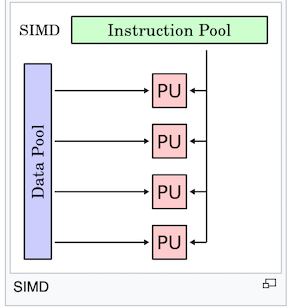
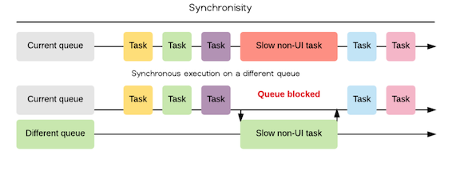
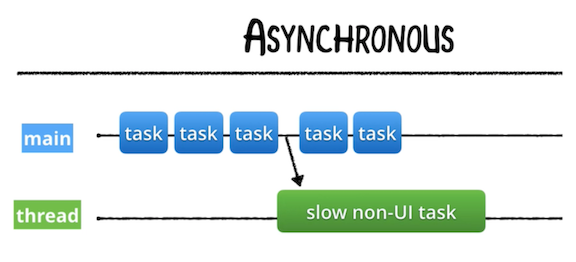

# Grand Central Dispatch (Part 1)

<!-- INSTRUCTOR Notes:

1) for initial exercise, the quiz location is:
https://docs.google.com/document/d/1679wsznKuafup32eV-ae5KQZ6jcx_aIkGY7CQ6ZGp_w/edit

2) xxxx
 -->

## Minute-by-Minute

| **Elapsed** | **Time**  | **Activity**              |
| ----------- | --------- | ------------------------- |
| 0:00        | 0:05      | Objectives                |
| 0:05        | 0:30      | Initial Activity                |
| 0:35        | 0:30      | Overview I                  |
| 1:05        | 0:10      | BREAK                     |
| 1:15        | 0:30      | In Class Activity I       |
| TOTAL       | 1:45      |                           |


## Learning Objectives (5 min)

By the end of this lesson, you should be able to...

1. Identify and describe:
- Apple's 2 APIs for managing Concurrency - __*Grand Central Dispatch*__ and __*Operations*__
- __*queues*__ and __*dispatch queues*__
- __*FIFO*__ Queues
- __*Synchronous*__ and __*Asynchronous*__ tasks
- the lifecycle and other attributes of the __*Main Queue*__
2. How to implement:
- basic examples of __*dispatch queues*__ running built-in `.sync` and `.async` functions

## Initial Exercise (30 min)

Discuss as a class...

### Part 1

In the Movie Theatre Game from Lesson 1:

- What physical construct (ie., customer line, casher, etc.) represented: </br>
&nbsp;&nbsp; - A *process*? </br>
&nbsp;&nbsp; - A *thread*? </br>
&nbsp;&nbsp; - A *long-running task*? </br>

- Which aspect of your solution represented: </br>
&nbsp;&nbsp; - Concurrency? </br>
&nbsp;&nbsp; - Parallelism? </br>

### Part 2

Follow up for Lesson 1's Activity 2

### Part 3

1. Review of Concurrency & Parallelism concepts from Lesson 1...

2. **Questions from Last Lesson**:

1) How is it possible to have __*parallelism without concurrency?*__

Let's examine of few of the types of Parallelism...

__*Bit-level Parallelism:*__ Can be thought of as *hardware-based* parallelism.

Historically, 4-bit microprocessors were replaced with 8-bit, then 16-bit, then 32-bit microprocessors, and now 64-bit CPUs, each capable of processing *twice* the number of instructions per cycle as the one before.

Because the number of instructions the system must run to execute a particular task on a 64-bit processor is significantly reduced (compared to previous processors), it can be said that the same number of instructions can now be *executed* in parallel.

However, there is __*no concurrency*__ in this case because it does not involve changes to the *structure* of the executed task.

__*Data Parallelism:*__  &mdash; is parallelism inherent in program loops, which focuses on distributing the __*data*__ across *different computing nodes* to be processed in parallel.

In Data Parallelism, *the same calculation* is performed on *the same* or *different* sets of data.

Example:

A **Single instruction, multiple data (SIMD)** is a class of parallel computers... with multiple processing elements that perform the same operation on multiple data points simultaneously.

Such machines exploit data level parallelism, but not concurrency: there are simultaneous (parallel) computations, but only a single process (instruction) at a given moment.

SIMD is particularly applicable to common tasks such as adjusting the contrast in a digital image or adjusting the volume of digital audio. Most modern CPU designs include SIMD instructions to improve the performance of multimedia use.

In the diagram of a SIMD system below, the same instruction (task) from the Instruction Pool is sent via the four PUs (Processing Units) for execution on the same data object (the Data Pool).

Again, because there is no manipulation of the structure of the task, there is *no concurrency* involved:

&nbsp;&nbsp;&nbsp;&nbsp;&nbsp;  </br>

&nbsp;&nbsp;&nbsp;&nbsp;&nbsp; [Source - wikipedia](https://en.wikipedia.org/wiki/SIMD)

__*Task Parallelism:*__ &mdash; is the characteristic of a parallel program that *entirely different calculations* can be performed on either *the same* or *different* sets of data.

This contrasts with Data Parallelism, where *the same calculation* is performed on *the same* or *different* sets of data.

> Note that __*Concurrency*__ is a type of Task Parallelism where tasks are divided (decomposed) into smaller bits for parallel processing.

### Part 4

And now...

...a small **Quiz**...

<!-- Answers to Quiz:
1)
- B) Concurrency
- E) Thread
- F) Parallelism
- C) Amdahl’s Law
- A) Context Switching (or Time-Slicing)
2)
- Grand_Central_Dispatch
- Operations
3) Concurrency = structure
Parallelism = execution
4) (answer can be any 3 of these 5)
- Deadlocks
- Race Conditions
- Readers-Writers Problem
- Thread Explosions
- Priority Inversion
-->

## Overview/TT I (20 min)

### Topics for this Session

- GCD vs Operations
- Dispatch Queues
- FIFO
- Synchronous vs Asynchronous
- The Main Queue
<!-- - Serial vs Concurrent
- QoS Priorities
- Default Queues
- Custom Queues -->

### GCD and Operations (cont'd)

In Lesson 1, we introduced the two Apple-provided APIs you use in iOS to manage concurrent tasks *without* working with threads *directly*: **Grand Central Dispatch (GCD)** and **Operations.**

Before we dive deeper into GCD, let's quickly compare the two to begin your understanding of when and how to use them:

|  Grand Central Dispatch | Operations |
| ------------- | ------------- |
| A *lightweight* way to represent units of work that are going to be executed concurrently. GCD uses **closures** to handle what runs on another thread. |  Operations are **objects** that encapsulate data and functionality. Operations add a little *extra development overhead* compared to GCD. |
| The system takes care of scheduling for you. Adding dependencies, cancelling or suspending code blocks is labor intensive | Allow for greater control over the submitted tasks, including some control over scheduling through adding dependencies among various operations and can re-use, cancel or suspend them.  |
| GCD is good to use for simple, common tasks that need to be run only once and in the background. |  Operations make it easier to do complex tasks. Use them when you need (a) task reusability, (b) considerable communication between tasks, or (c) to closely monitor task execution. |

Apple recommends using the API with the "highest-level of abstraction" (which is Operations), though most developers use a combination of both APIs.

And because Operations are build on top of GCD, it is important to master the lower-level API first...

> *Note: Where Swift uses closures (functions) to handle the code that runs on another thread, C#, Typescript, Python, JavaScript and other languages use the the more common Async/Await pattern. The original plans for Swift 5.0 included adding the Async/Await pattern, but this was removed from the Swift specification until some future release.*

### Why use GCD?

GCD's design improves simplicity, portability and performance.

- It can help you __*improve your app’s responsiveness*__ by deferring computationally expensive tasks from the foreground (`main` thread) to the background (non-UI threads).

- It __*simplifies*__ the creation and the execution of asynchronous or synchronous tasks.

- It’s a concurrency model that is __*much easier to work with__* than locks and threads.

Though GCD still uses threads in its implementation, developers do not have to manage threads themselves.

GCD's tasks are so lightweight to enqueue that Apple, in its 2009 technical brief on GCD, stated that "only 15 instructions are required for implementation, whereas creating traditional threads could require several hundred instructions." <sup>1</sup>

### What does GCD do?

GCD is Apple's implementation of C's `libdispatch` library. It runs directly in the UNIX layer of iOS.

<!-- Its purpose is to queue up tasks — either a function or a closure — that can be run in parallel, depending on availability of resources; it then executes the tasks on an available processor core. -->

GCD works by allowing specific __*tasks*__ &mdash; functions or closures &mdash; that can be run in parallel to be __*queued up*__ for execution and, depending on availability of processing resources, __*schedule*__ them to execute on any of the available processor cores (referred to as "routing" by Apple). <sup>1</sup>

GCD abstracts the notion of threads, and exposes __*dispatch queues*__ to handle __*work items*__ (*work items* are blocks <sup>2</sup> of code that you want to execute). These tasks are assigned (dispatched) to a dispatch queue, which processes them in a __*First-In-First-Out (FIFO)*__ order.

Allowing the `libdispatch` library and the operating system to manage threads means developers have much fewer lines of code to write and less to debug; and the library can optimize thread management behind the scenes much more efficiently than a developer.

> <sup>2</sup> Note: Apple's documentation sometimes refers to a `block` in lieu of a `closure` because `block` was the name used in Objective-C. In the context of concurrency in iOS, you can consider `block` and `closure` interchangeable> [action]

*Sources include:* </br>
- wikipedia
- Apple docs

### Threads, Tasks & DispatchQueues in GCD

Grand Central Dispatch still uses threads at a low level but abstracts them away from the developer.

You work with threads by creating `DispatchQueues`.

__*DispatchQueues*__

In Computer Science, a `queue` is a data structure that manages a collection of objects in FIFO <sup>3</sup> order, where the first object added to the queue is the first object removed from (executed by) the queue.

 <!-- (just like the ticket line at a movie theater and other examples of queues in real-life). -->

&nbsp;&nbsp;&nbsp;&nbsp;&nbsp;&nbsp;&nbsp;&nbsp;&nbsp;&nbsp;&nbsp;&nbsp;&nbsp;&nbsp;&nbsp;&nbsp;&nbsp;&nbsp;&nbsp;&nbsp;&nbsp;&nbsp;  </br>
&nbsp;&nbsp;&nbsp;&nbsp;&nbsp;&nbsp;&nbsp;&nbsp;&nbsp;&nbsp;&nbsp;&nbsp;&nbsp;&nbsp;&nbsp;&nbsp;&nbsp;&nbsp;&nbsp;&nbsp;&nbsp;&nbsp;&nbsp;&nbsp; Photo credit: FreeImages.com/Sigurd Decroos

</br>

In GCD, `DispatchQueue` is a queue object that manages the execution of tasks on your app's `main` thread or on a `background thread`.

It is a FIFO <sup>3</sup> queue to which your application can submit tasks in the form of block objects (functions or closures).

`DispatchQueues`:
- maintain a queue of tasks and execute these tasks, either __*serially or concurrently,*__ in their turn.
- __*hide all thread management*__ related activities. (You can configure a queue, but you won’t interact directly with any thread associated with it.)
- are __*thread safe*__: They can be accessed from different threads simultaneously without locking. (Developers can use `DispatchQueues` to make their own code thread safe.)

Work submitted to `dispatch queues` executes on the *pool of threads* managed by the system.

Except for the dispatch queue (the `main queue`) representing your app's `main thread`, the system makes no guarantees about which thread it uses to execute a task.

__*Thread Pools*__
Thread creation and destruction are expensive processes.

Instead of creating a new thread whenever a task is to be executed, then destroying it when the task finishes, available threads are taken from a pool of available threads created and managed by the operating system ([Thread Pool pattern](https://en.wikipedia.org/wiki/Thread_pool)).

<!-- When you create a `DispatchQueue`, the OS will potentially create and assign one or more threads to the queue. If existing threads are available in the pool, they can be reused; if not, then the OS will create them as needed. -->

&nbsp;&nbsp;&nbsp;&nbsp;&nbsp;&nbsp;&nbsp;&nbsp;&nbsp;&nbsp;&nbsp;&nbsp;&nbsp;&nbsp;&nbsp;  </br>

&nbsp;&nbsp;&nbsp;&nbsp;&nbsp;&nbsp;&nbsp;&nbsp;&nbsp;&nbsp;&nbsp;&nbsp;&nbsp;&nbsp;&nbsp;&nbsp;&nbsp;&nbsp;&nbsp; *A sample thread pool (green boxes) with waiting tasks (blue) and completed tasks (yellow)* </br>
&nbsp;&nbsp;&nbsp;&nbsp;&nbsp;&nbsp;&nbsp;&nbsp;&nbsp;&nbsp;&nbsp;&nbsp;&nbsp;&nbsp;&nbsp;&nbsp;&nbsp;&nbsp;&nbsp; *Source:* https://en.wikipedia.org/wiki/Thread_pool

__*Tasks*__

Tasks in GCD:
- encapsulate code and data into a single object.
- are lightweight, easy to create, and easy to enqueue.
- can be expressed either as a function or as an anonymous "block" of code (eg, a closure).

</br>

> <sup>3</sup> FIFO: First In, First Out &mdash; Tasks run in the order in which they are added to the queue — the first task in the queue will be the first to start. Though each block of code will be *started* in the order they were submitted, because more than one code block can be executed at the same time, the order in which tasks *finish* isn't guaranteed.

</br>

<!-- Blocks are an extension to the syntax of C, C++, and Objective-C programming languages that encapsulate code and data into a single object in a way similar to a closure.[11] GCD can still be used in environments where blocks are not available.[15] -->

<!-- A task in Grand Central Dispatch can be used either to create a work item that is placed in a queue or assign it to an event source. If a task is assigned to an event source, then a work unit is made from the block or function when the event triggers, and the work unit is placed in an appropriate queue. This is described by Apple as more efficient than creating a thread whose sole purpose is to wait on a single event triggering. -->


### Synchronous & Asynchronous Tasks

Tasks placed into a queue can either run __*synchronously*__ or __*asynchronously.*__

**Synchronous** &mdash; Submits a task for execution on the current queue and __*returns*__ control to the calling function __*only after*__ that code block (task) finishes executing.

When you schedule a work item (task) __*synchronously,*__ your app will __*wait*__ and __*block*__ the current thread's run loop until execution of the current task finishes, before returning control to the current queue and executing the next task.

__*Diagram 1 - Synchronous Task, Same Queue*__ </br>
In this diagram, each task must __*wait*__ for the preceding task to complete before it will be executed. Once started, each task will prevent (__*block*__) any other code from accessing the current queue (the `main queue`, in this case) until done:

&nbsp;&nbsp;&nbsp;&nbsp;&nbsp;&nbsp;&nbsp;  </br>

__*Diagram 2 - Synchronous Task, Different Queue*__ </br>
Again, each task must also __*wait*__ for the preceding task to complete before it will be executed. Once started, each task will still __*block*__ the current queue until completed, even though the submitted task executes on a different queue.

If the current queue is the `main queue`, then this will block any UI-related tasks from proceeding until the submitted tasks is completed on the other queue's thread.


&nbsp;&nbsp;&nbsp;&nbsp;&nbsp;&nbsp;&nbsp;  </br>
&nbsp;&nbsp;&nbsp;&nbsp;&nbsp;&nbsp;&nbsp;&nbsp;&nbsp;&nbsp; *Source:* https://medium.com/shakuro/introduction-to-ios-concurrency-a5db1cf18fa6 </br></br>

**Asynchronous** &mdash; Schedules a task for __*immediate execution,*__ and __*immediately returns*__ control to the calling function.

When you schedule a work item (task) __*asynchronously,*__ that task:
- will be submitted to its queue immediately, but it will also return execution to your app immediately, ordering the submitted task to be executed but *not waiting for it.* This way, the app is free to run other tasks while the submitted task is executing.
- can be submitted by code on one thread but actually *run on a different thread.* This allows the task to be __*started immediately*__ and to take advantage of additional processor resources to finish their work more quickly.

An asynchronous task (a closure or function) __*does not block*__ the current thread of execution from proceeding on to the next function, and your code on the current thread __*does not wait*__ for the submitted task to finish &mdash; it continues executing while the submitted task runs elsewhere.

&nbsp;&nbsp;&nbsp;&nbsp;&nbsp;&nbsp;&nbsp;  </br>

### Creating a Queue

The way you work with threads in GCD is by creating a `DispatchQueue`.

When you create a `DispatchQueue`, the OS will potentially create and assign one or more threads to the queue. If existing threads are available in the pool, they can be reused; if not, then the OS will create them as needed.

It's easy to create a `DispatchQueue`. This example creates a new `DispatchQueue` called `myQueue` with a *label* (identifier) of `"com.makeschool.mycoolapp.networking"`:

```Swift
  let myQueue = DispatchQueue(label: "com.makeschool.mycoolapp.networking")
 ```

The `label:` argument needs to be a unique identifier. The example above illustrates the preferred practice of using a reverse-DNS name (eg, com.your_company.your_app) to guarantee uniqueness (you could also use a UUID).

And because the `label:` helps immensely when debugging, it is a good idea to assign it text that is meaningful to you (ie, the ".networking" token above).

#### .sync() and .async()

To define whether a task runs __*synchronously*__ or __*asynchronously*__, you call the `.sync` or the `.async` function on your newly-created queue:

```Swift  
  let myQueue = DispatchQueue(label: "com.makeschool.mycoolapp.networking")

  myQueue.sync {
      // do something synchronous here...
  }
```

## In Class Activity I (10 min)

### Individually

**Required Resources:**
- The [GCDPlay.playground](https://github.com/Make-School-Courses/MOB-2.3-Concurrency-Parallelism-in-iOS/blob/master/Lessons/02-Grand-Central_Dispatch-Pt1/assets/GCDPlay.playground.zip) </br>
<!-- - The [GCDPlay.playground](https://github.com/Make-School-Courses/MOB-2.3-Concurrency-Parallelism-in-iOS/tree/master/Lessons/02-Grand-Central_Dispatch-Pt1/assets/GCDPlay.playground) </br> -->

<!--  </br>
[these](ClosuresChallenges.md) -->


**TODO:**
1. run the `GCDPlay.playground` and observe its output

**Q:** What can you infer about the order in which the 2 `for loops` execute?

**Q:** On what queue does the following `for loop` run?

```Swift  
  for i in 100..<110 {
      print("🐳 ", i)
  }

```

2. Currently, the playground runs the `.sync` function on the queue labeled `"com.makeschool.queue"`
- change `.sync` to `.async` and run the playground again

**Q:** How has the output changed after changing `.sync` to `.async`? (ie, in what order do the `for loops` execute now?)

**GCDPlay.playground code:**

```Swift
  import Foundation

  let queue = DispatchQueue(label: "com.makeschool.queue")

  queue.sync {
      for i in 0..<10 {
          print("🍎 ", i)
      }
  }

  for i in 100..<110 {
      print("🐳 ", i)
  }
 ```


 <!-- TODO: add another example exercise

  - see previous Lesson Plans for suitable playgrounds

 -->


#### As A Class

Share/discuss diagrammed solutions...

## After Class
1. Research:
- `DispatchObject`
- `DispatchWorkItem`
- `dispatchMain()`

<!-- 2. Assignment:
- -->


<!-- TODO: have students to the Ray W tute on Concurrency -->


## Wrap Up (5 min)

- Complete reading
- Complete challenges

## Additional Resources

1. [Slides](https://docs.google.com/presentation/d/16TFhJiItD0xLRO2r9jBq7xpVRR7lo5ISdkQ-nSNlrlg/edit#slide=id.p)
2. [Grand_Central_Dispatch - wikipedia](https://en.wikipedia.org/wiki/Grand_Central_Dispatch) <sup>1</sup>
3. [Async/await - wikipedia](https://en.wikipedia.org/wiki/Async/await)
4. [Coroutine - wikipedia](https://en.wikipedia.org/wiki/Coroutine)
5. [Deadlock - wikipedia](https://en.wikipedia.org/wiki/Deadlock)
6. [dispatchqueue - Apple](https://developer.apple.com/documentation/dispatch/dispatchqueue)
7. [Concurrency Is Not Parallelism - a video by Rob Pike](https://www.youtube.com/watch?v=cN_DpYBzKso)
8. [Async/Await for Swift - a proposed change to Swift by Chris Lattner, Joe Groff](https://gist.github.com/lattner/429b9070918248274f25b714dcfc7619)
