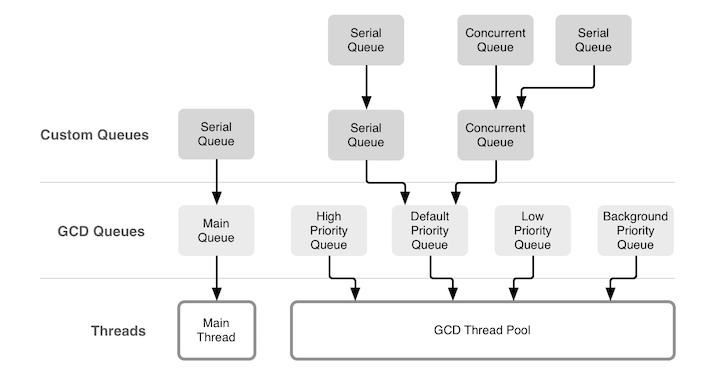
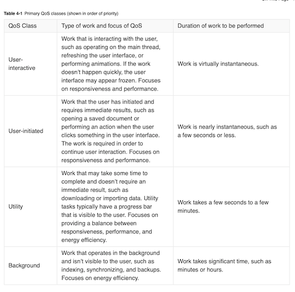

# Grand Central Dispatch (Part 3)

<!-- INSTRUCTOR Notes:

 -->

## Minute-by-Minute

| **Elapsed** | **Time**  | **Activity**              |
| ----------- | --------- | ------------------------- |
| 0:00        | 0:05      | Objectives                |
| 0:05        | 0:15      | Initial Exercise          |
| 0:20        | 0:15      | Overview / TT I           |
| 0:35        | 0:20      | In Class Activity I       |
| 0:55        | 0:10      | BREAK                     |
| 1:05        | 0:15      | Overview / TT II          |
| 1:15        | 0:35      | In Class Activity II      |
| TOTAL       | 1:50      |                           |


## Learning Objectives (5 min)
By the end of this lesson, you should be able to...

1. Identify and describe:
  - how to create Serial and Concurrent DispatchQueues
  - how to create and use queues of various QoS levels
  - how QoS levels are inferred and promoted by GCD
  - how Captured Closure Variables behave with enqueued tasks
2. Implement basic examples of:
  - Serial Queues and Concurrent Queues with various Qos levels
  - DispatchGroups


## Initial Exercise (10 min)

### Part 1 - As A Class

- Highlights of WWDC 2019 so far...

### Part 2 - As A Class

- Review of GCD subtopics and questions from previous class...

</br>

&nbsp;&nbsp;&nbsp;&nbsp;  </br>

&nbsp;&nbsp;&nbsp;&nbsp;&nbsp;&nbsp;&nbsp; *Source:*
&nbsp;&nbsp;&nbsp;&nbsp;&nbsp;&nbsp;&nbsp; https://www.objc.io/issues/2-concurrency/concurrency-apis-and-pitfalls/

## Overview/TT I (20 min)

### Creating Serial Queues

From our previous lesson, the example below illustrates how easy it is to create `DispatchQueues`.

Here, we create a new `DispatchQueue` called `myQueue` with a *label* (identifier) of `"com.makeschool.mycoolapp.networking"`:

```Swift
  let myQueue = DispatchQueue(label: "com.makeschool.mycoolapp.networking")
 ```
This example invokes the __*default initializer*__ for a `DispatchQueue`.

If you do not expressly define your `DispatchQueue` with the `.concurrent` attribute, GCD will __*by default*__ create a __*serial*__ queue (wherein each task must complete before the next task is able to start).

### Creating Concurrent Queues

It's just as easy to create a **concurrent**`DispatchQueue`.

To create a concurrent queue, pass the `.concurrent` attribute to your new queue:

```Swift
  let myQueue = DispatchQueue(label: "com.makeschool.mycoolapp.networking", attributes: .concurrent)
 ```

### QoS Priority Levels (Quick Review)

A `Quality of Service (QoS)` class categorizes work to be performed on a `DispatchQueue`.

Concurrent queues are so common that Apple has provided six different global concurrent queues, depending on the `Quality of Service (QoS)` the queue should have &mdash; four primary QoS classes and two special QoS classes.

If we look "under the hood", we can see all six QoS classes defined in the `QoSClass enum`:

 </br>


When using a __*concurrent*__ dispatch queue, you'll need to tell GCD how important the tasks are that get sent to the queue so that it can properly prioritize execution of your task against all other tasks competing for resources.

By specifying a QoS to work, you indicate its importance, and the system prioritizes it and schedules it accordingly.

Remember that higher-priority work has to be performed faster, takes more system resources to complete, and requires more energy than lower-priority work.

> Note: Global queues are always concurrent and first-in, first-out.

This table describes the four primary QoS classes Apple offers:

 </br>


**Special Quality of Service Classes**

In addition to the primary QoS classes, there are two special types of QoS (described in Table 4-2). In most cases, you won’t be exposed to these classes, but there is still value in knowing they exist.

 </br>

&nbsp;&nbsp;&nbsp;&nbsp;&nbsp;&nbsp;&nbsp; *Source:*
&nbsp;&nbsp;&nbsp;&nbsp;&nbsp;&nbsp;&nbsp; https://developer.apple.com/library/archive/documentation/Performance/Conceptual/EnergyGuide-iOS/PrioritizeWorkWithQoS.html


### Creating QoS priority

Need a concurrent queue but don't want to have to manage your own? Then just *use the global class method* on `DispatchQueue` to use one of the __*pre-defined global queues:*__

```Swift
  let queue = DispatchQueue.global(qos: .userInteractive)
 ```
But if you wish to create your own concurrent `DispatchQueue`, you can specify to the system your *target* QoS level in its initializer:

```Swift
  let queue = DispatchQueue(label: "com.makeschool.mycoolapp.networking",
                          qos: .userInitiated,
                          attributes: .concurrent)
 ```

### QoS Inference and Promotion

Accurately specifying appropriate QoS classes for the work your app performs &mdash; as in the example above &mdash; ensures that your app is responsive and energy efficient.

But behavior that QoS levels are __*not static*__ &mdash; GCD pays attention to the types of tasks being submitted to a queue and will adjust the QoS level as it deems necessary.

If you submit a task with a higher QoS than the queue has, GCD will increase the queue's QoS level to match the higher level of the task you submitted.

In addition, all tasks enqueued will also have their priorities raised.

Though there is a vast number of scenarios in which QoS inference and promotion might occur, common examples are:
- where the QoS of a task (or operation) and the QoS of a queue do not match
- the QoS of an operation and that of its dependent operation do not match
- an task (or operation) has no QoS assigned

> NOTE: Apple applies numerous rules governing how QoS inference and promotion occurs with regard to queues and operations. For more info, review the source material.


&nbsp;&nbsp;&nbsp; *Source:* </br>
&nbsp;&nbsp;&nbsp;&nbsp;&nbsp; [Prioritize Work with Quality of Service Classes](https://developer.apple.com/library/archive/documentation/Performance/Conceptual/EnergyGuide-iOS/PrioritizeWorkWithQoS.html)


### Tasks & Captured Closure Variables

Tasks sent to `DispatchQueues` are most often closures.

But the rules of closures do not change when used with `DispatchQueues` &mdash; you must still must properly handle a closure's captured variables if you plan to use them later.

However, how GCD manages `DispatchQueues` affects the timing of events, especially the order in which the lifecycle of dependent references ends.

Remember: When using `DispatchQueues`, capturing references *weakly* or *strongly* should be based on your needs &mdash; especially with regard to using `self`.

#### Example Scenario:

Consider that when your app starts, it must contact a remote resource to update the app's state (ex: for In-App Purchase, Email updates, news feeds).

This task:
- is not user-initiated
- does not need to happen immediately
- depends on networking I/O

Thus, it would be a good candidate to be sent to the global utility queue.

```Swift  
  DispatchQueue.global(qos: .utility).async { [weak self] in
    guard let self = self else { return }
    // Perform some work here
    // ...
    // Switch back to the main queue to
    // update your UI
    DispatchQueue.main.async {
      self.textLabel.text = "Data up to date"
    }
  }
```

Note that *strongly* capturing self in a GCD async closure will not cause a retain cycle because the entire closure will be deallocated as soon as it completes.

But it *will* extend the lifetime of `self`.

In other words, if you make a network request from a view controller that has been dismissed in the meantime, the closure will still get called:
- if you capture the view controller __*weakly*__ it will be `nil`.
- but if you capture it __*strongly*__ the view controller will remain alive until the closure finishes its work.


## In Class Activity I (25 min)

### Part 1 - Observing QoS on Two Queues

1. Run the following code in a playground and observe its output:

[QoS_exercise1.playground](https://github.com/Make-School-Courses/MOB-2.3-Concurrency-Parallelism-in-iOS/blob/master/Lessons/04-Grand-Central_Dispatch-Pt3/assets/QoS_exercise1.playground.zip) </br>

```Swift  
  import Foundation

  let queue1 = DispatchQueue(label: "com.makeschool.queue1", qos: DispatchQoS.userInitiated)
  let queue2 = DispatchQueue(label: "com.makeschool.queue2", qos: DispatchQoS.userInitiated)

  queue1.async {
      for i in 0..<10 {
          print("🍎 ", i)
      }
  }

  queue2.async {
      for i in 100..<110 {
          print("🐳 ", i)
      }
  }
```

2. Change the QoS levels of the queues to match the following:

```Swift
  let queue1 = DispatchQueue(label: "com.makeschool.queue1", qos: DispatchQoS.userInitiated)
  let queue2 = DispatchQueue(label: "com.makeschool.queue2", qos: DispatchQoS.utility)
 ```
 **Q:** How has the output changed and why?

 3. Change the QoS levels of the queues in various ways and observe the results

### Part 2 - Observing QoS on Two Queues plus Main Queue

 1. Run the following code in a playground and observe its output:

[QoS_ex2.playground](https://github.com/Make-School-Courses/MOB-2.3-Concurrency-Parallelism-in-iOS/blob/master/Lessons/04-Grand-Central_Dispatch-Pt3/assets/QoS_ex2.zip) </br>


 ```Swift

   import Foundation

   let queue1 = DispatchQueue(label: "com.makeschool.queue1", qos: DispatchQoS.userInitiated)
   let queue2 = DispatchQueue(label: "com.makeschool.queue2", qos: DispatchQoS.utility)

   queue1.async {
       for i in 0..<10 {
           print("🍎 ", i)
       }
   }

   queue2.async {
       for i in 100..<110 {
           print("🐳 ", i)
       }
   }

   for i in 100..<110 {
       print("😬 ", i)
   }

  ```

  **Q:** What can you learn from the output here?


## Overview/TT II (20 min)

### Dispatch Groups

What if you need to process a group of tasks?

And what if, on completion of that task group, you want to execute some other code that is dependent on the group's completion?

For just such a scenario, Apple provides the `DispatchGroup` class, which allows you to:
- group tasks
- track the completion of a group of tasks

A `DispatchGroup` is a group of tasks that you monitor as a single unit. It allows you to group together multiple tasks and either __*wait*__ for them to complete or to __*receive a notification*__ once they complete.

Key points about dispatch group tasks:
- tasks do not all have to run at the same time.
- they can even run on __*different queues.*__
- they can be __*asynchronous*__ or __*synchronous.*__


Implementing a `DispatchGroup` is easy. It just takes three simple steps:
1. create the group
2. provide the group as an argument
3. invoke desired `DispatchGroup` functions/behaviors

#### Simple Example:

In this code snippet, we (1) create a dispatch group called `myDispatchGroup` and (2) assign `myDispatchGroup` as the group argument to three tasks.

- Note that one of the three tasks is on a separate queue. `DispatchGroups` are not assigned to a single dispatch queue. You can use a single group, yet submit jobs to multiple queues.

```Swift  
  let myDispatchGroup = DispatchGroup()

  myQueue.async(group: myDispatchGroup) { ... fetch data, images, etc. ... }
  myQueue.async(group: myDispatchGroup) { ... process data .... }
  myOtherQueue.async(group: myDispatchGroup) { ... other work ... }
```

Next, we invoke the `.notify()` function on the group, and tell it to update a textLabel on the `main queue` when all group tasks have completed:

```Swift  
  myDispatchGroup.notify(queue: DispatchQueue.main) { [weak self] in
     self?.textLabel.text = "All myDispatchGroup tasks have completed"
  }
```

#### Synchronous waiting

You can also wait __*synchronously*__ for all tasks in the group to finish executing.

DispatchGroup's `.wait()` function waits synchronously for the previously submitted work to finish, but it __*blocks the current thread*__ until all the group’s enqueued tasks finish.

There is also `.wait(timeout:)`, which you can use to specify a timeout. This waits synchronously for the previously submitted work to complete and returns if the work is not completed before the specified timeout period has elapsed.

The following code snippet builds on the dispatch group and queues created for the Simple Example above and adds a `.wait()` function which executes if all the tasks do not complete withing 30 seconds after the start of the first task:

```Swift  
  if myDispatchGroup.wait(timeout: .now() + 30) == .timedOut {
    print("Tasks didn't finish in 60 seconds")
  }
```

> Important Note: Remember that with the `.wait()` function tasks will still run even after the timeout has elapsed.


#### When to Use Dispatch Groups

In general, `DispatchGroups` are useful when you need to complete a group of tasks before executing some operation which is dependent on the results from the completion of all of the tasks in the group.

You can also use `DispatchGroups` to resolve race conditions where UI tasks are dependent on slow- or long-running data-related tasks.

Scenarios might include:

1. You need to load data from a group of data sources before you can create a model.

- Maybe your app needs to fetch documents from local storage, from iCloud Drive, and from some backend system, before combining the results of all fetches into a single document collection for user presentation.

- You need to run two distinct network calls and process their results together. Only after they’ve both returned do you have the necessary data to parse their URLSession responses.

2. An animation is running, parallel to a long database call. Once both of those have finished, you’d like to hide the loading spinner.

3. Creating a *false* delay using `.wait()` on a group of tasks to solve race conditions between UI and data fetches:

- You need to fetch data that needs to be updated in your UI — UICollectionView, UITableView, etc — but the data doesn't ever get updated in your UI because your views are reloading before the fetch has completed.

- An API call returns so quickly that the refresh control dismisses itself as soon as it has finished animating its appearance - this makes it seem like it is not refreshing.

...both might be solved by using the `.wait()` function to create an artificial delay for the UI task, while binding completion of one dependent task to completion of its dependency.


## In Class Activity II (30 min)

1. The following playground code assigns two tasks to a `DispatchGroup` and invokes `.wait()` function on the `DispatchGroup`:

[DispatchGroups_ex1.playground](https://github.com/Make-School-Courses/MOB-2.3-Concurrency-Parallelism-in-iOS/blob/master/Lessons/04-Grand-Central_Dispatch-Pt3/assets/DispatchGroups_ex1.playground.zip) </br>

- Run the code in a playground and observe its output...

```Swift  
  import UIKit
  import PlaygroundSupport

  /*: Tell the playground to continue running, even after it thinks execution has ended.
  You need to do this when working with background tasks. */

  PlaygroundPage.current.needsIndefiniteExecution = true

  let group = DispatchGroup()
  let myGlobalQueue = DispatchQueue.global(qos: .userInitiated)

  myGlobalQueue.async(group: group) {
    print("Start task 1")
    Thread.sleep(until: Date().addingTimeInterval(10))
    print("End task 1")
  }

  myGlobalQueue.async(group: group) {
    print("Start task 2")
    Thread.sleep(until: Date().addingTimeInterval(2))
    print("End task 2")
  }

  if group.wait(timeout: .now() + 5) == .timedOut {
    print("Hey, I've been waiting too long!")
  } else {
    print("All tasks completed")
  }

  /*: Instruct Xcode that the playground page has finished execution. */
  PlaygroundPage.current.finishExecution()
```

 **Q:** Why does it output `"Hey, I've been waiting too long!"` instead of `"All tasks completed"`?

  **Q:** How would you change it to get `"All tasks completed"` as its output?

 2. Make changes so that its output is now `"All tasks completed"`

## After Class
1. Research:
- Thunk
- Private Concurrent Queues
- `concurrentPerform()`
- `dispatch_apply`
- `dispatch_once`
- `dispatch_after`
- `DispatchWorkItem.notify `
- `DispatchQueue.concurrentPerform `
- other DispatchGroup methods: </br>
&nbsp;&nbsp;&nbsp; - `.enter()` </br>
&nbsp;&nbsp;&nbsp; - `.leave()` </br>
- Review (a) the section "Quality of Service Inference and Promotion" and (b) "Listing 4-3 Retrieving the QoS of a GCD dispatch queue" in this reference: </br>
&nbsp;&nbsp; - [Prioritize Work with Quality of Service Classes](https://developer.apple.com/library/archive/documentation/Performance/Conceptual/EnergyGuide-iOS/PrioritizeWorkWithQoS.html) </br>

2. Assignment:

[iOS-JankyTable_starter](https://github.com/Make-School-Labs/iOS-JankyTable_starter)


## Wrap Up (5 min)

- Complete reading
- Complete challenges

## Additional Resources

1. [Slides](https://docs.google.com/presentation/d/1A6lVkfykm6X5e5-0ejXifb4be5TSeHS8sKQi6MFcytw/edit#slide=id.g5b232d33ef_0_160)
2. [Prioritize Work with Quality of Service Classes - from Apple](https://developer.apple.com/library/archive/documentation/Performance/Conceptual/EnergyGuide-iOS/PrioritizeWorkWithQoS.html)
3. [DispatchQueue - from Apple](https://developer.apple.com/documentation/dispatch/dispatchqueue)
