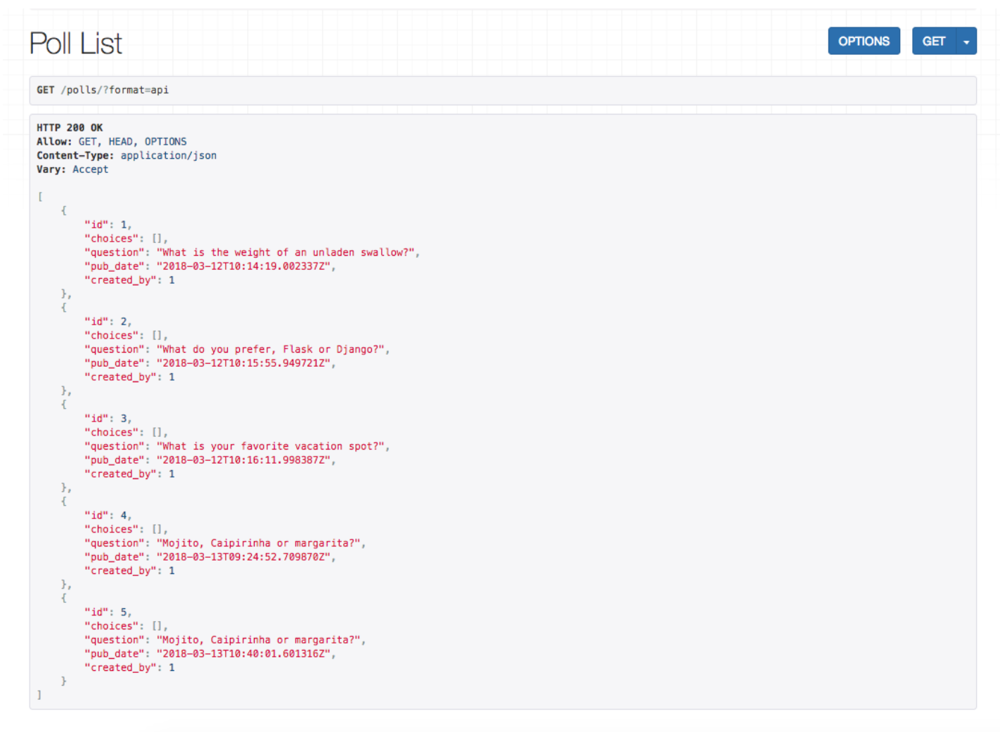

# 📜 Day 9: Django ❤️'s APIs

### ⏱ Agenda

1. [**05m**] 🏆 Objectives
1. [**05m**] ☀️ Warm Up
1. [**40m**] 📖 Overview: Django REST Framework
1. [**10m**] 🌴 BREAK
1. [**30m**] 💻 Activity: Build the MakeWiki API
1. [**20m**] 🎉 Activity: Contractor Project Kickoff
1. 📚 Resources & Credits

## [**05m**] 🏆 Objectives

1. Compare and contrast Django REST Framework and Express
1. Implement a RESTful API using Django REST Framework
1. Apply your knowledge in your Django Contractor Project 

## [**05m**] ☀️ Warm Up

Think back to what you learned in BEW 1.1.

In your own words, write down everything you know about the following questions:

**What is an API? How do we use them?**

## [**30m**] 📖 Overview: Django REST Framework

### Review: APIs

A **RESTful API** is a service that:

- Returns data in **JSON** format
- Has endpoints for **GET, POST, PUT/PATCH, and DELETE** operations

### Why DRF?

**Django REST Framework** is a powerful & flexible toolkit for building Web APIs.

Reasons you might want to use it:

- The [Web browsable API](https://restframework.herokuapp.com/) is a **huge usability win** for developers
- [Authentication policies](https://www.django-rest-framework.org/api-guide/authentication/) and packages (OAuth, etc)
- [Serialization](https://www.django-rest-framework.org/api-guide/serializers/) that supports both [ORM](https://www.django-rest-framework.org/api-guide/serializers#modelserializer) and [non-ORM](https://www.django-rest-framework.org/api-guide/serializers#serializers) data sources
- **Customizable** all the way down:
  - Use [regular function-based views](https://www.django-rest-framework.org/api-guide/views#function-based-views) if you don't need the [more](https://www.django-rest-framework.org/api-guide/generic-views/) [powerful](https://www.django-rest-framework.org/api-guide/viewsets/) [features](https://www.django-rest-framework.org/api-guide/routers/)
- [Extensive documentation](https://www.django-rest-framework.org/), and [great community support](https://groups.google.com/forum/?fromgroups#!forum/django-rest-framework).
- Used and trusted by internationally recognised companies:
  - [Mozilla](https://www.mozilla.org/en-US/about/), [Red Hat](https://www.redhat.com/), [Heroku](https://www.heroku.com/), [Eventbrite](https://www.eventbrite.co.uk/about/)


### Install DRF: Your First Plugin!

Add DRF to your tutorial project by following these steps:

1. `pip install djangorestframework`

1. Add `rest_framework` to your `INSTALLED_APPS` setting, above the declaration for `polls`.

1. Run `python manage.py startapp api` to create an `api/` directory. In it, create `urls.py` and `serializers.py` files.

#### Step 1: Define a serializer for the model

In `api/serializers.py`, add the following code to create serializers for Question and Choice:

```py
from rest_framework.serializers import ModelSerializer

from polls.models import Question, Choice

class QuestionSerializer(ModelSerializer):
    class Meta:
        model = Question
        fields = '__all__'

class ChoiceSerializer(ModelSerializer):
    class Meta:
        model = Choice
        fields = '__all__'
```

#### Step 2: Create Views with an APIView

In `api/views.py`, add the following to create List and Detail views for Questions:

```py
from rest_framework.views import APIView
from rest_framework.response import Response
from django.shortcuts import get_object_or_404

from polls.models import Question, Choice
from api.serializers import QuestionSerializer
from api.serializers import ChoiceSerializer

class QuestionList(APIView):
    def get(self, request):
        questions = Question.objects.all()[:20]
        data = QuestionSerializer(questions, many=True).data
        return Response(data)

class QuestionDetail(APIView):
    def get(self, request, pk):
        question = get_object_or_404(Question, pk=pk)
        data = QuestionSerializer(question).data
        return Response(data)
```

#### Step 3: Update URLs

In `mysite/urls.py` (your inner project directory), add the following to 

```py
urlpatterns = [
    path('api/', include('api.urls')),

    # ... more urls here
]
```

In `api/urls.py`, add the following URLConf to connect to our List and Detail views:

```py
from django.urls import path

from api.views import QuestionList, QuestionDetail

urlpatterns = [
    path('polls/', QuestionList.as_view(), name='polls_list'),
    path('polls/<int:pk>', QuestionDetail.as_view(), name='polls_detail')
]
```

#### Step 4: Open Browser to Test

Run your server, then open your browser to `localhost:8000/api/polls` to test out your Polls List endpoint.



#### Step 5: Refactor & Simplify Views - Generic Views

**QuestionList** and **QuestionDetail** get the work done, but **there are a bunch of common operations** --- we can do it in abstract way!

The **generic views** of Django Rest Framework help us in **code reusability**.

Generic Views **infer the response format** and **allowed methods** from the **serializer** class and **base** class.

Update your `api/views.py` to the following:

```py
from rest_framework.generics import ListCreateAPIView, RetrieveDestroyAPIView

from polls.models import Question
from api.serializers import QuestionSerializer
from api.serializers import ChoiceSerializer

class QuestionList(ListCreateAPIView):
    queryset = Question.objects.all()
    serializer_class = QuestionSerializer

class QuestionDetail(RetrieveDestroyAPIView):
    queryset = Question.objects.all()
    serializer_class = QuestionSerializer
```

## [**10m**] 🌴 BREAK


## [**30m**] 💻 Activity: Build the MakeWiki API

1. Create a new app in the makewiki project named api.

1. **CHALLENGE**: CRUD the Page model with DRF! ([**Quickstart Guide**](https://www.django-rest-framework.org/tutorial/quickstart/))
    - Page List
    - Page Details 
    - Delete a Page
    - Update a Page
    - Create a Page

1. **Test** the API:
    - With your browser
    - With [Postman](https://www.getpostman.com/downloads/)


## Wrap-Up

Fill out the [Vibe Check](https://make.sc/bew1.2-vibe-check) form to let your instructor know of any thoughts or feelings you'd like to share about the class!

## 📚 Resources & Credits

- [Django REST Framework](https://www.django-rest-framework.org/)
- [DRF Quickstart](https://www.django-rest-framework.org/tutorial/quickstart/)
- [DRF Serialization](https://www.django-rest-framework.org/tutorial/1-serialization/)
