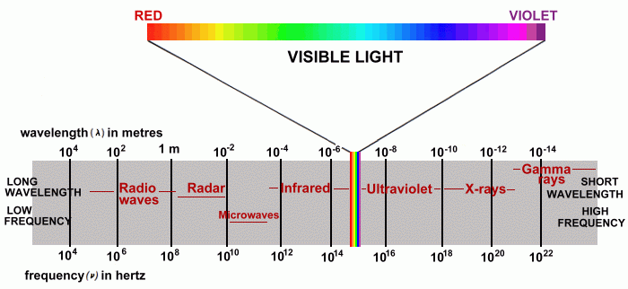
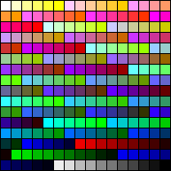
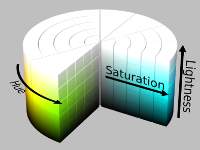

# UI Design - Color

An introduction to designing with color on the computer. 

[Slides](https://docs.google.com/presentation/d/1sIOJrlxhVqIjl54AufsztBB1WvfGxhqsnCd6I2pyTO0/edit?usp=sharing)

What is color? 

> Color: the property possessed by an object of producing different sensations on the eye as a 
> result of the way the object reflects or emits light.

What is light? 

> Light is electromagnetic radiation within a certain portion of the electromagnetic spectrum. 
> The word usually refers to visible light, which is visible to the human eye and is responsible 
> for the sense of sight.
> - **Wikipedia**



## How do humans see color?

Humans see a narrow frequency of electromagnetic radiation as light. We describe it as color. 

We see a range of color from red to violet, and black to white. 

We often describe color as a circle or a wheel where violet wraps around to red again. 
Really it's linear and our perception runs out at either end. 

(Some animals and people can see more or fewer colors listen to this 
[podcast](http://www.radiolab.org/story/211119-colors/))

### Qualities of color

In order to talk about **color** we need language to describe it's features. Color has 
a few qualities we can measure:

- Hue - Red, orange, yellow, green etc. 
- Saturation - How much color exists
- value/Lightness/Brightness - How dark or light

Colors can also be: 

- Warm - red, orange, yellow
- Cool - Blue, violet, purple

To create systems that work with color we need a model to describe how color behaves.

## Subtractive color

> A subtractive color model explains the mixing of a limited set of dyes, inks, paint pigments 
> or natural colorants to create a wider range of colors, each the result of partially or 
> completely subtracting (that is, absorbing) some wavelengths of light and not others.
> - **Wikipedia**

In short the subtractive model explains the color you see when some frequencies of light 
are absorbed as light bounces off a surface. 


This model is used in printing. Most color printers use the colors:

- Cyan
- Magenta
- Yellow
- Black

This is referred to as CMYK color. 

## Additive color

> Additive color is a method to create color by mixing a number of different light colors, 
> with shades of red, green, and blue being the most common primary colors used in additive 
> color system.
> - **Wikipedia**

Additive color starts with black and works to white. Imagine starting with an absences of 
light and adding light. You'd begin in the dark and things would get lighter as you add color. 

Additive color is a model that explains mixing light to generate color. This is why we use it 
to model color on the computer screen!


## Color on the computer 

The computer uses an additive color with the primary colors Red, Green,and Blue. 

Numeric values to determin how much Red, Green, and Blue are present in 
any pixel on the screen. 

## 8 bit 

With 8 bits of data you can display up to 256 colors. Sometimes called indexed color. 
8 bit color systems use a table of color values. 

Old Macs (1990s) used this color palette



### 16 bit color

16 bit color can display up to 65,536 colors. 


### 24 bit

With 24 bits you can display millions of colors. This is most common system used now. 

With this system you have 8 bits of red, 8 bits of green, and 8 bits of blue. 

(`2^8 * 2^8 * 2^8`) `256 * 256 * 256 ` = `16,777,216`

That's 256 levels of each: red, green, and blue. 


### 32 bit

With 32 bits you can 8 bits of transparency to 24 bit color.

### Systems 

The computer supports a wide range of color systems, or abstract models to display color. 
These are all based on or resolve to the RGB color system. 

#### RGB

The most common is RGB or RGBA. In this system you set the amount of Red Green and Blue to 
determine the color. 

Usually you will input a range of 0 to 255 for each Red, Green, and Blue. Often the Alpha 
value will show as a range of 0 to 1, or 0 to 100. Behind the scenes Alpha has 256 values 
just like R, G, and B.

**Sketch**


**Xcode - Storyboard**


In code you might use something like: 

**Brackets web editor**


**CSS**

```css
body {
  background-color: rgba(255, 146, 0, 1);
}
```

**Swift**

```swift
var redorange = UIColor(red: 255/255, green: 146/255, blue: 0/255, alpha: 1)
```

#### HSL/HSB/HSV

HSB/HSV or HSBA color determines color as Hue, Saturation, and Brightness.

HSL and HSB are simialr but differ in how they set value.


 

HSB/HSL are alternative ways for the computer to generate RGB colors. 

These are good systems when you want to a range of hue's or need shift the hue.
These operations are difficult using only RGB values.

#### Hex Colors

Colors are often expressed as hex values. You see this often on the web.

Red orange: #FF9200

Hex colors are expressed with 3 pairs of hexidecimal values. These are numbers in 
base 16 written 0 to f

`1, 2, 3, ... 9, a, b, c, d, e, f`

Notice 16 * 16 = 256! So 00 in base 16 is 0 and ff in base 16 is 256.

The first two digits represents the amount of red, the second two digits green, and 
the last two digits blue. 

```css
body {
  background-color: #FF9200;
}
```


### Mixing RGB color

Primary colors

|Primary  | R   | G   | B   |
|---------|-----|-----|-----|
|Red      | 255 | 0   | 0   |
|Green    |   0 | 255 | 0   |
|Blue     |   0 | 0   | 255 |

|Secondary| R   | G   | B   |
|---------|-----|-----|-----|
|Yellow   | 255 | 255 | 0   |
|Cyan     |   0 | 255 | 255 |
|Magenta  | 255 | 0   | 255 |

|Grays    | R   | G   | B   |
|---------|-----|-----|-----|
|Light    | 222 | 222 | 222 |
|Medium   | 128 | 128 | 128 |
|Dark     | 44  | 44  | 44  |

|Others   | R   | G   | B   |
|---------|-----|-----|-----|
|Pink     | 255 | 165 | 220 |
|Orange   | 245 | 165 | 35  |
|Dark     | 44  | 44  | 44  |

## Color meaning

Color is a great way to communicate. Color has meaning through our 
experiences in the world and culture. 

https://www.blackbeardesign.com/understanding-color-the-meaning-of-color/

- **Yellow** - positivity, light, warmth, creativity, motivation
- **Orange** - Vitality, fun, playfulness, exuberance, youthfulness
- **Red** - Aggression, energy, provocativeness, passion, power
- **Purple** - royalty, sophistication, nostalgia, mystery, spirituality
- **Pink** - tenderness, sensitivity, friendship, compassion
- **Blue** - trustworthiness, dependability, security, calmness
- **Green** - wealth, health, serenity, prestige, abundance
- **Brown** - earthiness, natural, simplicity, durability, rustic
- **Black** - prestige, value, timelessness, sophistication, formality
- **White** - pure, noble, clean, soft, freshness
- **Gold** - elegance, affluence, quality, elite, idealistic
- **Gray/Silver** - scientific, balance, calm, maturity, cold

These change by culture, and can shift with fashion over time. 

### Color by emotion


### Object association

Objects we are familiar with have colors. Sometimes you want to use the color
of the object. 

- Orange (the fruit) would look weird in any other color

Sometimes you don't 

- Money you might use green, but look at PayPal. They would rather look stable and reliable. 

## Color Pyschology

Scouring the internet I've found some intersting observations. 

- Women don’t like gray, orange, and brown. They like blue, purple, and green.
- Men don’t like purple, orange, and brown. Men like blue, green, and black.
- Use blue in order to cultivate user’s trust.
- Yellow is for warnings.
- Green is ideal for environmental and outdoor products.
- Orange is a fun color that can create a sense of haste or impulse.
- Black adds a sense of luxury and value.
- Use bright primary colors for your call to action.
  - CTA == Call To Action
  > In marketing, a call to action (CTA) is an instruction to the audience designed to provoke an immediate response, usually using an imperative verb such as "call now", "find out more" or "visit a store today".

(https://blog.kissmetrics.com/psychology-of-color-and-conversions/)

## Some Examples of colors

The best way to learn about design and color is to look at some successful examples. 

Bootstrap is a CSS framework that has several built in color palettes. These show 
good use of color. 

https://mdbootstrap.com/css/colors/
https://coolors.co/
http://stylifyme.com/
http://blog.visme.co/website-color-schemes/
https://www.awwwards.com/trendy-web-color-palettes-and-material-design-color-schemes-tools.html

## Color systems

[Kuler](https://color.adobe.com)

Color systems are methods you can use to help you choose the colors you use. 

**Analogous colors** are groups of three colors that are next to each other on 
the color wheel, sharing a common color, with one being the dominant color, 
which tends to be a primary or secondary color, and a tertiary. Red, orange, 
and red-orange are examples.

**Complimentry colors** are colors that are opposite each other on the color wheel. 

**Monochrome colors** are colors that share the same hue and differ in value and
saturation. 

**Tirads** are sets of three colors evely spaced around the color wheel. 

## Tips you can act on today!

These are things you can do to make your design look better today. 

### Don't use Black and White

Generally black and white are too strong and create harsh contrast. 

Light gray is better than white. Darkgray is better than black. 

### Grey is not a Color

Don't feel like you are making great design because you make everything shades of gray. 

While grays are good your grays will look ten times better with a color or two. 

## Exercise 

The goal is to take one of the example projects and apply some color using the ideas 
covered earlier. 

1. Choose colors that you feel best fit the values of the project. To do this you will 
have to decide what the values are be reading the description. 
2. Use a color system and choose colors that fit that system. You can adjust the colors, 
especially for value, to make it look better. 
  - Analagous
  - Complimentry
  - Monochrome

- http://tiffzhang.com/startup/index.html

Provide three logos for three different products. Products have a short description of the 
company they represent. 

Provide three app and web site mock ups. 

Students color these logos. Post their logos to Slack. 

Students vote on logos that best express the values of the company

## Resources 

https://speckyboy.com/understanding-and-the-meaning-of-color-within-design/


