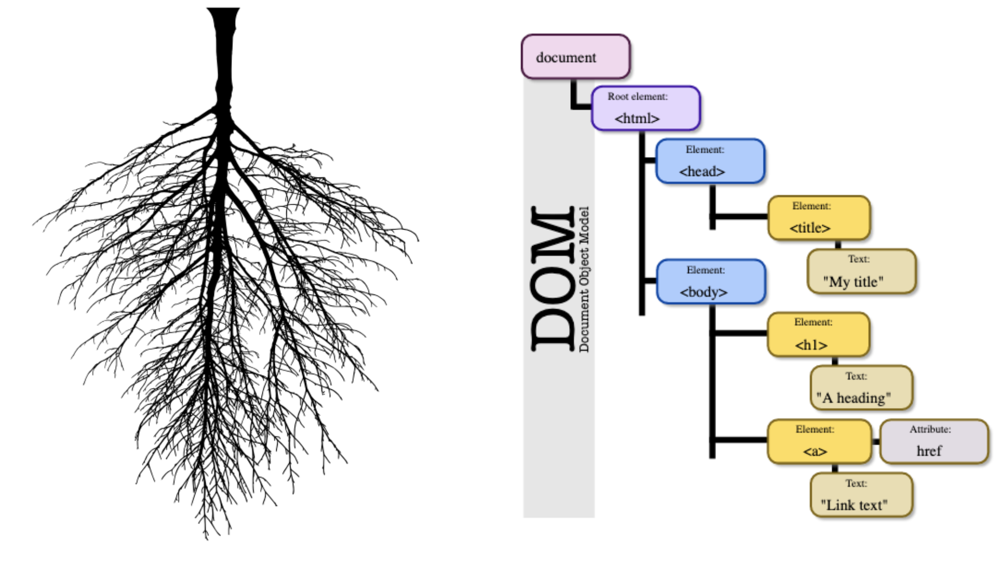

<!-- .slide: data-background="./Images/header.svg" data-background-repeat="none" data-background-size="40% 40%" data-background-position="center 10%" class="header" -->
# FEW 1.1 - CSS Intro

<div>CSS Intro</div>

<!-- Put a link to the slides so that students can find them -->

➡️ [**Slides**](/Syllabus-Template/Slides/lesson1.html ':ignore')

<!-- > -->

## Warmup

Make a copy of this [warmup worksheet](https://docs.google.com/document/d/1b33gdfYCSBSj9xeebKScwH2cfBvZxER6TDK9KwmXWJk/edit#) and answer the questions. We'll review as a group.

<!-- > -->

## Learning Objectives <!--(5 min)-->

1. Describe CSS it's use and syntax
1. Use CSS styles to define the appearance of text on the screen
1. Use basic selectors to target styles to elements
1. Define a base font style for a document
1. Use flex box to arrange things in a page

<!-- > -->

<!-- 

Success Skills Exercise - Keyboard shortcuts and file management

- Find the files that you are using in VS code.
- Command O 
- Command N
- Command S
- Command I
- ...

 -->

### Why you should know this

CSS is powerful gives you full control of the appearance of everything you see on the screen. To be a front end engineer you need to be a master of CSS. 

<!-- > -->

### Download the sample Files

**Download the source code from our example here:** [https://github.com/soggybag/learn-markup-level-2](https://github.com/soggybag/learn-markup-level-2)

Open the example file: **challenge-01-solution.html** in your browser and your code editor. We will make changes to the source code and view the changes in the browser.

<!-- > -->

## CSS Intro <!--(20 min)-->

<!-- > -->

### In Context

CSS is part of the sepration of concerns that make up web development.

- **HTML** - Defines the structure
- **CSS** - Applies presentation 
- **JavaScript** - Handles the business logic

We have a separate language that is specialized for each purpose. 


<!-- > -->

### An Analogy

Here is an analogy. 

- **HTML** - The bones
- **CSS** - The Skin 
- **JavaScript** - The Muscles


<!-- > -->

### CSS - The Language

Styles are written in the CSS language. 

CSS code can be used in a few places.

- files with the `.css` file extention 
- in the `<style></style>` tag in an HTML document
- inline styles using the `style=""` attribute

<!-- > -->

**style.css**

Written in this file: 

```CSS
body {
  margin: 0;
  background-color: #eee;
}
```

<!-- > -->

use the style tag anywhere in your HTML document. 

```HTML
<style>
  body {
    margin: 0;
    background-color: #eee;
  }
  ...
</style>
```

<!-- > -->

Inline styles are written in the style attribute of the tag. This applies to any tag. 

```HTML
<h1 style="color:red; font-size:2.5em">Hello World</h1>
```

<!-- > -->

### Style Rules

<!-- > -->

### Example

CSS is written as style rules that might look like this:

```CSS 
body {
  margin: 0;
  font-family: Helevtica;
  font-size: 14px;
  background-color: #eee;
  color: #444;
}
```

<!-- > -->

### Selector

A rule begins with a selector

```CSS 
p { /* <-- Selector */
  ...
}
```

This is a selector. This rule applies to all `<p>` tags in a document. 

<!-- > -->

Selectors come in many different types. Selectors are almost a language to themselves!

| Selector Type |          Use Case                                 |          Example CSS Selector       |          Example HTML               |
|:-------------:|:-------------------------------------------------:|:-----------------------------------:|:-----------------------------------:|
| tag           | Use to apply rule to _all_ elements with that _tag_ | `header { ... }`                    |    `<header>`  |
| class         | Use to apply rule to _all_ elements with that _class name_ | `.title { ... }`                    |    `<h3 class="title">`  |
| id            | Use to apply rule to _the one_ element with that _id_ | `#content { ... }`                    |    `<ul id="content">`  |
| descendant    | Use to apply rule to all elements that are descendants of a specified element. Descendants _can_ nest | `#content p { ... }`     |    `<div class="content"><p>hello</p></div>` <br /> **Also valid:** <br /> `<div class="content"><section><p>Paragraph 3 in the div.</p></section></div>` |
| child    | Use to apply rule to all elements that are _direct descendants (children)_ of a specified element. | `#content > p { ... }`     |    `<div class="content"><p>hello</p></div>` <br /> **NOT valid:** <br /> `<div class="content"><section><p>Paragraph 3 in the div.</p></section></div>` |

These are just a small handful of the various selector types out there.

<!-- v -->

**Research with a partner to figure out what this selector is doing. Utilize google, w3schools, and any other online resource:**

```CSS
ul li:nth-child(2n) { ... }
```

<!-- > -->

## The DOM <!--(5 min)-->

When a website is loaded, your browser creates a **D**ocument **O**bject **M**odel **(DOM)** of the page.

The DOM contains all of the objects on the page. You can try this out yourself!

1. Go to any website in Chrome or Firefox
1. Right click on the page
1. Press the Inspect button

Look at all that HTML!


### DOM Tree

You can think of the DOM as a tree of HTML objects:



It's important to understand this when talking about CSS selectors. Many of them work based on the tree. 

```HTML
<body>
    <header>
        <h3 class="title">
        <p>
    <p>
    <ul id="content">
        <li>
            <a>
        <li>
            <a>
        <li>
            <a>
```

<!-- > -->

## Selector Practice <!--(30 min)-->

CSS Diner - https://flukeout.github.io

<!-- > -->

## Check for understanding <!--7 min-->

Answer the following questions on your own (2 min), then pair with another student and discuss in a breakout room (2 min). We'll discuss as a group at the end (3 min):

1. When would you use a class selector vs. an id selector?
1. What would the CSS selector look like for a rule that targets any image that is a descendent of an element with the class name `fluffy-cats`?

<!-- > -->

## Break <!--(10 min)-->

Take a 10 minute break

<!-- > -->

## Properties and Values <!--(10 min)-->

These are properties and values. 

```CSS 
margin: 0;
font-family: Helevtica;
font-size: 14px;
background-color: #eee;
color: #444;
```

Properties and values are always separated by a colon. 

Property names in CSS are always kabob-case

**And end with a semicolon!**

<!-- > -->

### Units

There are variety of possible values some require a unit.  


<table><tr><td width="50%">

- `0` - doesn't need a unit
- `Helevtica` - Font Name
  - "Times New Roman" - When a value contains spaces use the quotes
- `14px` - Pixels
- `#eee` - hex color

</td><td width="50%">

- `1fr` - fraction
- `2em` - em (same as the font size)
- `4rem` - root em (based on root font size)
- `50%` - fifty percent
</td></tr></table>

<!-- > -->

### Example

A style rule starts with a selector. And contains a list of property value pairs. 

```CSS
selector {
  property: value;
  property: value;
  ...
}

p {
  font-size: 1em;
  color: #333;
}
```

<!-- > -->

## Putting CSS into Practice <!--(10 min)-->

<!-- > -->

CSS will take a long time to master. 

We will start with basic concepts which you can expand upon to build your skills. 

The web is mostly text. Controlling typography will be an important skill. 

<!-- > -->

Follow these steps: 

1. _Set a base font style_ on the body
1. Style the big things first
1. **Work your way to the details**

<!-- > -->

### Setting a base font style.

All other elements will inherit these styles.

```CSS
body {
  font-size: 16px;
  font-family: Helvetica;
  color: #333;
}
```

Other rules my effect how the inherited value is calculated.

<!-- > -->

### em

When we set `font-size` we often set the size in `em`s. This is a relative unit. It represents a multiple of the current font size. 

```CSS
body {
  font-size: 16px;
  font-family: Helvetica;
}

h1 { 
  font-size: 2em; /* 2 x 16px = 32px */
}
```

<!-- > -->

`em` as a unit is also good because it allows you to size elemnts in the same units used for type. This makes for pleasing design. 

<!-- > -->

## Check for understanding <!--7 min-->

Answer the following questions on your own (2 min), then pair with another student and discuss in a breakout room (2 min). We'll discuss as a group at the end (3 min):

1. Fill in the blanks: Properties and values are always separated by a ______. Property names in CSS are always ________-case, and each line ends with a _________
1. What is the reationship between the base style and the `em` unit?

<!-- > -->

## Activity <!--(30 min)-->

Take a look at this:  https://www.android.com/phones-tablets/

Open the sample code: https://github.com/soggybag/learn-markup-level-2

<!-- > -->

### Structure

- The entire page is in a section
- The page is divided into sections
- Each section begins with header
- Most sections ends with a footer

<!-- > -->

The page is divided into sections. Each section begins with header and the header contains an h2 followed by an h3. 

On the Android site h2 is smaller than the h3. 

<!-- > -->

Add some styles to this page. 

```css
body {
  font-family: Helvetica;
  font-size: 16px;
}

h1 { font-size: 1em; }
h2 { font-size: 1em; }
h3 { font-size: 4.5em; }
```

Changing the font size on the body will change the size of the fonts relatively on the other elements.

<!-- > -->

## Lab

Start working on [Homework 3](../assignments/03-Portfolio-Part-2-Styles.md)! We'll go over it and use the remainder of class to work on it.

Submit one question you have about the homework to the class slack channel!

<!-- > -->

### Additional Resources

1. https://www.android.com/phones-tablets/
1. https://github.com/soggybag/learn-markup-level-2/blob/master/challenge-01-solution.html
1. https://flukeout.github.io

